# **UNIDAD 1: Introducción a microservicios y arquitecturas evolutivas**

## **CDD-2601 | Enero 2026**

## 🎯 **Objetivos de aprendizaje**

Al finalizar esta unidad, el estudiante será capaz de:

1. **Comprender** el contexto histórico que origina los microservicios
2. **Diferenciar** entre arquitecturas monolíticas, SOA y microservicios  
3. **Identificar** ventajas, riesgos y casos de uso apropiados
4. **Analizar** transformaciones arquitectónicas reales de la industria
5. **Evaluar** criterios para toma de decisiones arquitectónicas

---

## 📚 **Estructura del contenido**

```text
unidad-1-introduccion/
├── 01-teoria/        # Material conceptual y fundamentos
├── 02-actividades/   # Ejercicios de consolidación
├── 03-practicas/     # Laboratorios prácticos evaluados
└── 04-recursos/      # Material complementario y referencias
```

---

# **1.1 CONTEXTO HISTÓRICO Y EVOLUCIÓN**

## 🏢 **ARQUITECTURA MONOLÍTICA**

### **¿Qué es un monolito?**

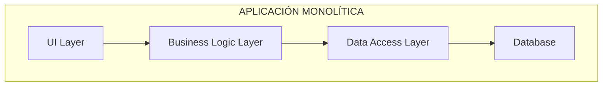

> **🔍 Explicación del diagrama:**  
> Este diagrama muestra la estructura típica de una aplicación monolítica donde todas las capas están integradas en una sola unidad desplegable. El flujo va desde la interfaz de usuario (UI) hacia abajo: UI → Lógica de Negocio → Acceso a Datos → Base de Datos. Todas estas capas se despliegan juntas como una sola aplicación.

### **✅ Ventajas del monolito:**

- **Simplicidad:** Una sola aplicación para desarrollar y desplegar
- **Testing:** Pruebas end-to-end más directas
- **Debugging:** Stack traces completos y fácil troubleshooting
- **Rendimiento:** Sin latencia de red entre componentes

### **❌ El "Monolito Intolerable"**

#### **Problemas que surgen:**

- **🚀 Escalabilidad:** Toda la aplicación debe escalarse junta
- **👥 Equipos:** Múltiples equipos trabajando en el mismo código base
- **🔧 Tecnología:** Atado a una sola tecnología/framework
- **📦 Despliegues:** Releases grandes y riesgosos

---

## 🌐 **SERVICE-ORIENTED ARCHITECTURE (SOA)**

### **Evolución hacia servicios:**

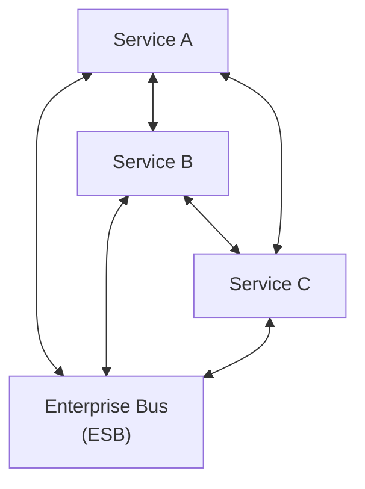

> **🔍 Explicación del diagrama:**  
> En SOA, los servicios se comunican a través de un Enterprise Service Bus (ESB) centralizado que actúa como intermediario. Aunque los servicios pueden comunicarse directamente entre sí, el ESB proporciona transformación de mensajes, enrutamiento y gobernanza centralizada. Esto crea una arquitectura híbrida entre monolitos y microservicios.

### **🎯 Principios SOA:**

- **Reutilización:** Servicios compartidos entre aplicaciones
- **Interoperabilidad:** Estándares como SOAP, WSDL
- **Gobernanza:** Control centralizado mediante ESB
- **Abstracción:** Servicios como cajas negras

### **🔄 SOA vs MICROSERVICIOS**

| **Aspecto**      | **SOA**                    | **Microservicios**        |
| ---------------- | -------------------------- | ------------------------- |
| **Tamaño**       | Servicios grandes          | Servicios pequeños        |
| **Comunicación** | ESB centralizado           | HTTP/REST directo         |
| **Datos**        | Bases de datos compartidas | DB por servicio           |
| **Despliegue**   | Monolítico                 | Independiente             |
| **Governance**   | Centralizada               | Descentralizada           |
| **Tecnología**   | Estándares pesados (SOAP)  | Protocolos ligeros (REST) |

---

## 🚀 **TRANSICIÓN A MICROSERVICIOS**

### **📖 Definición:**

> *"Los microservicios son un enfoque arquitectónico para construir aplicaciones como un conjunto de servicios pequeños, autónomos que se comunican a través de APIs bien definidas."*

### **🔑 Características clave:**

- **🎯 Una responsabilidad:** Cada servicio hace una cosa bien
- **🔄 Desarrollo independiente:** Equipos autónomos
- **📦 Despliegue independiente:** Ciclos de release separados
- **💾 Datos independientes:** Base de datos por servicio
- **🌐 Comunicación ligera:** REST, messaging

---

# **1.2 PRINCIPIOS FUNDAMENTALES**

## 🔗 **DESACOPLAMIENTO (COUPLING)**

### **Alto acoplamiento = problemas:**

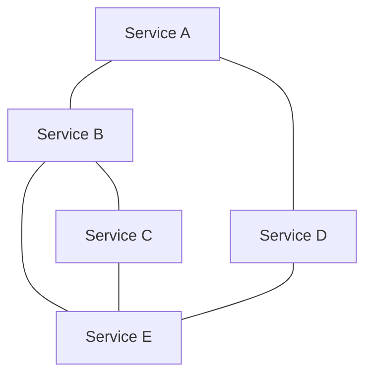

> **🔍 Explicación del diagrama:**  
> Las líneas sólidas representan dependencias fuertes entre servicios. Cuando Service A cambia, potencialmente afecta a Service B y D. Service B está fuertemente acoplado a C y E, creando un efecto dominó donde un cambio en cualquier servicio puede requerir modificaciones en múltiples servicios conectados.

**❌ Cambio en uno afecta a todos**

### **Bajo acoplamiento = flexibilidad:**

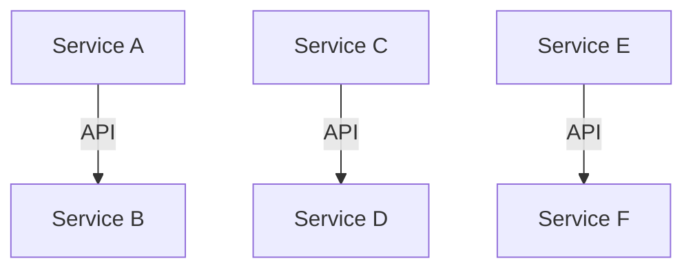

> **🔍 Explicación del diagrama:**  
> Las flechas con etiqueta "API" muestran comunicación a través de interfaces bien definidas. Cada servicio se comunica solo con el siguiente a través de APIs estándar, sin dependencias directas. Esto permite que cada servicio evolucione independientemente siempre que mantenga su contrato de API.

**✅ Servicios independientes**

### **🎯 Tipos de desacoplamiento:**

- **Temporal:** No necesitan estar activos al mismo tiempo
- **Espacial:** No necesitan conocer ubicaciones específicas
- **Tecnológico:** Diferentes lenguajes y frameworks

---

## 🎯 **COHESIÓN**

### **Alta cohesión interna:**

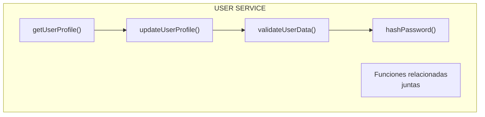

> **🔍 Explicación del diagrama:**  
> Este USER SERVICE muestra **alta cohesión** porque todas las funciones están estrechamente relacionadas con la gestión de usuarios. Existe un flujo lógico: obtener perfil → actualizar → validar datos → procesar contraseña. Todas las funciones trabajan juntas hacia un objetivo común y comparten el mismo dominio de responsabilidad.

### **❌ Baja cohesión - evitar:**

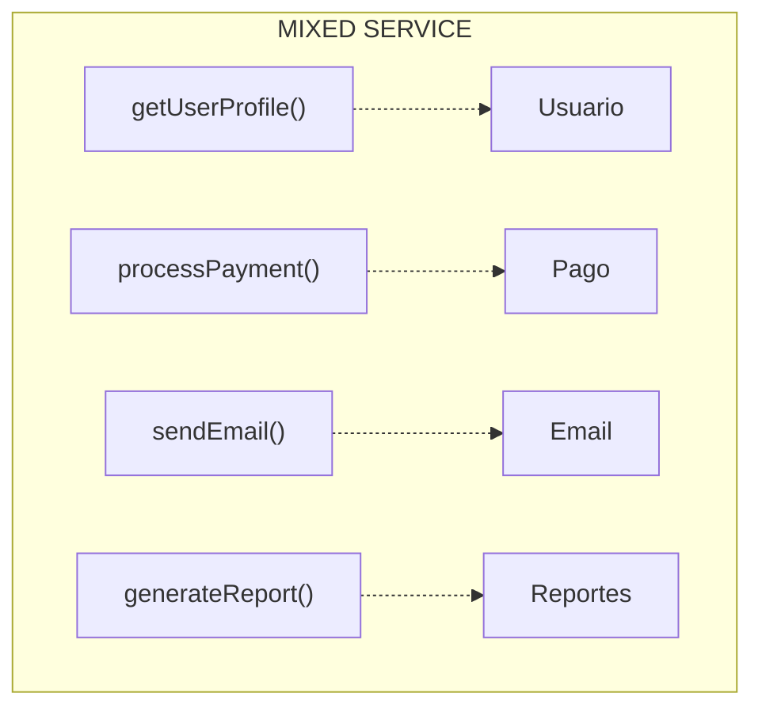

> **🔍 Explicación del diagrama:**  
> Este MIXED SERVICE demuestra **baja cohesión** porque combina funciones no relacionadas: gestión de usuarios, procesamiento de pagos, envío de emails y generación de reportes. Las líneas punteadas indican que cada función pertenece a un dominio diferente. Este diseño viola el principio de responsabilidad única y dificulta el mantenimiento.

---

## 📦 **MODULARIDAD**

### **Bounded Context (DDD):**

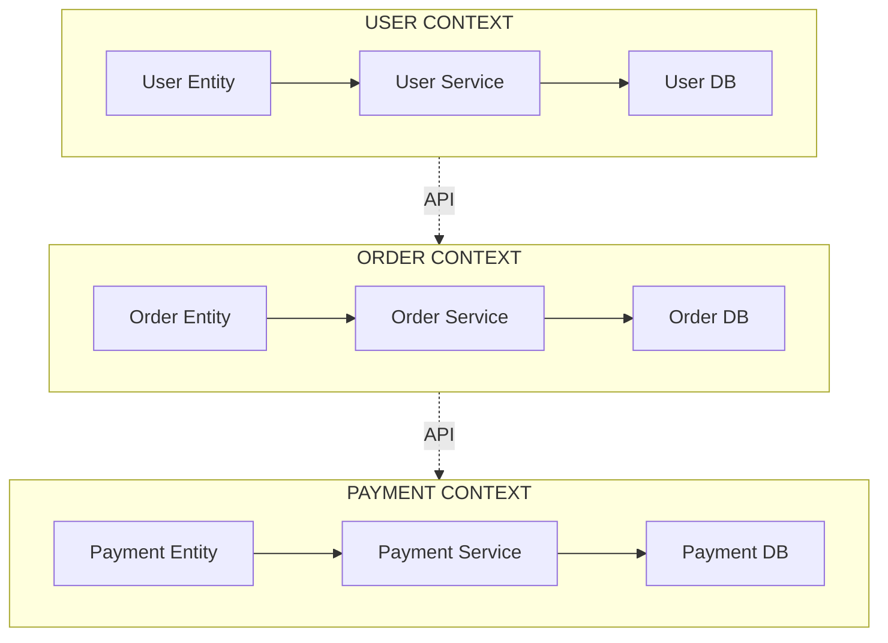

> **🔍 Explicación del diagrama:**  
> Cada **Bounded Context** representa un dominio de negocio independiente con su propia Entity, Service y Database. Los contextos se comunican únicamente a través de APIs bien definidas (líneas punteadas), manteniendo la separación de responsabilidades. Esto permite que cada contexto evolucione independientemente sin afectar a los demás.

### **🎯 Principios de Modularidad:**

- **Single Responsibility:** Una razón para cambiar
- **Interface Segregation:** APIs específicas por cliente
- **Dependency Inversion:** Depender de abstracciones

---

## 👥 **AUTONOMÍA DE EQUIPOS**

### **Estructura Tradicional:**

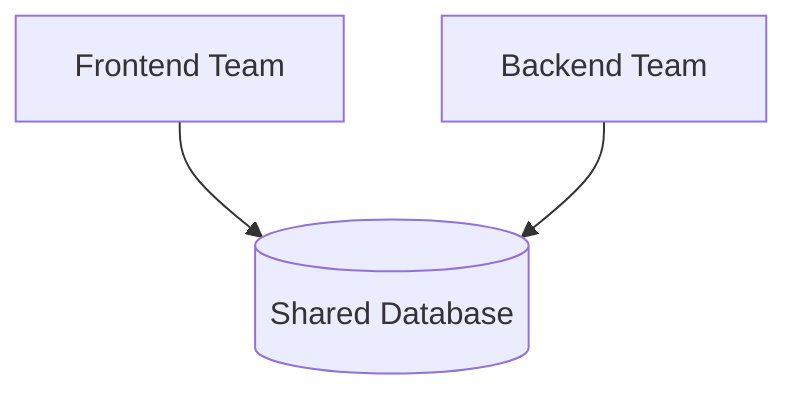

> **🔍 Explicación del diagrama:**  
> En la estructura tradicional, múltiples equipos (Frontend y Backend) comparten una base de datos común. Esto crea dependencias porque cualquier cambio en el schema de la base de datos requiere coordinación entre ambos equipos, ralentizando el desarrollo y creando cuellos de botella.

**❌ Dependencias entre equipos**

### **Estructura Microservicios:**

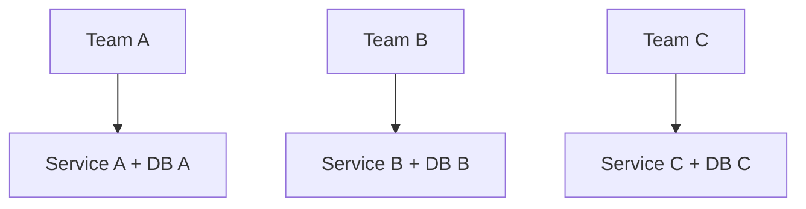

> **🔍 Explicación del diagrama:**  
> En microservicios, cada equipo tiene **ownership completo** de su servicio y base de datos. Team A es responsable del Service A y su DB A exclusivamente. Esto elimina dependencias entre equipos y permite desarrollo, despliegue y escalamiento independientes. Cada equipo puede tomar decisiones técnicas de forma autónoma.

**✅ Equipos completamente autónomos**

### **🚀 Beneficios:**

- **Velocidad:** Sin esperar a otros equipos
- **Innovación:** Tecnologías propias por equipo
- **Responsabilidad:** Ownership completo del servicio

---

## 💾 **BASE DE DATOS POR SERVICIO**

### **❌ Antipatrón - DB Compartida:**

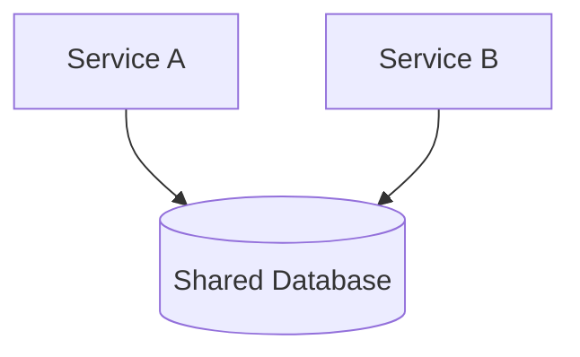

> **🔍 Explicación del diagrama:**  
> Este antipatrón muestra dos servicios accediendo a una **base de datos compartida**. Esto viola el principio de **Database per Service** y crea acoplamiento fuerte entre servicios. Cambios en el schema afectan múltiples servicios, se requiere coordinación para deployments, y se pierde la autonomía de los equipos de desarrollo.

### **✅ Patrón Correcto:**

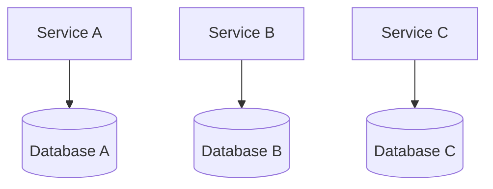

> **🔍 Explicación del diagrama:**  
> El patrón correcto implementa **Database per Service** donde cada servicio tiene su propia base de datos dedicada. Service A usa Database A, Service B usa Database B, etc. Esto garantiza encapsulación de datos, permite que cada servicio elija la tecnología de persistencia más apropiada y elimina dependencias entre equipos para cambios de schema.

### **🎯 Ventajas:**

- **Evolución independiente:** Cambios de schema sin coordinación
- **Tecnología apropiada:** SQL vs NoSQL según necesidad
- **Aislamiento de fallos:** Problema en una DB no afecta otras

---

# **1.3 CASOS DE ESTUDIO**

## 📺 **NETFLIX: De DVD a Streaming Global**

### **🎬 El Desafío:**

- **2008:** Servicio DVD por correo + streaming naciente
- **Problema:** Monolito no podía escalar para streaming masivo
- **Meta:** Soportar millones de usuarios simultáneos globalmente

### **🏗️ Transformación:**

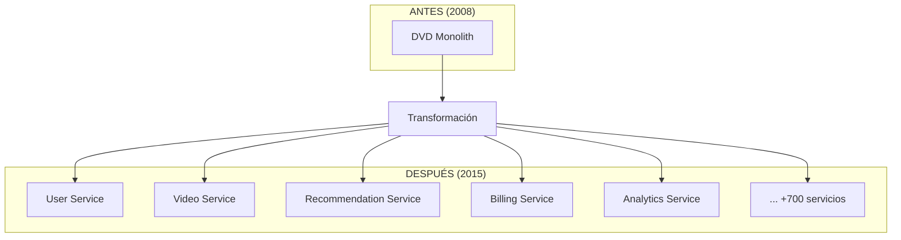

> **🔍 Explicación del diagrama:**  
> Netflix evolucionó de un **monolito único** para DVDs a más de **700 microservicios independientes**. Cada servicio maneja una responsabilidad específica: User Service (perfiles), Video Service (streaming), Recommendation Service (algoritmos ML), etc. Esta transformación les permitió escalar globalmente y soportar millones de usuarios concurrentes.

### **📊 Resultados:**

- **+700 microservicios** desplegados independientemente
- **Disponibilidad:** 99.99% uptime global
- **Escalabilidad:** Billions de horas de video al mes

---

## 🚗 **UBER: Escalando la Movilidad**

### **🚀 Crecimiento Explosivo:**

- **2010:** Startup simple de taxis
- **2015:** Operaciones globales complejas
- **Servicios:** UberEATS, UberFREIGHT, UberAIR

### **🏗️ Arquitectura Microservicios:**

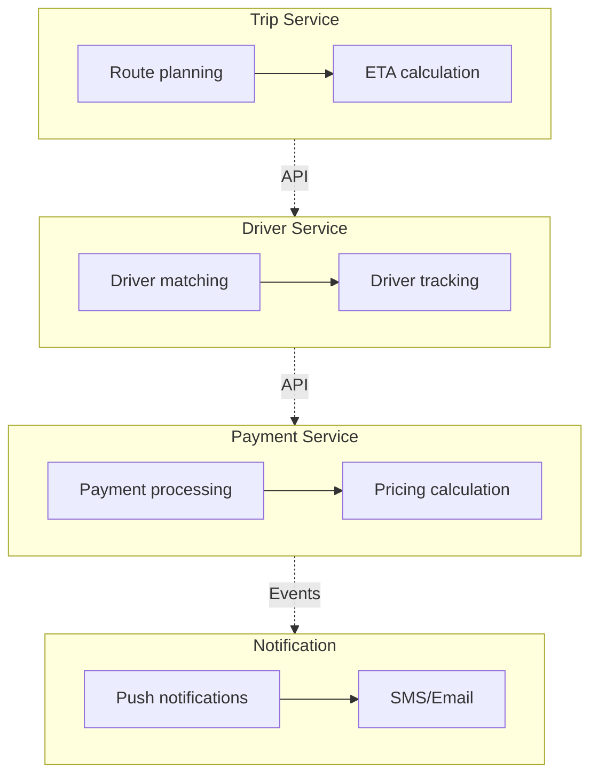

> **🔍 Explicación del diagrama:**  
> Uber descompuso su plataforma en servicios especializados: **Trip Service** maneja rutas y cálculos de tiempo, **Driver Service** gestiona emparejamiento y seguimiento de conductores, **Payment Service** procesa pagos y precios, y **Notification Service** envía alertas. La comunicación via APIs y eventos permite que cada servicio evolucione independientemente mientras mantiene la funcionalidad integrada.

### **🎯 Lecciones Aprendidas:**

- **Domain-Driven Design** para definir servicios
- **Event-driven architecture** para comunicación
- **Circuit breakers** para resiliencia

---

## 🛒 **AMAZON: La Plataforma de Plataformas**

### **📈 Escala Masiva:**

- **Millones** de productos
- **Cientos de millones** de usuarios
- **Miles de desarrolladores** internos

### **🏗️ Estrategia "Two-Pizza Teams":**

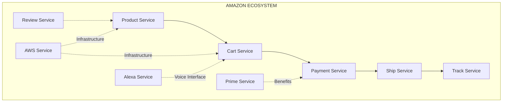

> **🔍 Explicación del diagrama:**  
> Amazon organiza sus servicios en un **ecosistema interconectado** donde cada servicio tiene una responsabilidad clara. El flujo principal (líneas sólidas) va desde Product → Cart → Payment → Ship → Track. Los servicios de soporte (líneas punteadas) como AWS proveen infraestructura, Alexa ofrece interfaces de voz, y Prime agrega beneficios. Cada servicio es mantenido por un equipo pequeño ("two-pizza team").

### **🔑 Principios Amazon:**

- **API First:** Todo servicio debe tener API
- **Decentralized:** Cada equipo = dueño de su servicio
- **Scalable:** Diseñado para escalar horizontalmente

---

## 🎯 **ESTRUCTURA ORGANIZACIONAL**

### **⚖️ LEY DE CONWAY:**

> *"Las organizaciones que diseñan sistemas están constreñidas a producir diseños que copian las estructuras de comunicación de estas organizaciones."*

### **Tradicional vs Microservicios:**

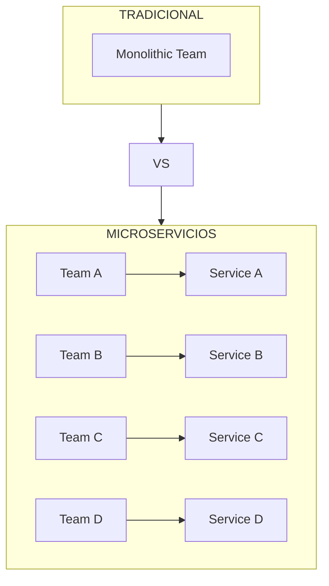

> **🔍 Explicación del diagrama:**  
> La **Ley de Conway** se demuestra claramente aquí: en el enfoque tradicional, un **equipo monolítico** produce sistemas monolíticos. En microservicios, múltiples equipos especializados (Team A, B, C, D) crean servicios independientes que reflejan su estructura organizacional. La transformación requiere cambios tanto en arquitectura como en organización de equipos.

### **🔄 "Inverse Conway Maneuver":**

1. **Diseñar** la arquitectura deseada
2. **Reorganizar** equipos según la arquitectura
3. **Resultado:** Sistema que refleja estructura organizacional

---

## 🤔 **¿CUÁNDO USAR MICROSERVICIOS?**

### **✅ Casos Apropiados:**

- **Equipos grandes** (>50 desarrolladores)
- **Dominios complejos** con múltiples bounded contexts
- **Escalabilidad diferenciada** por componentes
- **Innovación tecnológica** constante
- **Deployment independiente** crítico

### **❌ Casos NO Apropiados:**

- **Equipos pequeños** (<10 desarrolladores)
- **Dominios simples** bien definidos
- **Aplicaciones CRUD** básicas
- **Startups tempranas** buscando product-market fit
- **Sistemas con transacciones ACID** complejas

---

## ⚡ **TRADE-OFFS DE MICROSERVICIOS**

### **✅ VENTAJAS:**

| **Aspecto**           | **Beneficio**                        |
| --------------------- | ------------------------------------ |
| **🚀 Escalabilidad** | Escalar servicios independientemente |
| **🛠️ Tecnología**  | Diversidad tecnológica por equipo    |
| **⚡ Deployment**     | Releases independientes y frecuentes |
| **🔒 Resiliencia**   | Fault isolation entre servicios      |
| **👥 Equipos**       | Autonomía y ownership completo       |

### **❌ DESAFÍOS:**

| **Aspecto**          | **Reto**                          |
| -------------------- | --------------------------------- |
| **🌐 Complejidad**  | Distributed systems complexity    |
| **🔄 Comunicación** | Network latency y timeouts        |
| **🗃️ Datos**      | Eventual consistency              |
| **🐛 Debugging**    | Trazas distribuidas complejas     |
| **🚀 Deployment**   | Orchestration y service discovery |

---

## 📚 **Actividades de aprendizaje**

### 🎯 [Actividades de consolidación](../02-actividades/README.md)

Ejercicios para reforzar los conceptos:

1. **Cuadro Comparativo** - Análisis sistemático de estilos arquitectónicos
2. **Mapa Conceptual** - Visualización de componentes fundamentales  
3. **Análisis de Casos** - Investigación de transformaciones reales

### 🔬 [Prácticas de laboratorio](../03-practicas/README.md)

Dos prácticas evaluadas que preparan para el proyecto final:

#### [Práctica 1.1: Análisis comparativo](../03-practicas/practica-1-1.md)

- **Modalidad:** Individual
- **Objetivo:** Desarrollar criterio técnico para selección arquitectónica
- **Entregables:** Matriz comparativa + análisis de casos + matriz de decisión

#### [Práctica 1.2: Estudio de caso](../03-practicas/practica-1-2.md)

- **Modalidad:** Equipos 2-3 personas
- **Objetivo:** Analizar desacoplamiento real y crear mapa conceptual
- **Entregables:** Análisis completo + mapa interactivo + aplicación al proyecto

### 📚 [Recursos complementarios](../04-recursos/README.md)

Material de apoyo y referencias:

- **Bibliografía especializada** - Newman, Richardson, Fowler
- **Blogs técnicos oficiales** - Netflix, Uber, Amazon
- **Herramientas de diagramado** - Miro, Lucidchart, Draw.io
- **Plantillas y templates** - Análisis, mapas conceptuales

---

## 📅 **Cronograma detallado**

### **Semana 1: Fundamentos y principios**

| Tipo                  | Actividad                                  |
| --------------------- | ------------------------------------------ |
| Teoría                | Contexto histórico y SOA vs Microservicios |
| Práctica              | Análisis comparativo de arquitecturas      |
| Actividad             | Cuadro comparativo + Mapa conceptual       |
| Trabajo Independiente | Lectura Newman Cap. 1-3 + Fowler article   |

### **Semana 2: Casos de estudio y aplicación**

| Tipo                  | Actividad                                        |
| --------------------- | ------------------------------------------------ |
| Teoría                | Casos Netflix, Uber, Amazon + Ley de Conway      |
| Práctica              | Análisis de transformación empresarial           |
| Práctica              | Mapa conceptual + Presentaciones                 |
| Trabajo Independiente | Investigación de caso + preparación presentación |

---

## 📊 **Evaluación**

### **Criterios transversales**

1. **Rigor técnico** - Precisión conceptual y terminología correcta
2. **Pensamiento crítico** - Análisis de trade-offs y justificaciones
3. **Aplicación práctica** - Conexión con escenarios reales
4. **Comunicación** - Claridad en documentación y presentación

---

## 🔗 **Conexión con el Proyecto Final**

Esta unidad sienta las bases conceptuales para el **Proyecto Final: Plataforma de Ingesta y Procesamiento de Datos**:

### **Fundamentos transferibles**

1. **Justificación arquitectónica** → Por qué microservicios para este dominio
2. **Bounded contexts** → Identificación de servicios independientes (3-5)
3. **Patrones de comunicación** → Event-driven architecture
4. **Criterios de decisión** → Selección de tecnologías (Spring Boot + Quarkus)

### **Casos de referencia**

- **Netflix:** Patrones de resiliencia (Circuit Breaker, API Gateway)
- **Uber:** Arquitectura orientada a eventos y procesamiento de datos
- **Amazon:** Principios de service ownership y observabilidad

---

## ✅ **Checklist de Finalización**

### **Para estudiantes**

Al finalizar la Unidad 1, deberías poder:

- [ ] **Explicar** las diferencias entre monolito, SOA y microservicios
- [ ] **Justificar** la selección arquitectónica para un caso específico
- [ ] **Identificar** patrones de desacoplamiento en casos reales
- [ ] **Aplicar** criterios de decisión a tu proyecto final
- [ ] **Comunicar** análisis técnicos de forma clara y estructurada

### **Para docentes**

- [ ] **Evaluar** comprensión conceptual mediante rúbricas específicas
- [ ] **Retroalimentar** análisis de casos y mapas conceptuales
- [ ] **Conectar** aprendizajes con unidades siguientes
- [ ] **Documentar** mejores prácticas de estudiantes para futuros cursos

---

## 📚 **Lecturas Recomendadas**

- Newman, S. - "Building Microservices" Cap. 1-3
- Fowler, M. - "Microservices" article  
- Richardson, C. - "Microservice Patterns" Cap. 1

---

**Siguiente:** [Unidad 2: Diseño y Modelado de Microservicios →](../unidad-2-diseno/README.md)

---

*Esta unidad está diseñada para ser la base sólida sobre la cual construiremos progresivamente las competencias técnicas necesarias para el desarrollo de sistemas distribuidos modernos.*
