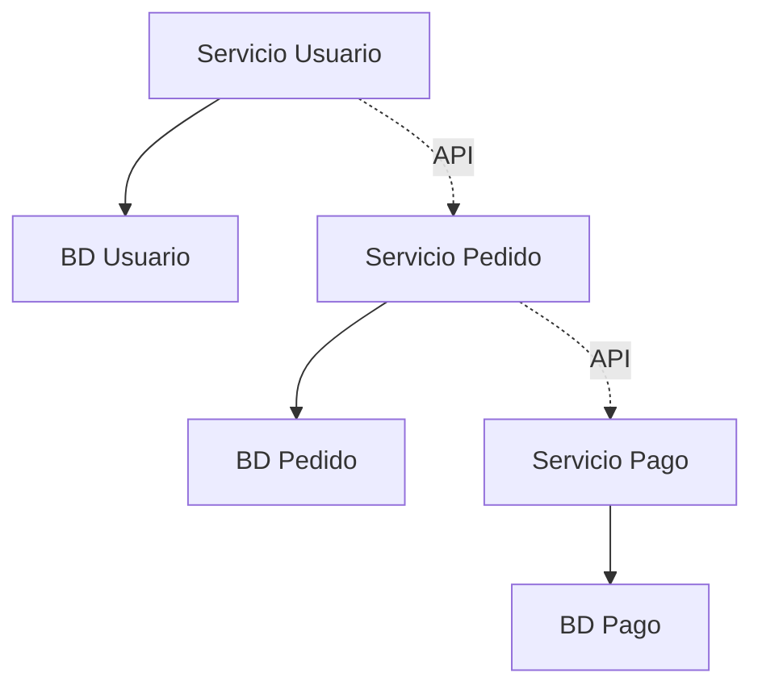

# Unidad 1: Introducción a los Microservicios y Arquitecturas Evolutivas

## 📋 Información General

- **Duración:** 2 semanas (10 horas académicas)
- **Modalidad:** 2 horas teoría + 3 horas práctica + 5 horas trabajo independiente
- **Competencias:** Fundamentos conceptuales y diferenciación arquitectónica

---

## 🎯 Objetivos de Aprendizaje

Al finalizar esta unidad, el estudiante será capaz de:

1. **Comprender** el contexto histórico y arquitectónico que origina los microservicios
2. **Diferenciar** claramente entre arquitecturas monolíticas, SOA y microservicios
3. **Identificar** ventajas, riesgos y casos de uso apropiados para microservicios
4. **Analizar** casos de estudio reales de la industria
5. **Evaluar** criterios para migración arquitectónica

---

## 📚 Contenido Teórico

### 1.1 Contexto Histórico y Necesidad de Evolución

#### 1.1.1 Arquitectura Monolítica
- **Definición y características**
  - Aplicación como unidad única de despliegue
  - Base de datos centralizada
  - Interfaz de usuario, lógica de negocio y acceso a datos en un solo artefacto

- **Ventajas del Monolito**
  - Simplicidad en desarrollo inicial
  - Facilidad de testing (pruebas end-to-end)
  - Despliegue sencillo
  - Rendimiento optimizado (comunicación interna)

- **Problemas y limitaciones**
  - Dificultad de escalabilidad selectiva
  - Tecnología única (vendor lock-in)
  - Equipos grandes trabajando en la misma base de código
  - Ciclos de despliegue largos y riesgosos

- **El concepto de "Monolito Intolerable"**
  - Punto donde los costos superan los beneficios
  - Indicadores: tiempo de build > 10 minutos, equipos > 8 personas
  - Impacto en velocidad de entrega y innovación

#### 1.1.2 Arquitectura Orientada a Servicios (SOA)
- **Principios fundamentales de SOA**
  - Servicios como ciudadanos de primera clase
  - Interfaz bien definida y contrato
  - Descubrimiento y composición de servicios

- **Diferencias clave con Microservicios**
  | Aspecto       | SOA                     | Microservicios        |
  | ------------- | ----------------------- | --------------------- |
  | Comunicación  | SOAP/WS-*               | REST/HTTP, Mensajería |
  | Gobierno      | Centralizado (ESB)      | Descentralizado       |
  | Base de datos | Compartida              | Por servicio          |
  | Tamaño        | Servicios grandes       | Servicios pequeños    |
  | Equipos       | Grandes, especializados | Pequeños, autónomos   |

#### 1.1.3 La Transición a Microservicios
- **Definición de Microservicios (Martin Fowler)**
  > "Un enfoque para desarrollar una aplicación como un conjunto de pequeños servicios, cada uno ejecutándose en su propio proceso y comunicándose mediante mecanismos ligeros"

- **Objetivos y filosofía**
  - Autonomía de los equipos de desarrollo
  - Agilidad en la entrega de software
  - Escalabilidad independiente de componentes
  - Diversidad tecnológica controlada

---

### 1.2 Principios Fundamentales y Componentes

#### 1.2.1 Desacoplamiento, Cohesión y Modularidad

**Coupling (Acoplamiento)**
- Grado de dependencia entre servicios
- Tipos: temporal, espacial, de datos, de interfaz
- **Objetivo:** Minimizar el acoplamiento entre servicios

**Cohesión**
- Grado de relación entre elementos dentro de un servicio
- **Principio:** Alta cohesión dentro del servicio
- Ejemplo: Todas las operaciones de "Usuario" en un solo servicio

**Modularidad**
- Separación clara de responsabilidades
- Interfaz bien definida
- Implementación encapsulada

#### 1.2.2 Autonomía de Equipos y Base de Datos por Servicio

**Autonomía de Equipos**
- Equipos pequeños (2 pizzas de Jeff Bezos - Amazon)
- Propiedad completa: desarrollo, despliegue, operación
- Decisiones tecnológicas descentralizadas

**Base de Datos por Servicio**
- Cada microservicio gestiona su propia persistencia
- No hay acceso directo entre bases de datos
- Comunicación solo a través de APIs

#### 1.2.3 Ventajas, Riesgos y Trade-offs

**Ventajas**
- ✅ Escalabilidad independiente
- ✅ Diversidad tecnológica
- ✅ Equipos autónomos
- ✅ Fallos aislados
- ✅ Despliegues independientes

**Riesgos y Desafíos**
- ❌ Complejidad de red y latencia
- ❌ Consistencia de datos distribuidos
- ❌ Monitoreo y debugging complejo
- ❌ Testing de integración
- ❌ Overhead operacional

**Trade-offs Principales**
- Complejidad técnica vs. Agilidad organizacional
- Consistencia vs. Disponibilidad (CAP Theorem)
- Performance vs. Escalabilidad independiente

---

### 1.3 Casos de Estudio y Adopción

#### 1.3.1 Análisis de Arquitecturas en la Industria

**Netflix: El Pionero**
- Migración desde monolito a 700+ microservicios
- Arquitectura cloud-native desde el inicio
- Patrones: Circuit Breaker (Hystrix), Service Discovery (Eureka)
- Lecciones: Importancia de observabilidad y automatización

**Uber: Escalando Globalmente**
- Dominio: conectar conductores y pasajeros
- Microservicios geográficamente distribuidos
- Desafíos: latencia, consistencia eventual
- Soluciones: Event Sourcing, CQRS

**Amazon: La Transformación Cultural**
- "Service-Oriented Organization"
- Cada equipo expone funcionalidad como servicio
- Principio: "You build it, you run it"
- Impacto en velocidad de innovación

#### 1.3.2 Criterios de Decisión para Migrar

**Indicadores para Microservicios**
- Equipos > 6-8 personas por producto
- Diferentes velocidades de cambio por módulo
- Necesidades de escala heterogéneas
- Múltiples tecnologías requeridas

**Cuándo NO usar Microservicios**
- Equipos pequeños (< 5 personas)
- Dominio no bien entendido
- Infraestructura inmadura
- Requisitos de consistencia fuerte

#### 1.3.3 Estructura y Organización de Equipos (Ley de Conway)

**Ley de Conway**
> "Las organizaciones que diseñan sistemas están constreñidas a producir diseños que son copias de las estructuras de comunicación de estas organizaciones"

**Implicaciones para Microservicios**
- La arquitectura técnica debe alinearse con la estructura organizacional
- Equipos autónomos → Servicios desacoplados
- Comunicación entre equipos → Comunicación entre servicios

**Inverse Conway Maneuver**
- Diseñar primero la arquitectura deseada
- Estructurar los equipos según esa arquitectura
- Permitir que la organización evolucione el sistema

---

## 🎓 Competencias Específicas Desarrolladas

1. **Comprender** el contexto histórico y arquitectónico que da origen al enfoque de microservicios
2. **Diferenciar** arquitecturas monolíticas, SOA y microservicios
3. **Identificar** ventajas, riesgos y casos de uso apropiados
4. **Analizar** casos reales de transformación arquitectónica
5. **Evaluar** criterios organizacionales y técnicos para adopción

---

## 📖 Referencias y Lecturas

### Lecturas Obligatorias
1. Fowler, M. (2014). "Microservices" - https://martinfowler.com/articles/microservices.html
2. Newman, S. (2021). "Building Microservices" (Capítulos 1-3)

### Lecturas Complementarias
1. Richardson, C. (2018). "Microservices Patterns" (Capítulo 1)
2. Netflix Tech Blog - "Microservices Architecture"
3. Uber Engineering - "Microservice Architecture at Uber"

### Recursos Adicionales
- Twelve-Factor App: https://12factor.net/
- Microservices.io: Patterns and Anti-patterns
- AWS Architecture Center: Microservices

---

**Siguiente:** [Actividades de Aprendizaje →](actividades/README.md)