# Unidad 2: Diseño y modelado de microservicios

## 🎯 Objetivos de aprendizaje

Al finalizar esta unidad, el estudiante será capaz de:

1. **Aplicar** Domain-Driven Design (DDD) para definir bounded contexts
2. **Diseñar** APIs RESTful siguiendo principios de madurez y especificarlas con OpenAPI
3. **Identificar** y aplicar patrones arquitectónicos: API Gateway, Saga, CQRS, Event Sourcing
4. **Modelar** la comunicación entre microservicios usando Context Mapping
5. **Preparar** el diseño base para la plataforma de ingesta y procesamiento de datos

---

## 📚 Contenido teórico

## 2.1 Domain-Driven Design (DDD) y contextos

### 2.1.1 Conceptos centrales de DDD

**El problema del diseño complejo**

- Sistemas grandes con múltiples dominios de negocio
- Necesidad de alinear el código con la realidad del negocio
- Evitar el "modelo de datos centralizado" que genera acoplamiento

**Dominio**
> El dominio es la esfera de conocimiento y actividad alrededor de la cual la lógica de la aplicación gira.

- **Core Domain:** Lo que diferencia a la organización (ventaja competitiva)
- **Supporting Domain:** Importante pero no diferenciador
- **Generic Domain:** Funcionalidad común (autenticación, logging, etc.)

**Modelo**
> Una abstracción que describe aspectos seleccionados del dominio y puede ser usada para resolver problemas relacionados con ese dominio.

- Representa conceptos del negocio y sus relaciones
- Evoluciona con el entendimiento del dominio
- Debe ser útil para resolver problemas reales

**Lenguaje ubicuo (Ubiquitous language)**
> Un lenguaje estructurado alrededor del modelo de dominio y usado por todos los miembros del equipo para conectar todas las actividades del equipo con el software.

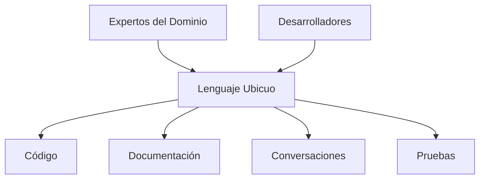

> **🔍 Explicación del diagrama:**  
> El **Lenguaje Ubicuo** actúa como punto central de comunicación entre **Expertos del Dominio** y **Desarrolladores**. Este lenguaje común se refleja en todos los artefactos del proyecto: el código usa los mismos términos que la documentación, las conversaciones del equipo y las pruebas. Esto elimina ambigüedades y garantiza que todos hablen el mismo "idioma" del negocio.

**Ejemplo: Sistema de E-commerce**

```markdown
# Lenguaje Ubicuo - E-commerce

**Producto:** Un ítem que puede ser vendido
**Inventario:** Cantidad disponible de un producto
**Pedido:** Solicitud de compra de uno o más productos
**Carrito:** Colección temporal de productos antes del pedido
**Cliente:** Persona que puede realizar pedidos
**Pago:** Procesamiento financiero de un pedido
**Envío:** Entrega física del pedido al cliente
```

### 2.1.2 Bounded Contexts para delimitar responsabilidades

**Definición de Bounded Context**
> Una descripción de un límite (típicamente un subsistema, o el trabajo de un equipo particular) dentro del cual un modelo particular es definido y aplicable.

**Características de un Bounded Context:**

- Tiene un modelo unificado internamente
- El mismo término puede tener significado diferente en otros contextos
- Define límites explícitos de responsabilidad
- Permite que equipos trabajen autónomamente

**Ejemplo: Bounded Contexts en E-commerce**

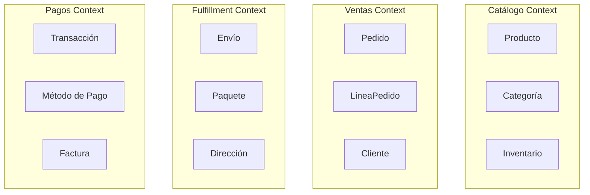

> **🔍 Explicación del diagrama:**  
> Cada **Bounded Context** representa un área de negocio con su propio modelo y vocabulario. En **Catálogo Context**, "Producto" incluye características técnicas e inventario. En **Ventas Context**, el mismo "Producto" se enfoca en precio y disponibilidad. **Fulfillment** ve "Producto" como peso y dimensiones para envío, mientras **Pagos** lo considera como un item facturable. Cada contexto mantiene su propia perspectiva consistente.

**Producto en diferentes contextos:**

- **Catálogo Context:** Producto = SKU + descripción + precio + inventario
- **Ventas Context:** Producto = ID + nombre + precio (snapshot al momento del pedido)
- **Fulfillment Context:** Producto = dimensiones + peso + restricciones de envío

**Criterios para Identificar Bounded Contexts:**
1. **Lenguaje:** Diferentes significados del mismo término
2. **Equipos:** Diferentes equipos → diferentes contextos
3. **Fuentes de datos:** Diferentes sistemas de origen
4. **Procesos de negocio:** Diferentes workflows
5. **Regulaciones:** Diferentes compliance requirements

### 2.1.3 Context Mapping: patrones de colaboración

**Más información:** [Context Mapping Patterns](context-mapping-patterns.md)

**Context Map**
> Un diagrama que muestra los Bounded Contexts y las relaciones entre ellos.

**Patrones de Relación entre contextos:**

#### 1. Shared Kernel

- Pequeño subconjunto del modelo compartido
- **Uso:** Cuando hay conceptos verdaderamente compartidos
- **Riesgo:** Acoplamiento fuerte, coordinación requerida

#### 2. Customer-Supplier

- Un contexto depende de otro
- **Upstream:** Proveedor del servicio
- **Downstream:** Consumidor del servicio
- **Ejemplo:** Catálogo (upstream) → Ventas (downstream)

#### 3. Conformist

- El downstream adopta el modelo del upstream tal como es
- **Uso:** Cuando no hay poder de negociación
- **Ejemplo:** Integración con sistema legacy

#### 4. Anticorruption Layer (ACL)

- Capa de traducción para proteger el modelo propio
- **Uso:** Integración con sistemas externos o legacy
- **Beneficio:** Aísla cambios del sistema externo

#### 5. Open Host Service

- Protocolo bien definido para acceso al contexto
- **Implementación:** API REST, mensajería
- **Ejemplo:** API pública del catálogo de productos

#### 6. Published Language

- Lenguaje común para intercambio de información
- **Ejemplos:** JSON schemas, contratos de eventos
- **Uso:** Comunicación asíncrona entre contextos

**Ejemplo de Context Map: E-commerce**

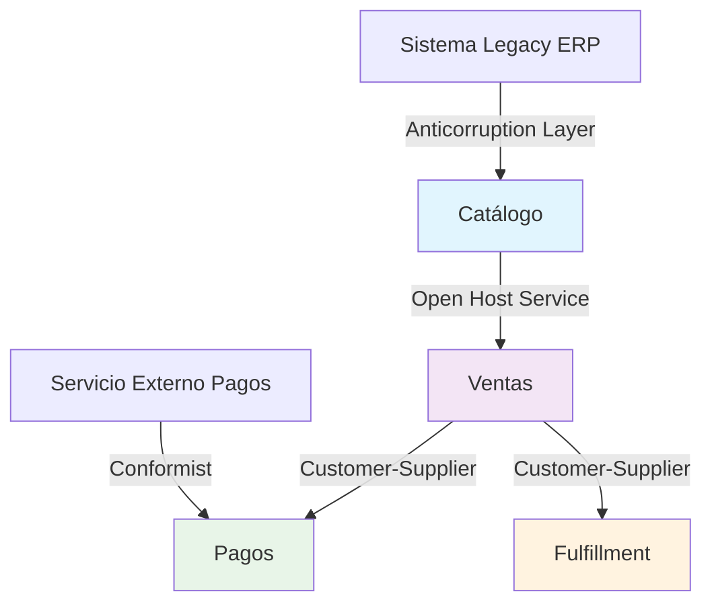

> **🔍 Explicación del diagrama:**  
> Este **Context Map** ilustra las relaciones estratégicas entre Bounded Contexts. **Catálogo** expone un **Open Host Service** a Ventas, creando una API pública estable. **Ventas** actúa como **Customer** de Pagos y Fulfillment, dirigiendo sus necesidades. El **Anticorruption Layer** protege al Catálogo del sistema legacy ERP, mientras el contexto de Pagos adopta una estrategia **Conformist** con el servicio externo de pagos. Los colores ayudan a diferenciar visualmente cada contexto.

---

## 2.2 Diseño de APIs y contratos

### 2.2.1 Richardson Maturity Model para APIs RESTful

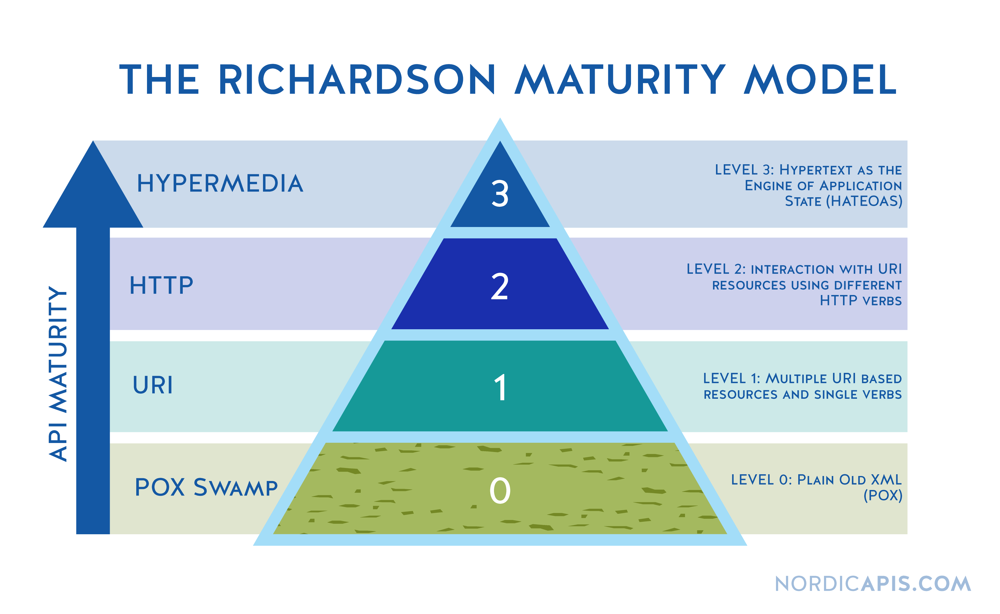

**Nivel 0: The Swamp of POX (Plain Old XML)**

- Un endpoint, un método HTTP (usualmente POST)
- Toda la información en el payload
- No aprovecha HTTP como protocolo

```http
POST /appointmentService HTTP/1.1
Content-Type: application/xml

<bookAppointment>
  <doctor>mjones</doctor>
  <patient>jsmith</patient>
  <date>2024-01-15</date>
</bookAppointment>
```

**Nivel 1: Resources**

- Múltiples URIs, pero solo un método HTTP
- Cada recurso tiene su propia URI
- Mejora organización pero no semántica HTTP

```http
POST /doctors/mjones HTTP/1.1
POST /patients/jsmith HTTP/1.1
POST /appointments HTTP/1.1
```

**Nivel 2: HTTP Verbs**

- Uso apropiado de métodos HTTP
- Códigos de estado HTTP significativos
- Semántica HTTP correcta

```http
GET /doctors/mjones HTTP/1.1        # Obtener información
POST /appointments HTTP/1.1         # Crear cita
PUT /appointments/123 HTTP/1.1      # Actualizar cita
DELETE /appointments/123 HTTP/1.1   # Cancelar cita
```

**Nivel 3: Hypermedia Controls (HATEOAS)**

- Links dinámicos que guían al cliente
- API autodescriptiva
- Desacoplamiento entre cliente y servidor

```json
{
  "appointment": {
    "id": 123,
    "doctor": "mjones",
    "patient": "jsmith",
    "date": "2024-01-15",
    "status": "scheduled"
  },
  "links": {
    "self": "/appointments/123",
    "cancel": "/appointments/123/cancel",
    "reschedule": "/appointments/123/reschedule"
  }
}
```

**Ejemplo Completo: API de productos (Nivel 2-3)**

```yaml
# Nivel 2: Métodos HTTP correctos

GET    /products           # Lista productos
GET    /products/{id}      # Obtiene producto específico
POST   /products           # Crea nuevo producto
PUT    /products/{id}      # Actualiza producto completo
PATCH  /products/{id}      # Actualiza producto parcial
DELETE /products/{id}      # Elimina producto

# Códigos de estado apropiados

200 OK                     # Operación exitosa
201 Created                # Recurso creado
204 No Content             # Eliminación exitosa
400 Bad Request            # Error en datos enviados
404 Not Found              # Recurso no encontrado
409 Conflict               # Conflicto (ej. duplicado)
```

```json
    // Nivel 3: HATEOAS
{
  "id": "prod-123",
  "name": "Laptop Gaming",
  "price": 1299.99,
  "inventory": 5,
  "_links": {
    "self": { "href": "/products/prod-123" },
    "category": { "href": "/categories/electronics" },
    "reviews": { "href": "/products/prod-123/reviews" },
    "add-to-cart": {
      "href": "/cart/items",
      "method": "POST",
      "enabled": true
    }
  }
}
```

### 2.2.2 OpenAPI/Swagger para definición de contratos

**¿Qué es OpenAPI Specification (OAS)?**
> Un estándar para describir APIs REST de manera que tanto humanos como máquinas puedan entender los servicios sin acceso al código fuente.

**Beneficios de OpenAPI:**

- **Documentación automática** y siempre actualizada
- **Generación de código** cliente y servidor
- **Testing automatizado** basado en especificación
- **Mock servers** para desarrollo paralelo
- **Validación de contratos** en CI/CD

**Estructura Básica de OpenAPI 3.0**

```yaml
openapi: 3.0.3
info:
  title: Product Catalog API
  description: API para gestión de catálogo de productos
  version: 1.0.0
  contact:
    name: Team Catálogo
    email: catalogo@empresa.com

servers:
  - url: https://api.empresa.com/v1
    description: Producción
  - url: https://api-staging.empresa.com/v1
    description: Staging

paths:
  /products:
    get:
      summary: Lista productos
      description: Obtiene lista paginada de productos
      parameters:
        - name: page
          in: query
          schema:
            type: integer
            default: 1
        - name: limit
          in: query
          schema:
            type: integer
            default: 20
            maximum: 100
      responses:
        '200':
          description: Lista de productos
          content:
            application/json:
              schema:
                $ref: '#/components/schemas/ProductList'
        '400':
          description: Parámetros inválidos
          content:
            application/json:
              schema:
                $ref: '#/components/schemas/Error'

    post:
      summary: Crea nuevo producto
      requestBody:
        required: true
        content:
          application/json:
            schema:
              $ref: '#/components/schemas/ProductCreate'
      responses:
        '201':
          description: Producto creado exitosamente
          content:
            application/json:
              schema:
                $ref: '#/components/schemas/Product'
        '400':
          description: Datos inválidos
        '409':
          description: Producto ya existe

  /products/{productId}:
    parameters:
      - name: productId
        in: path
        required: true
        schema:
          type: string

    get:
      summary: Obtiene producto por ID
      responses:
        '200':
          description: Producto encontrado
          content:
            application/json:
              schema:
                $ref: '#/components/schemas/Product'
        '404':
          description: Producto no encontrado

components:
  schemas:
    Product:
      type: object
      required:
        - id
        - name
        - price
      properties:
        id:
          type: string
          example: "prod-123"
        name:
          type: string
          example: "Laptop Gaming"
        description:
          type: string
          example: "Laptop para gaming de alta gama"
        price:
          type: number
          format: decimal
          minimum: 0
          example: 1299.99
        category:
          $ref: '#/components/schemas/Category'
        inventory:
          type: integer
          minimum: 0
          example: 15
        createdAt:
          type: string
          format: date-time
        updatedAt:
          type: string
          format: date-time

    ProductCreate:
      type: object
      required:
        - name
        - price
        - categoryId
      properties:
        name:
          type: string
          minLength: 1
          maxLength: 200
        description:
          type: string
          maxLength: 1000
        price:
          type: number
          format: decimal
          minimum: 0
        categoryId:
          type: string

    Category:
      type: object
      properties:
        id:
          type: string
        name:
          type: string
        description:
          type: string

    ProductList:
      type: object
      properties:
        data:
          type: array
          items:
            $ref: '#/components/schemas/Product'
        pagination:
          $ref: '#/components/schemas/Pagination'

    Pagination:
      type: object
      properties:
        page:
          type: integer
        limit:
          type: integer
        total:
          type: integer
        totalPages:
          type: integer

    Error:
      type: object
      required:
        - code
        - message
      properties:
        code:
          type: string
          example: "INVALID_PARAMETER"
        message:
          type: string
          example: "El parámetro 'limit' debe ser menor a 100"
        details:
          type: object
```

**Versionado de APIs**

```yaml
# Estrategia 1: Versionado en URL

servers:
  - url: https://api.empresa.com/v1
  - url: https://api.empresa.com/v2

# Estrategia 2: Versionado en Header

components:
  parameters:
    ApiVersion:
      name: API-Version
      in: header
      schema:
        type: string
        enum: ['1.0', '2.0']

# Estrategia 3: Versionado en Content-Type

content:
  application/vnd.empresa.product.v1+json:
    schema:
      $ref: '#/components/schemas/ProductV1'
  application/vnd.empresa.product.v2+json:
    schema:
      $ref: '#/components/schemas/ProductV2'
```

---

## 2.3 Patrones arquitectónicos de despliegue e integración

### 2.3.1 API Gateway y patrones de entrada

**¿Qué es un API Gateway?**
> Un servidor que actúa como punto de entrada único para múltiples microservicios, proporcionando funcionalidades transversales como enrutamiento, autenticación, rate limiting y monitoreo.

**Problemas que resuelve:**

- **Múltiples endpoints:** Clientes no necesitan conocer ubicaciones específicas
- **Funcionalidad transversal:** Autenticación, logging, rate limiting centralizado
- **Versionado de APIs:** Gestión centralizada de versiones
- **Transformación:** Adaptación de formatos entre cliente y servicios

**Responsabilidades del API Gateway:**

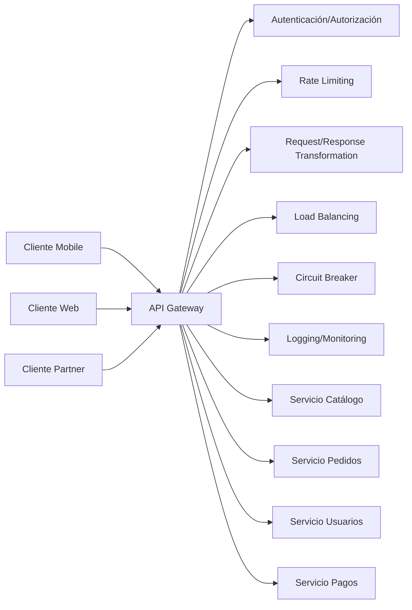

> **🔍 Explicación del diagrama:**  
> El **API Gateway** centraliza todas las interacciones entre clientes externos (Mobile, Web, Partner) y microservicios internos. Actúa como un **proxy inteligente** que aplica funcionalidades transversales: autenticación, rate limiting, transformaciones, Load Balancing, Circuit Breakers y monitoreo. Esto permite que los microservicios se enfoquen en su lógica de negocio mientras el gateway maneja aspectos operacionales comunes.

**Ejemplo: Configuración API Gateway (Kong/Zuul style)**

```yaml
# Gateway Routes Configuration

routes:
  - name: catalog-service
    path: /api/v1/products/**
    service: catalog-service
    plugins:
      - rate-limiting:
          minute: 100
      - jwt-auth: {}

  - name: orders-service
    path: /api/v1/orders/**
    service: orders-service
    plugins:
      - oauth2: {}
      - request-transformer:
          add_headers:
            - "X-User-ID: {{jwt.sub}}"

  - name: payments-service
    path: /api/v1/payments/**
    service: payments-service
    plugins:
      - ip-restriction:
          allow: ["10.0.0.0/8"]
      - request-size-limiting:
          allowed_payload_size: 1024

services:
  - name: catalog-service
    url: http://catalog.internal:8080
    load_balancing: round_robin
    health_checks:
      active:
        http_path: /health
        healthy_threshold: 2

  - name: orders-service
    url: http://orders.internal:8080
    retries: 3
    timeout: 5000ms
```

**Patrón Backend for Frontend (BFF)**

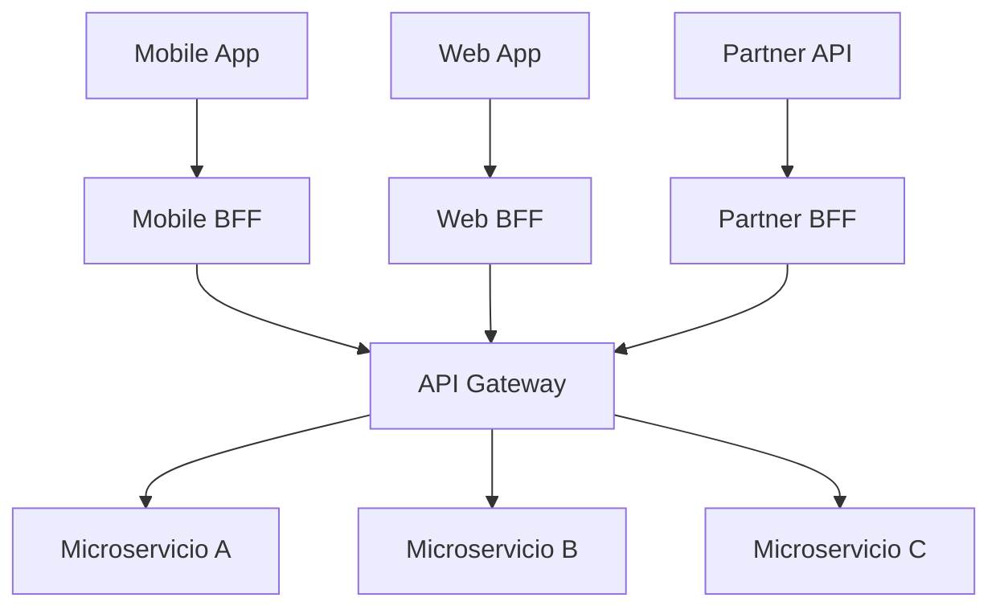

> **🔍 Explicación del diagrama:**  
> El patrón **Backend for Frontend (BFF)** crea APIs especializadas para cada tipo de cliente. **Mobile BFF** optimiza respuestas para pantallas pequeñas y conectividad limitada, **Web BFF** proporciona datos ricos para interfaces web, y **Partner BFF** expone funcionalidades específicas para integraciones B2B. Cada BFF actúa como un adaptador que transforma y agrega datos de múltiples microservicios según las necesidades específicas de cada frontend.

### 2.3.2 Saga pattern para transacciones distribuidas

**El problema de las transacciones distribuidas**

- ACID no es práctico en sistemas distribuidos
- Two-Phase Commit (2PC) es frágil y bloquea recursos
- Necesidad de consistencia eventual

**¿Qué es el patrón Saga?**
> Un patrón para gestionar transacciones de larga duración que abarca múltiples servicios mediante una secuencia de transacciones locales, cada una con su compensación correspondiente.

**Tipos de Saga:**

#### 1. Choreography-Based Saga

- Cada servicio sabe qué hacer después de su transacción
- No hay coordinador central
- Comunicación mediante eventos

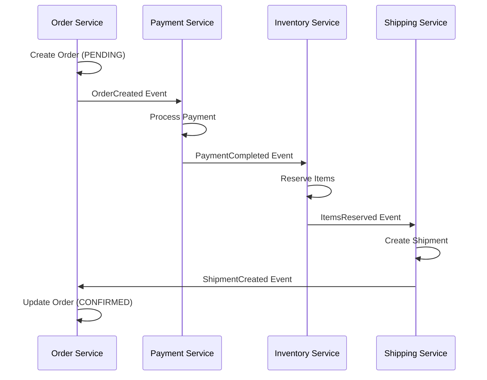

> **🔍 Explicación del diagrama:**  
> Esta **Saga Coreografiada** maneja una transacción distribuida de pedido e-commerce sin coordinador central. Cada servicio reacciona a eventos y produce el siguiente: Order Service crea pedido → Payment Service procesa pago → Inventory Service reserva items → Shipping Service crea envío. Cada servicio mantiene su estado local y publica eventos para el siguiente paso. Si algún paso falla, debe haber eventos de compensación para revertir cambios anteriores.

#### 2. Orchestration-Based Saga

- Coordinador central (Orchestrator) controla el flujo
- Servicios solo responden a comandos del orchestrator
- Estado centralizado de la saga

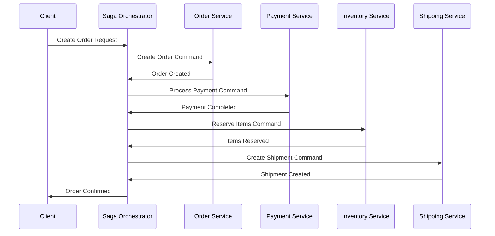

> **🔍 Explicación del diagrama:**  
> Esta **Saga Orquestada** usa un **Saga Orchestrator** centralizado que coordina toda la transacción distribuida. El cliente envía una sola petición al orquestador, quien ejecuta cada paso secuencialmente: crear orden → procesar pago → reservar inventario → crear envío. A diferencia de la coreografía, aquí los servicios no se comunican directamente entre sí, sino que responden únicamente al orquestador, quien mantiene el estado completo de la transacción.

### 2.3.3 CQRS y Event Sourcing

#### Command Query Responsibility Segregation (CQRS)

**Principio Básico:**
> Separar las operaciones de lectura (queries) de las operaciones de escritura (commands) usando diferentes modelos.

**Motivación:**

- Diferentes patrones de acceso (lectura vs escritura)
- Optimización específica para cada tipo de operación
- Escalado independiente
- Modelos de datos especializados

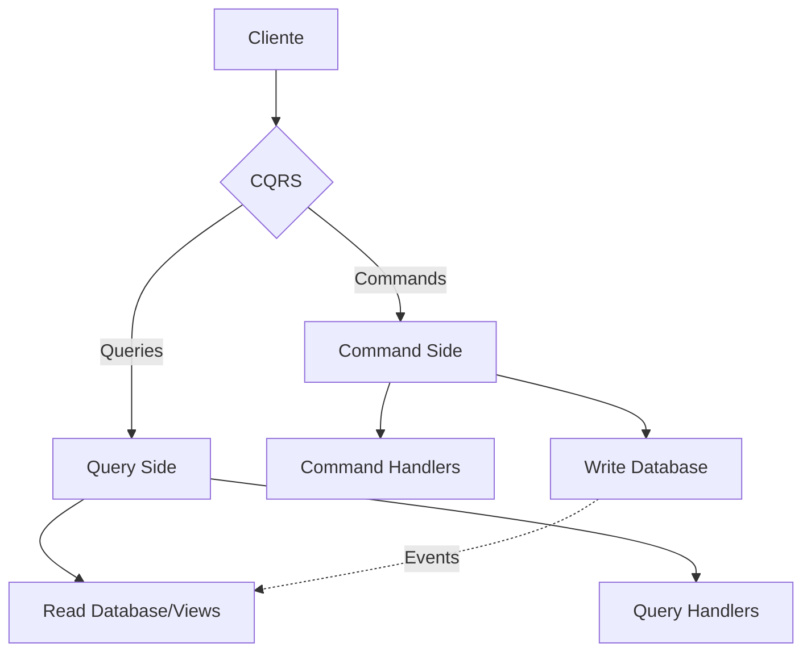

> **🔍 Explicación del diagrama:**  
> **CQRS (Command Query Responsibility Segregation)** separa físicamente las operaciones de escritura y lectura. El **Command Side** maneja operaciones que modifican estado (crear, actualizar, eliminar) usando Command Handlers y una Write Database optimizada para transacciones. El **Query Side** maneja consultas usando Query Handlers y Read Database/Views optimizadas para lecturas complejas. Los eventos (línea punteada) sincronizan ambos lados, permitiendo eventual consistency.


#### Event Sourcing

**Concepto:**
> Almacenar todos los cambios de estado como una secuencia de eventos inmutables, en lugar de almacenar solo el estado actual.

**Beneficios:**

- **Auditabilidad completa:** Historial completo de cambios
- **Reproducibilidad:** Reconstruir estado en cualquier momento
- **Debugging:** Investigar cómo se llegó a un estado específico
- **Analytics:** Análisis de patrones de comportamiento

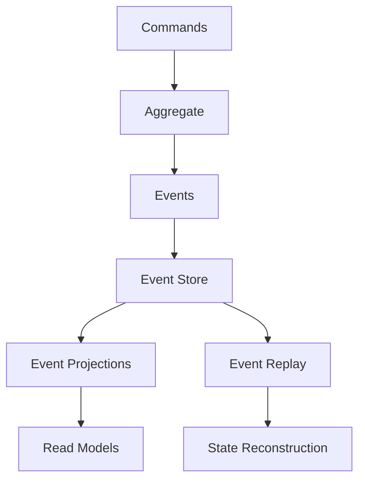

> **🔍 Explicación del diagrama:**  
> **Event Sourcing** almacena el estado como una secuencia de eventos inmutables. Los **Commands** modifican **Aggregates** que generan **Events**, almacenados permanentemente en el **Event Store**. Los **Event Projections** procesan estos eventos para crear **Read Models** optimizados para consultas. El **Event Replay** permite reconstruir el estado de cualquier aggregate en cualquier momento histórico, proporcionando auditabilidad completa y capacidad de debugging temporal.


---

## 🎓 Competencias específicas desarrolladas

1. **Aplicar Domain-Driven Design (DDD)** para definir bounded contexts y modelar dominios complejos
2. **Diseñar APIs RESTful** siguiendo el Richardson Maturity Model y especificar contratos con OpenAPI
3. **Identificar patrones arquitectónicos** apropiados: API Gateway, Saga, CQRS, Event Sourcing
4. **Modelar comunicación** entre microservicios usando context mapping y published languages
5. **Preparar diseño base** para sistemas distribuidos orientados a eventos

---

## 📖 Referencias y Lecturas

### Lecturas obligatorias

1. Vernon, V. (2016). "Domain-driven design distilled" - Capítulos 1-4
2. Richardson, C. (2018). "Microservices Patterns" - Capítulos 2-4
3. OpenAPI Specification 3.1.0 - Documentación oficial

### Lecturas complementarias

1. Evans, E. (2003). "Domain-driven design" - Capítulos 1-3
2. Fowler, M. "Richardson Maturity Model" - martinfowler.com
3. Kleppmann, M. (2017). "Designing Data-Intensive Applications" - Capítulo 11

### Recursos técnicos

- Swagger/OpenAPI Editor: <https://editor.swagger.io/>
- DDD Reference: <https://www.domainlanguage.com/ddd/reference/>
- Microservices Patterns: <https://microservices.io/patterns/>

---

## 📍 Context mapping - proyecto final

### Context mapping del proyecto

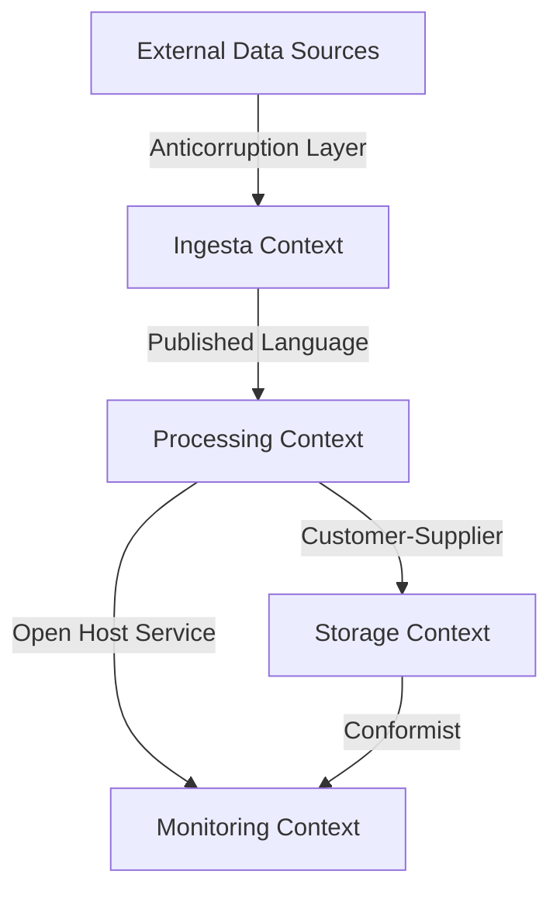

> **🔍 Explicación del diagrama:**  
> Este **Context Map** muestra las relaciones entre bounded contexts en un sistema de procesamiento de datos. **Ingesta Context** publica un lenguaje común hacia **Processing Context**, que tiene una relación Customer-Supplier con **Storage Context**. El **Anticorruption Layer** protege al contexto de ingesta de fuentes externas, mientras **Monitoring Context** recibe información mediante Open Host Service y conformist pattern para observabilidad.

---

**Siguiente:** [Actividades de aprendizaje →](../03-actividades/README.md)
