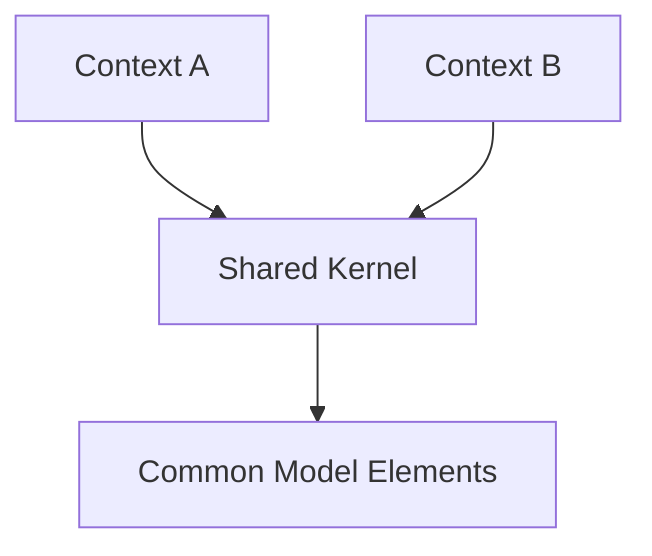
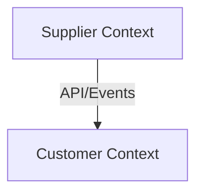
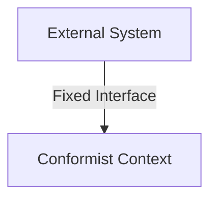
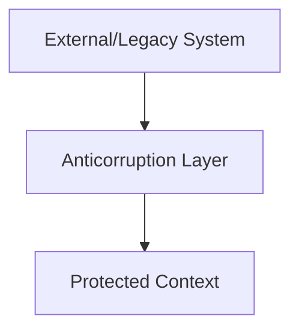
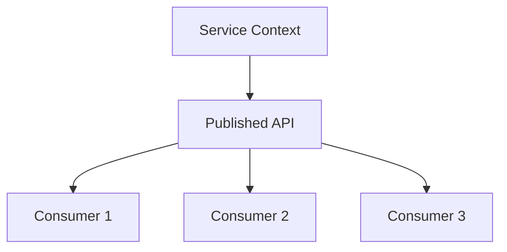
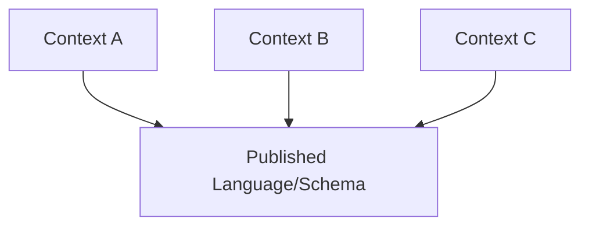

# 📐 Context Mapping Patterns

## 📚 **Introducción**

Los **Context Mapping Patterns** son patrones estratégicos de Domain-Driven Design (DDD) que definen cómo diferentes **Bounded Contexts** se relacionan e integran entre sí. Estos patrones ayudan a gestionar las dependencias, comunicación y evolución de sistemas distribuidos como microservicios.

### **¿Por qué son importantes?**
- **Gestión de complejidad:** Definen estrategias claras para la integración
- **Evolución independiente:** Permiten que diferentes contextos evolucionen sin romperse
- **Comunicación de equipos:** Establecen expectativas claras entre equipos de desarrollo
- **Arquitectura sostenible:** Reducen el acoplamiento no deseado

---

## 📖 **Glosario de términos**

- **Bounded Context:** Límite conceptual donde un modelo de dominio específico es válido y consistente
- **Upstream/Downstream:** Relación direccional donde upstream influye en downstream (río arriba/río abajo)
- **Context Mapping:** Proceso de identificar y documentar las relaciones entre Bounded Contexts
- **Domain Model:** Representación abstracta de un dominio de negocio específico
- **API Contract:** Acuerdo formal que define cómo dos sistemas se comunican
- **Schema:** Estructura formal que define el formato de datos o mensajes
- **Legacy System:** Sistema heredado, usualmente más antiguo y difícil de modificar

---

## Context Mapping Patterns Detailed

## 1. Shared Kernel



> **🔍 Explicación del diagrama:**  
> El **Shared Kernel** representa código y modelo compartido entre dos Bounded Contexts. Context A y Context B dependen de elementos comunes del modelo. Aunque reduce duplicación, crea acoplamiento ya que cambios en el kernel afectan ambos contextos. Se recomienda para conceptos muy estables y equipos que pueden coordinarse estrechamente.

- **Cuándo usar:** Conceptos pequeños, estables y compartidos
- **Riesgo:** Acoplamiento y sobrecarga de coordinación

### **💡 Ejemplo práctico:**
**Sistema de e-commerce:** Los contextos de "Catálogo" y "Inventario" comparten un **Shared Kernel** con las entidades básicas `Producto` y `SKU` porque ambos necesitan la misma definición fundamental del producto.

```java
// Shared Kernel: Common Product Model
public class Product {
    private ProductId id;
    private String name;
    private SKU sku;
    // Modelo compartido entre contextos
}
```

## 2. Customer-Supplier Development Teams



> **🔍 Explicación del diagrama:**  
> La relación **Customer-Supplier** establece una jerarquía clara donde el **Supplier Context** provee servicios al **Customer Context**. El supplier tiene la responsabilidad de satisfacer las necesidades del customer y mantener APIs estables. Esta relación funciona bien cuando hay comunicación directa entre equipos y el supplier puede priorizar las necesidades del downstream.

- **Cuándo usar:** Relación clara upstream/downstream
- **Beneficio:** El proveedor prioriza las necesidades del cliente

### **💡 Ejemplo práctico:**
**Sistema bancario:** El contexto "Core Banking" (supplier) provee APIs de cuentas y transacciones al contexto "Mobile Banking" (customer). El equipo de Core Banking colabora activamente con Mobile Banking para asegurar que las APIs satisfagan sus necesidades.

```yaml
# API diseñada colaborativamente
/api/accounts/{id}/balance:
  get:
    # Endpoint solicitado específicamente por Mobile Banking
    response: { balance, currency, lastUpdate }
```

## 3. Conformist



> **🔍 Explicación del diagrama:**  
> El patrón **Conformist** se usa cuando no tienes influencia sobre el sistema upstream y debes adaptarte completamente a su modelo. El **Conformist Context** adopta el modelo del **External System** tal como está, sin transformaciones. Es la opción más simple pero puede crear acoplamiento fuerte al modelo externo.

- **Cuándo usar:** Sin influencia sobre el sistema upstream
- **Estrategia:** Adoptar el modelo externo tal como está

### **💡 Ejemplo práctico:**
**Integración con API de pago externa:** Una aplicación se integra con la API de **Stripe** o **PayPal**. No puede cambiar cómo funcionan estas APIs, por lo que debe adoptar completamente su modelo de datos y flujos de trabajo.

```java
// Modelo conformista que adopta estructura de Stripe
public class StripePayment {
    private String id;           // Formato de Stripe
    private Long amount;         // En centavos (regla de Stripe)
    private String currency;     // ISO codes (como define Stripe)
}
```

## 4. Anticorruption Layer



> **🔍 Explicación del diagrama:**  
> El **Anticorruption Layer (ACL)** actúa como traductor entre el **External/Legacy System** y el **Protected Context**. Protege al contexto interno de cambios en sistemas externos y permite mantener un modelo de dominio limpio. El ACL implementa patrones Translator, Adapter y Facade para transformar datos entre diferentes modelos.

- **Cuándo usar:** Necesidad de proteger el modelo de dominio de influencias externas
- **Implementación:** Patrones Translator, Adapter y Facade

### **💡 Ejemplo práctico:**
**Migración de sistema legacy:** Una aplicación moderna necesita datos de un sistema mainframe de los años 90. El **ACL** traduce entre el modelo moderno (objetos JSON) y el formato legacy (registros de ancho fijo).

```java
// ACL que protege el modelo moderno
@Component
public class LegacyCustomerAdapter {
    
    public Customer translate(LegacyCustomerRecord legacy) {
        return Customer.builder()
            .id(new CustomerId(legacy.getCustId()))
            .name(legacy.getFullName().trim())  // Limpiar espacios
            .email(parseEmail(legacy.getContactInfo()))
            .build();
    }
}
```

## 5. Open Host Service



> **🔍 Explicación del diagrama:**  
> El patrón **Open Host Service** expone una API pública bien documentada y versionada para múltiples consumidores. El **Service Context** publica una **Published API** que sirve a varios **Consumers**. Esto permite que muchos sistemas accedan al servicio de manera estandarizada, reduciendo el acoplamiento punto a punto y facilitando la evolución independiente.

- **Cuándo usar:** Múltiples consumidores necesitan acceso
- **Estrategia:** API pública bien documentada y versionada

### **💡 Ejemplo práctico:**
**API de usuarios para toda la empresa:** El contexto "User Management" expone una API REST bien documentada que usan múltiples aplicaciones: CRM, E-commerce, Analytics, HR System, etc.

```yaml
# OpenAPI bien documentada y versionada
openapi: 3.0.0
info:
  title: User Management API
  version: v2.1.0
paths:
  /users/{id}:
    get:
      summary: "Obtener usuario por ID"
      parameters:
        - name: id
          schema: { type: string, format: uuid }
      responses:
        200:
          description: "Usuario encontrado"
```

## 6. Published Language



> **🔍 Explicación del diagrama:**  
> El patrón **Published Language** establece un esquema o formato común que múltiples contextos pueden usar para comunicarse. Context A, B y C todos dependen del **Published Language/Schema** centralizado. Es útil cuando múltiples equipos necesitan un formato estándar de comunicación, como esquemas de eventos, formatos de mensajes o APIs públicas bien documentadas.

- **Cuándo usar:** Múltiples contextos necesitan formato común de comunicación
- **Ejemplos:** Esquemas de eventos, formatos de mensajes, esquemas XML

### **💡 Ejemplo práctico:**
**Eventos de dominio en e-commerce:** Se define un **Published Language** para eventos que múltiples contextos necesitan entender: `OrderPlaced`, `PaymentProcessed`, `ShipmentStarted`.

```json
{
  "eventType": "OrderPlaced",
  "version": "1.0",
  "timestamp": "2024-02-11T10:30:00Z",
  "payload": {
    "orderId": "ord_123456",
    "customerId": "cust_789",
    "items": [...],
    "totalAmount": 299.99
  }
}
```

**Consumidores del evento:**
- **Inventario:** Reduce stock
- **Fulfillment:** Inicia preparación
- **Analytics:** Registra métricas
- **Customer Service:** Actualiza historial

---

## 🎯 **Guía de selección de patrones**

### **Matriz de decisión:**

| **Situación** | **Patrón recomendado** | **Razón** |
|---------------|------------------------|-----------|
| Pequeño modelo compartido entre equipos cercanos | **Shared Kernel** | Reduce duplicación, coordinación factible |
| Proveedor puede adaptarse a necesidades del cliente | **Customer-Supplier** | Colaboración directa, APIs a medida |
| Sistema externo no modificable | **Conformist** | Mínima resistencia, adoptar modelo externo |
| Sistema legacy que contamina modelo limpio | **Anticorruption Layer** | Proteger dominio interno, traducción controlada |
| Muchos consumidores diversos | **Open Host Service** | API estándar, reduce acoplamiento múltiple |
| Múltiples contextos, formato común | **Published Language** | Comunicación estandarizada, interoperabilidad |

### **⚠️ Antipatrones comunes:**

1. **Shared Kernel muy grande** → Difícil coordinación, mejor dividir contextos
2. **ACL para sistemas simples** → Overengineering, considerar Conformist
3. **Customer-Supplier sin comunicación** → Se convierte en Conformist accidentalmente
4. **Published Language por contexto** → Perdemos el beneficio de estandarización

---

*Los Context Mapping Patterns son la base para diseñar integraciones sostenibles entre microservicios. La elección correcta del patrón puede marcar la diferencia entre un sistema flexible y uno rígido y frágil.*
