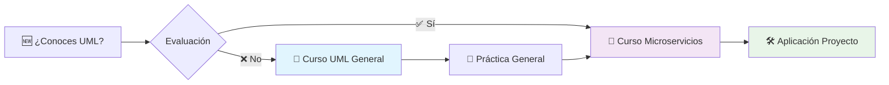
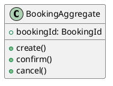

# Recursos Complementarios - Unidad 2

## 📐 Cursos UML Express

### [Curso UML Express: Guía Completa de Diagramas](curso-express-uml-general.md)

**🎯 Objetivo:** Guía condensada de **todos los diagramas UML** con criterios claros para saber cuándo usar cada uno.

**📊 Contenido completo:**
- **🏗️ Diagramas Estructurales:** Clases, Objetos, Componentes, Despliegue, Paquetes
- **🔄 Diagramas de Comportamiento:** Casos de Uso, Actividades, Estados  
- **💬 Diagramas de Interacción:** Secuencia, Comunicación, Temporización
- **🎯 Guía de Decisión:** Qué diagrama usar según propósito y fase del proyecto
- **📊 Matriz de Uso:** Recomendaciones por fase (Análisis → Despliegue)

**👥 Para quién:**
- Estudiantes que **no conocen UML** → Base sólida completa
- Estudiantes que **ya conocen UML** → Referencia rápida y actualización

### [Curso UML Express para Microservicios y Contenedores](curso-express-uml-microservicios.md)

**🎯 Objetivo:** Diagramas UML esenciales específicamente para microservicios containerizados.

**🔗 Contenido especializado:**
- 📋 **Casos de Uso:** Definir fronteras de microservicios desde Bounded Contexts
- 🏗️ **Clases de Dominio:** Del DDD al código (Aggregates → DTOs → APIs)
- 🔄 **Diagramas de Secuencia:** Patrones de comunicación (Saga, API Gateway, CQRS)
- 🚀 **Despliegue:** Arquitectura completa en Docker/Kubernetes
- 🔗 **Conexión OpenAPI:** De UML a especificaciones de API

**👥 Para quién:**
- Proyectos de **microservicios y contenedores**
- **Arquitecturas distribuidas** y cloud-native

## 🎯 Estrategia de uso recomendada

### **📚 Flujo de aprendizaje**

### **🎯 Por tipo de proyecto**

| **Contexto** | **Curso Recomendado** | **Razón** |
|-------------|---------------------|-----------|
| Monolitos, Librerías | 📐 **UML General** | Cobertura completa, todos los diagramas |
| Microservicios, Cloud | 🚀 **UML Microservicios** | Enfoque específico, patrones distribuidos |
| Sistemas Híbridos | 📐 **Ambos** | Flexibilidad según componente |
| Refactoring Legacy | 📐 **General** → 🚀 **Microservicios** | Evolución arquitectónica |

### **📋 Como material de apoyo**

**ANTES de las actividades de modelado:**
- 📖 **Consulta el curso apropiado** según tu proyecto
- 🎯 **Identifica diagramas necesarios** usando la guía de decisión
- 🛠️ **Prepara plantillas** en Mermaid para mejor compatibilidad

---

## 🛠️ Recursos de Desarrollo Práctico

### [Proceso de desarrollo completo](proceso-desarrollo.md)

**🎯 Objetivo:** Guía paso a paso del proceso completo desde análisis hasta despliegue.

**📋 Fases cubiertas:**
- **📋 Análisis y Diseño:** Requerimientos funcionales y no funcionales
- **🛣️ Diseño de API:** Modelado de datos y creación de contratos OAS
- **🔧 Desarrollo:** Generación de código e implementación
- **🧪 Testing:** Pruebas unitarias, integración y carga
- **🚀 Despliegue:** Contenedores, CI/CD y monitoreo

**👥 Para quién:** Estudiantes que necesitan una guía completa del flujo de trabajo

### [Convenciones de nomenclatura: API vs DB vs URL](diseno-api-db-url.md)

**🎯 Objetivo:** Resolver el debate común sobre convenciones de nomenclatura en diferentes capas.

**📋 Contenido:**
- **🔤 Schema OAS:** camelCase para JSON (firstName, productOrder)
- **🌐 URLs REST:** kebab-case para endpoints (/user-orders, /product-categories)  
- **🗃️ Base de Datos:** snake_case para tablas y columnas (user_id, created_at)
- **🔄 Traducción:** Cómo mapear entre convenciones

**💡 Enfoque:** Desacoplamiento claro entre capas con traducción automática

### [Guía de nomenclatura para campos de Base de Datos](nombrado-campos-db.md)

**🎯 Objetivo:** Best practices específicas para naming en bases de datos.

**📋 Estilos cubiertos:**
- **🐍 snake_case:** Recomendado general (PostgreSQL, MySQL)
- **🐪 camelCase:** Frameworks como Entity Framework
- **🔠 PascalCase:** Sistemas legacy y SQL Server
- **📏 Criterios de decisión** por motor de BD y framework

**⚖️ Recomendaciones:** Por tipo de proyecto y stack tecnológico

---

## �📚 Material de referencia especializado

### Libros fundamentales DDD

#### 📖 Lectura obligatoria

1. **Vernon, V. (2016). "Domain-Driven Design Distilled"**
   - Capítulos 1-4: Conceptos fundamentales y Bounded Contexts
   - **Por qué es esencial:** Versión condensada y práctica del DDD original
   - **Disponible:** Biblioteca digital ITQ, O'Reilly Safari

2. **Richardson, C. (2018). "Microservices Patterns"**
   - Capítulos 2-4: Decomposición y comunicación entre servicios
   - **Enfoque:** Patrones específicos para arquitecturas de microservicios

#### 📚 Referencia avanzada

1. **Evans, E. (2003). "Domain-Driven Design: Tackling Complexity"**
   - Texto original y fundamental
   - **Uso:** Consulta para conceptos profundos

2. **Kleppmann, M. (2017). "Designing Data-Intensive Applications"**
   - Capítulo 11: Stream Processing and Event-driven architecture
   - **Perspectiva:** Arquitectura de datos para microservicios

---

## 🌐 Recursos Web especializados

### Domain-Driven Design

#### DDD Community Portal

- **URL:** [https://www.domainlanguage.com/ddd/](https://www.domainlanguage.com/ddd/)
- **Contenido:**
  - DDD Reference by Eric Evans
  - Sample implementations y patterns
  - Community discussions y best practices

#### EventStorming Resources

- **URL:** [https://www.eventstorming.com/](https://www.eventstorming.com/)
- **Creador:** Alberto Brandolini
- **Contenido:**
  - EventStorming methodology complete guide
  - Remote facilitation techniques
  - Tools y templates para workshops

#### Context Mapping Patterns

- **URL:** [https://github.com/ddd-crew/context-mapping](https://github.com/ddd-crew/context-mapping)
- **Contenido:**
  - Visual patterns para context relationships
  - Context Mapping Canvas
  - Team collaboration tools

### API Design y OpenAPI

#### OpenAPI Initiative

- **URL:** [https://spec.openapis.org/oas/v3.1.0](https://spec.openapis.org/oas/v3.1.0)
- **Contenido oficial:**
  - Specification completa con ejemplos
  - Schema definitions y validation rules
  - Migration guides entre versiones

#### REST API Design Guidelines

- **Microsoft REST API Guidelines:** https://github.com/Microsoft/api-guidelines
- **Google API Design Guide:** https://cloud.google.com/apis/design
- **Zalando RESTful API Guidelines:** https://opensource.zalando.com/restful-api-guidelines/

#### Richardson Maturity Model

- **Martin Fowler Blog:** [https://martinfowler.com/articles/richardsonMaturityModel.html](https://martinfowler.com/articles/richardsonMaturityModel.html)
- **Interactive Examples:** https://restfulapi.net/richardson-maturity-model/

---

## 🛠️ Herramientas de desarrollo

### Modelado y diagramado

#### PlantUML - Diagrams as Code

- **URL:** [https://plantuml.com/](https://plantuml.com/)
- **Uso:** UML diagrams mediante texto
- **Ventajas:** Version control, automation, consistency
- **Integration:** VS Code, GitHub, Confluence

## Lucidchart - Professional Diagramming

- **URL:** [https://www.lucidchart.com/](https://www.lucidchart.com/)
- **Plan educativo:** Descuentos para estudiantes
- **Templates:** DDD, microservices architecture, API design
- **Collaboration:** Real-time editing, comments, version history

### Context Mapper - DDD Modeling Tool

- **URL:** [https://contextmapper.org/](https://contextmapper.org/)
- **Tipo:** Domain-specific language para DDD
- **Features:**
  - Bounded Context definition
  - Context Mapping visualization
  - Code generation desde models

### API Design y Specification

#### Swagger Editor - Online & Desktop

- **Online:** [https://editor.swagger.io/](https://editor.swagger.io/)
- **Desktop:** Electron app para trabajo offline
- **Features:**
  - Real-time validation
  - Interactive documentation
  - Code generation en múltiples lenguajes

#### Insomnia Designer

- **URL:** [https://insomnia.rest/products/designer](https://insomnia.rest/products/designer)
- **Enfoque:** Visual API design
- **Integration:** Testing, mock servers, collaboration

#### Postman API Platform

- **URL:** [https://www.postman.com/](https://www.postman.com/)
- **Capabilities:**
  - API specification editing
  - Mock servers desde OpenAPI
  - Automated testing
  - Team collaboration

### EventStorming Digital Tools

#### Miro - Collaborative Whiteboard

- **URL:** [https://miro.com/](https://miro.com/)
- **Templates:** EventStorming, Context Mapping
- **Features:** Sticky notes, infinite canvas, real-time collaboration
- **Education:** Free plans para estudiantes

#### Mural - Digital Workshop Space

- **URL:** [https://www.mural.co/](https://www.mural.co/)
- **Focus:** Facilitated workshops y design thinking
- **Templates:** DDD workshops, architecture sessions

---

**Siguiente:** [Unidad 3: Implementación con Spring Boot y Quarkus →](../../unidad-3-implementacion/README.md)
