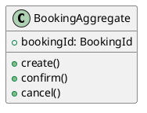
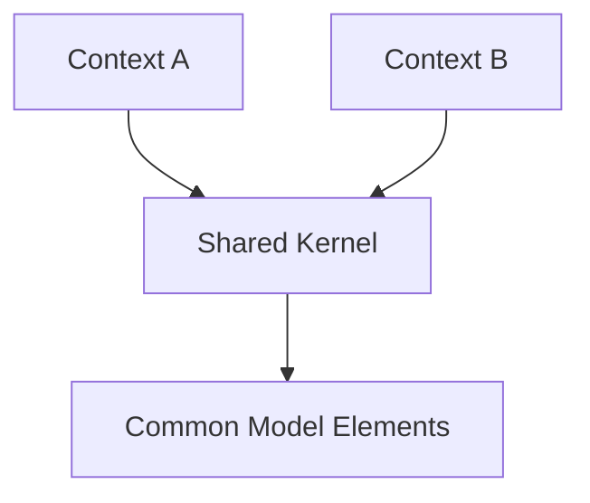
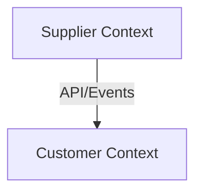
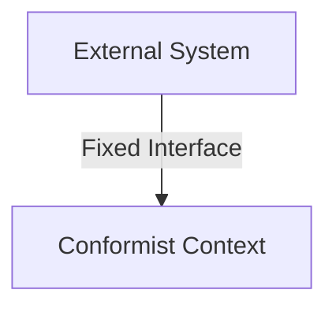
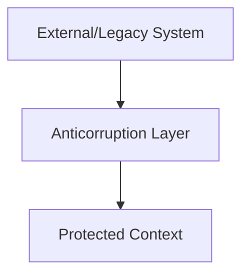
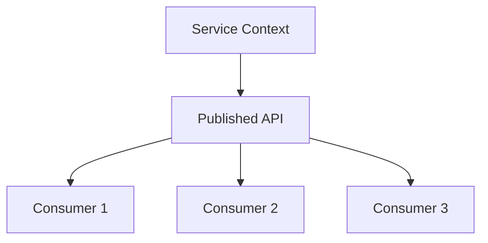
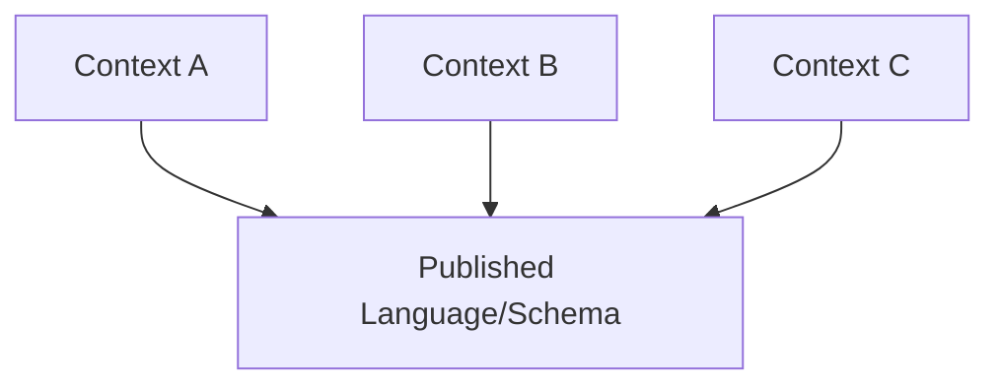

# Recursos Complementarios - Unidad 2

## 📚 Material de referencia especializado

### Libros fundamentales DDD

#### 📖 Lectura Obligatoria

1. **Vernon, V. (2016). "Domain-Driven Design Distilled"**
   - Capítulos 1-4: Conceptos fundamentales y bounded contexts
   - **Por qué es esencial:** Versión condensada y práctica del DDD original
   - **Disponible:** Biblioteca digital ITQ, O'Reilly Safari

2. **Richardson, C. (2018). "Microservices Patterns"**
   - Capítulos 2-4: Decomposición y comunicación entre servicios
   - **Enfoque:** Patrones específicos para arquitecturas de microservicios

#### 📚 Referencia Avanzada

1. **Evans, E. (2003). "Domain-Driven Design: Tackling Complexity"**
   - Texto original y fundamental
   - **Uso:** Consulta para conceptos profundos

2. **Kleppmann, M. (2017). "Designing Data-Intensive Applications"**
   - Capítulo 11: Stream Processing and Event-driven architecture
   - **Perspectiva:** Arquitectura de datos para microservicios

---

## 🌐 Recursos Web Especializados

### Domain-Driven Design

#### DDD community portal

- **URL:** [https://www.domainlanguage.com/ddd/](https://www.domainlanguage.com/ddd/)
- **Contenido:**
  - DDD Reference by Eric Evans
  - Sample implementations y patterns
  - Community discussions y best practices

#### EventStorming resources

- **URL:** [https://www.eventstorming.com/](https://www.eventstorming.com/)
- **Creador:** Alberto Brandolini
- **Contenido:**
  - EventStorming methodology complete guide
  - Remote facilitation techniques
  - Tools y templates para workshops

#### Context mapping patterns

- **URL:** [https://github.com/ddd-crew/context-mapping](https://github.com/ddd-crew/context-mapping)
- **Contenido:**
  - Visual patterns para context relationships
  - Context Mapping Canvas
  - Team collaboration tools

### API Design y OpenAPI

#### OpenAPI initiative

- **URL:** [https://spec.openapis.org/oas/v3.1.0](https://spec.openapis.org/oas/v3.1.0)
- **Contenido oficial:**
  - Specification completa con ejemplos
  - Schema definitions y validation rules
  - Migration guides entre versiones

#### REST API design guidelines

- **Microsoft REST API Guidelines:** https://github.com/Microsoft/api-guidelines
- **Google API Design Guide:** https://cloud.google.com/apis/design
- **Zalando RESTful API Guidelines:** https://opensource.zalando.com/restful-api-guidelines/

#### Richardson Maturity Model

- **Martin Fowler Blog:** [https://martinfowler.com/articles/richardsonMaturityModel.html](https://martinfowler.com/articles/richardsonMaturityModel.html)
- **Interactive Examples:** https://restfulapi.net/richardson-maturity-model/

---

## 🛠️ Herramientas de desarrollo

### Modelado y Diagramado

#### PlantUML - Diagrams as Code

- **URL:** [https://plantuml.com/](https://plantuml.com/)
- **Uso:** UML diagrams mediante texto
- **Ventajas:** Version control, automation, consistency
- **Integration:** VS Code, GitHub, Confluence



## Lucidchart - Professional Diagramming

- **URL:** [https://www.lucidchart.com/](https://www.lucidchart.com/)
- **Plan educativo:** Descuentos para estudiantes
- **Templates:** DDD, microservices architecture, API design
- **Collaboration:** Real-time editing, comments, version history

### Context Mapper - DDD Modeling Tool

- **URL:** [https://contextmapper.org/](https://contextmapper.org/)
- **Tipo:** Domain-specific language para DDD
- **Features:**
  - Bounded context definition
  - Context mapping visualization
  - Code generation desde models

### API Design y Specification

#### Swagger Editor - Online & Desktop

- **Online:** [https://editor.swagger.io/](https://editor.swagger.io/)
- **Desktop:** Electron app para trabajo offline
- **Features:**
  - Real-time validation
  - Interactive documentation
  - Code generation en múltiples lenguajes

#### Insomnia Designer

- **URL:** [https://insomnia.rest/products/designer](https://insomnia.rest/products/designer)
- **Enfoque:** Visual API design
- **Integration:** Testing, mock servers, collaboration

#### Postman API Platform

- **URL:** [https://www.postman.com/](https://www.postman.com/)
- **Capabilities:**
  - API specification editing
  - Mock servers desde OpenAPI
  - Automated testing
  - Team collaboration

### EventStorming Digital Tools

#### Miro - Collaborative Whiteboard

- **URL:** [https://miro.com/](https://miro.com/)
- **Templates:** EventStorming, Context Mapping
- **Features:** Sticky notes, infinite canvas, real-time collaboration
- **Education:** Free plans para estudiantes

#### Mural - Digital Workshop Space

- **URL:** [https://www.mural.co/](https://www.mural.co/)
- **Focus:** Facilitated workshops y design thinking
- **Templates:** DDD workshops, architecture sessions

---

## 📊 Plantillas y Templates

### Bounded Context Canvas

```markdown
# Bounded Context Canvas: [Context Name]

## Name

[Context Name]

## Strategic Classification

- [ ] Core Domain
- [ ] Supporting Domain
- [ ] Generic Domain

## Domain Roles

**Domain Expert:** [Name and contact]
**Technical Lead:** [Name and contact]

## Ubiquitous Language

| Term | Definition | Synonyms |
|------|------------|----------|
| [Term 1] | [Clear definition] | [Alternative terms] |
| [Term 2] | [Clear definition] | [Alternative terms] |

## Scope & Responsibilities

### In Scope

- [Responsibility 1]
- [Responsibility 2]

### Out of Scope

- [What this context does NOT handle]

## Business Model

### Business Rules

- [Key business rule 1]
- [Key business rule 2]

### Metrics & KPIs

- [Success metric 1]
- [Success metric 2]

## Architecture

### Aggregates

- [Aggregate 1]: [Brief description]
- [Aggregate 2]: [Brief description]

### Services

- [Domain Service 1]
- [Application Service 1]

### Events

**Domain Events Produced:**

- [Event 1]
- [Event 2]

**Domain Events Consumed:**

- [Event 1]
- [Event 2]

## Team & Organization

### Team Structure

- **Size:** [Number of people]
- **Skills:** [Required skills]
- **Location:** [Team distribution]

### Dependencies

**Upstream Dependencies:**

- [Context A]: [Type of dependency]

**Downstream Dependencies:**

- [Context B]: [Type of dependency]

## Technical Decisions

### Technology Stack

- **Language:** [Programming language]
- **Framework:** [Framework choice]
- **Database:** [Database type and technology]
- **Message Broker:** [If applicable]

### Integration Patterns

- [Pattern 1]: [Usage context]
- [Pattern 2]: [Usage context]

## Evolution

### Planned Changes

- [Future change 1]
- [Future change 2]

### Risk Assessment

- **High Risk:** [Risk description and mitigation]
- **Medium Risk:** [Risk description and mitigation]
```

### OpenAPI Specification Template

```yaml
# Complete OpenAPI 3.0 Template

openapi: 3.0.3
info:
  title: "[API Name]"
  description: |
    # [API Name]

    Brief description of the API purpose and functionality.

    ## Authentication

    Describe authentication requirements.

    ## Rate Limiting

    Describe rate limiting policies.

  version: "1.0.0"
  contact:
    name: "[Team Name]"
    email: "[team@company.com]"
    url: "[Documentation URL]"
  license:
    name: "MIT"
    url: "https://opensource.org/licenses/MIT"

servers:
  - url: "https://api.company.com/v1"
    description: "Production server"
  - url: "https://api-staging.company.com/v1"
    description: "Staging server"

security:
  - BearerAuth: []

paths:
  # Resource collection
  /[resources]:
    get:
      tags: ["[Resource]"]
      summary: "List [resources]"
      description: "Retrieve paginated list of [resources] with optional filtering"
      parameters:
        - $ref: '#/components/parameters/PageParam'
        - $ref: '#/components/parameters/LimitParam'
        # Add specific filters
      responses:
        '200':
          description: "List of [resources]"
          content:
            application/json:
              schema:
                $ref: '#/components/schemas/[Resource]List'
        '400':
          $ref: '#/components/responses/BadRequest'
        '401':
          $ref: '#/components/responses/Unauthorized'

    post:
      tags: ["[Resource]"]
      summary: "Create new [resource]"
      requestBody:
        required: true
        content:
          application/json:
            schema:
              $ref: '#/components/schemas/[Resource]Create'
      responses:
        '201':
          description: "[Resource] created successfully"
          headers:
            Location:
              description: "URL of created resource"
              schema:
                type: string
          content:
            application/json:
              schema:
                $ref: '#/components/schemas/[Resource]'
        '400':
          $ref: '#/components/responses/BadRequest'

  # Individual resource
  /[resources]/{[resource]Id}:
    parameters:
      - $ref: '#/components/parameters/[Resource]IdParam'

    get:
      tags: ["[Resource]"]
      summary: "Get [resource] by ID"
      responses:
        '200':
          description: "[Resource] found"
          content:
            application/json:
              schema:
                $ref: '#/components/schemas/[Resource]'
        '404':
          $ref: '#/components/responses/NotFound'

components:
  securitySchemes:
    BearerAuth:
      type: http
      scheme: bearer
      bearerFormat: JWT

  parameters:
    PageParam:
      name: page
      in: query
      description: "Page number (1-based)"
      schema:
        type: integer
        minimum: 1
        default: 1

    LimitParam:
      name: limit
      in: query
      description: "Number of items per page"
      schema:
        type: integer
        minimum: 1
        maximum: 100
        default: 20

  responses:
    BadRequest:
      description: "Invalid request data"
      content:
        application/json:
          schema:
            $ref: '#/components/schemas/ValidationError'

    Unauthorized:
      description: "Authentication required"
      content:
        application/json:
          schema:
            $ref: '#/components/schemas/Error'

    NotFound:
      description: "Resource not found"
      content:
        application/json:
          schema:
            $ref: '#/components/schemas/Error'

  schemas:
    # Main resource schema
    [Resource]:
      type: object
      required:
        - id
        - [required_field_1]
        - [required_field_2]
      properties:
        id:
          type: string
          format: uuid
          description: "Unique identifier"
          readOnly: true
        [field_1]:
          type: string
          description: "[Field description]"
          example: "[Example value]"
        createdAt:
          type: string
          format: date-time
          readOnly: true
        updatedAt:
          type: string
          format: date-time
          readOnly: true

    # Error handling schemas
    Error:
      type: object
      required:
        - code
        - message
      properties:
        code:
          type: string
          description: "Error code"
        message:
          type: string
          description: "Human readable error message"
        timestamp:
          type: string
          format: date-time
        traceId:
          type: string
          description: "Request trace ID for debugging"

    ValidationError:
      allOf:
        - $ref: '#/components/schemas/Error'
        - type: object
          properties:
            validationErrors:
              type: array
              items:
                type: object
                properties:
                  field:
                    type: string
                  code:
                    type: string
                  message:
                    type: string
```

---

---

## 📐 Design Patterns Reference

### Context Mapping Patterns Detailed

#### 1. Shared Kernel



> **🔍 Explicación del diagrama:**  
> El **Shared Kernel** representa código y modelo compartido entre dos bounded contexts. Context A y Context B dependen de elementos comunes del modelo. Aunque reduce duplicación, crea acoplamiento ya que cambios en el kernel afectan ambos contextos. Se recomienda para conceptos muy estables y equipos que pueden coordinarse estrechamente.

**Use when:** Small, stable, shared concepts
**Risk:** Coupling and coordination overhead

#### 2. Customer-Supplier Development Teams



> **🔍 Explicación del diagrama:**  
> La relación **Customer-Supplier** establece una jerarquía clara donde el **Supplier Context** provee servicios al **Customer Context**. El supplier tiene la responsabilidad de satisfacer las necesidades del customer y mantener APIs estables. Esta relación funciona bien cuando hay comunicación directa entre equipos y el supplier puede priorizar las necesidades del downstream.

**Use when:** Clear upstream/downstream relationship
**Benefit:** Supplier prioritizes customer needs

#### 3. Conformist



> **🔍 Explicación del diagrama:**  
> El patrón **Conformist** se usa cuando no tienes influencia sobre el sistema upstream y debes adaptarte completamente a su modelo. El **Conformist Context** adopta el modelo del **External System** tal como está, sin transformaciones. Es la opción más simple pero puede crear acoplamiento fuerte al modelo externo.

**Use when:** No influence over upstream system
**Strategy:** Adopt external model as-is

#### 4. Anticorruption Layer



> **🔍 Explicación del diagrama:**  
> El **Anticorruption Layer (ACL)** actúa como traductor entre el **External/Legacy System** y el **Protected Context**. Protege al contexto interno de cambios en sistemas externos y permite mantener un modelo de dominio limpio. El ACL implementa patrones Translator, Adapter y Facade para transformar datos entre diferentes modelos.

**Use when:** Need to protect domain model from external influences
**Implementation:** Translator, Adapter, Facade patterns

#### 5. Open Host Service



> **🔍 Explicación del diagrama:**  
> El patrón **Open Host Service** expone una API pública bien documentada y versionada para múltiples consumidores. El **Service Context** publica una **Published API** que sirve a varios **Consumers**. Esto permite que muchos sistemas accedan al servicio de manera estandarizada, reduciendo el acoplamiento punto a punto y facilitando la evolución independiente.

**Use when:** Multiple consumers need access
**Strategy:** Well-documented, versioned public API

#### 6. Published Language



> **🔍 Explicación del diagrama:**  
> El patrón **Published Language** establece un esquema o formato común que múltiples contextos pueden usar para comunicarse. Context A, B y C todos dependen del **Published Language/Schema** centralizado. Es útil cuando múltiples equipos necesitan un formato estándar de comunicación, como esquemas de eventos, formatos de mensajes o APIs públicas bien documentadas.

**Use when:** Multiple contexts need common communication format
**Examples:** Event schemas, message formats, XML schemas

---

## 🔧 Herramientas de Validación

### DDD Model Validation

#### Checklist de Bounded Context

```markdown
## Bounded Context Validation Checklist

### Cohesion ✓

- [ ] All concepts belong together logically
- [ ] Single team can own and understand the entire context
- [ ] Changes typically affect related concepts together

### Coupling ✓

- [ ] Minimal dependencies on other contexts
- [ ] Clear integration points defined
- [ ] No shared databases between contexts

### Language ✓

- [ ] Ubiquitous language consistently used
- [ ] Terms have specific meaning within context
- [ ] No ambiguous or overloaded terms

### Size ✓

- [ ] Not too small (2-3 classes minimum)
- [ ] Not too large (team can maintain in 2-3 months)
- [ ] Appropriate for microservice implementation

### Business Alignment ✓

- [ ] Maps to business capability or subdomain
- [ ] Clear business value and ownership
- [ ] Independent deployment makes sense
```

### API Design Validation

#### REST Maturity Assessment

```markdown
## Richardson Maturity Model Assessment

### Level 0: Swamp of POX ❌

- [ ] Single URI endpoint
- [ ] Only POST method used
- [ ] All operations in request payload

### Level 1: Resources ⚠️

- [ ] Multiple URIs for different resources
- [ ] Still using single HTTP method
- [ ] Resource identification in URI

### Level 2: HTTP Verbs ✅

- [ ] Proper HTTP methods (GET, POST, PUT, DELETE)
- [ ] Appropriate status codes (200, 201, 400, 404)
- [ ] Resource manipulation through representations

### Level 3: Hypermedia Controls ⭐

- [ ] Links to related resources
- [ ] Available actions discoverable
- [ ] API self-descriptive and explorable
```

### OpenAPI Specification Quality

#### Specification Completeness Checklist

```yaml
# OpenAPI Quality Assessment

✅ Structure:
  - [ ] Valid OpenAPI 3.0+ syntax
  - [ ] Complete info section with contact
  - [ ] Servers defined for different environments

✅ Paths:
  - [ ] All resources have CRUD operations where appropriate
  - [ ] Consistent URI naming conventions
  - [ ] Proper HTTP methods and status codes

✅ Schemas:
  - [ ] All request/response bodies defined
  - [ ] Appropriate data types and formats
  - [ ] Required fields marked correctly
  - [ ] Validation rules included (min, max, pattern)

✅ Documentation:
  - [ ] Clear descriptions for all operations
  - [ ] Examples provided for complex schemas
  - [ ] Error responses documented

✅ Security:
  - [ ] Authentication schemes defined
  - [ ] Security requirements specified per operation
  - [ ] Rate limiting considerations documented
```

---

## 📊 Métricas y KPIs de Diseño

### Context Design Quality Metrics

```markdown
## Bounded Context Health Metrics

### Cohesion Metrics

- **Conceptual Cohesion:** Related concepts / Total concepts
- **Change Cohesion:** Changes affecting single context / Total changes
- **Team Cohesion:** Single team ownership percentage

### Coupling Metrics

- **Afferent Coupling:** Number of incoming dependencies
- **Efferent Coupling:** Number of outgoing dependencies
- **Coupling Factor:** (Afferent + Efferent) / Total contexts

### API Quality Metrics

- **Response Time:** 95th percentile < 200ms
- **Error Rate:** < 1% for 4xx errors, < 0.1% for 5xx errors
- **Documentation Coverage:** All endpoints documented
- **Contract Stability:** Breaking changes per version
```

---

## 🎯 Preparación para Implementación

### Transition to Unit 3

#### Artifacts Ready for Implementation

1. **Bounded Context Models** → Service boundaries for Spring Boot/Quarkus
2. **OpenAPI Specifications** → Controller implementations and validation
3. **Context Maps** → Service communication patterns
4. **Domain Models** → Entity and Value Object classes

#### Technology Mapping

```markdown
## Design → Implementation Mapping

### DDD Concepts → Code Structure

- **Bounded Context** → Maven/Gradle module or service
- **Aggregate** → JPA Entity with lifecycle management
- **Value Object** → Immutable classes with business logic
- **Domain Service** → Spring @Service components
- **Repository** → Spring Data interfaces

### API Design → Spring Boot Implementation

- **OpenAPI Spec** → @RestController methods
- **Request DTOs** → @RequestBody validation annotations
- **Response DTOs** → @ResponseEntity return types
- **Error Handling** → @ControllerAdvice global handlers

### Integration Patterns → Technology Choices

- **API Gateway** → Spring Cloud Gateway or Netflix Zuul
- **Published Language** → JSON schemas for events
- **Anticorruption Layer** → Adapter pattern with external clients
- **Event Publishing** → Spring Cloud Stream with Kafka/RabbitMQ
```

---

**Siguiente:** [Unidad 3: Implementación con Spring Boot y Quarkus →](../../unidad-3-implementacion/README.md)
