# 📐 Curso UML Express: Guía completa de diagramas

## 🎯 Objetivo

Guía condensada de **todos los diagramas UML** con ejemplos prácticos y criterios claros para saber **cuándo usar cada uno** en el desarrollo de software.

## 📋 Prerequisitos

- Programación orientada a objetos básica
- Conceptos básicos de ingeniería de software

---

## 📊 UML en perspectiva

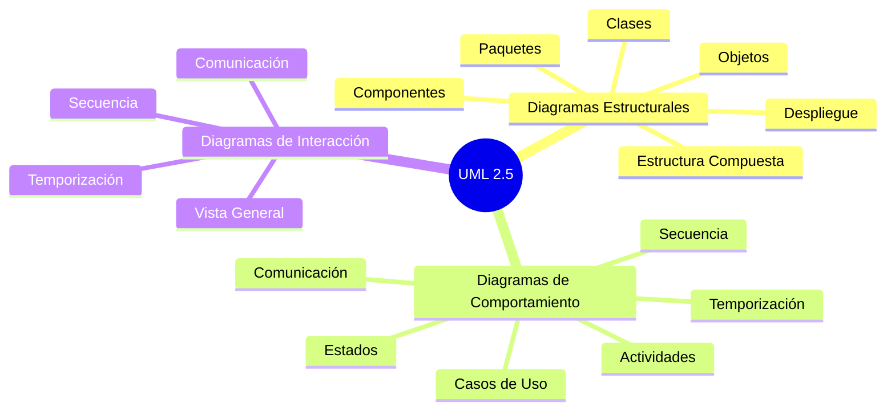

## 🗂️ Categorías principales

### **🏗️ Diagramas estructurales**
Muestran la **estructura estática** del sistema - qué elementos existen y cómo se relacionan.

### **🔄 Diagramas de comportamiento**  
Muestran el **comportamiento dinámico** del sistema - qué hace y cómo lo hace.

### **💬 Diagramas de interacción** (subset de comportamiento)
Muestran el **flujo de control y datos** entre objetos.

---

# 🏗️ DIAGRAMAS ESTRUCTURALES

## 1. 📋 Diagrama de clases

### 🎯 ¿Cuándo usarlo?

- ✅ **Diseño de arquitectura** de software
- ✅ **Modelado de datos** y relaciones
- ✅ **Documentación de APIs** y librerías
- ✅ **Análisis de dominio** (DDD)

### 🛠️ Ejemplo:

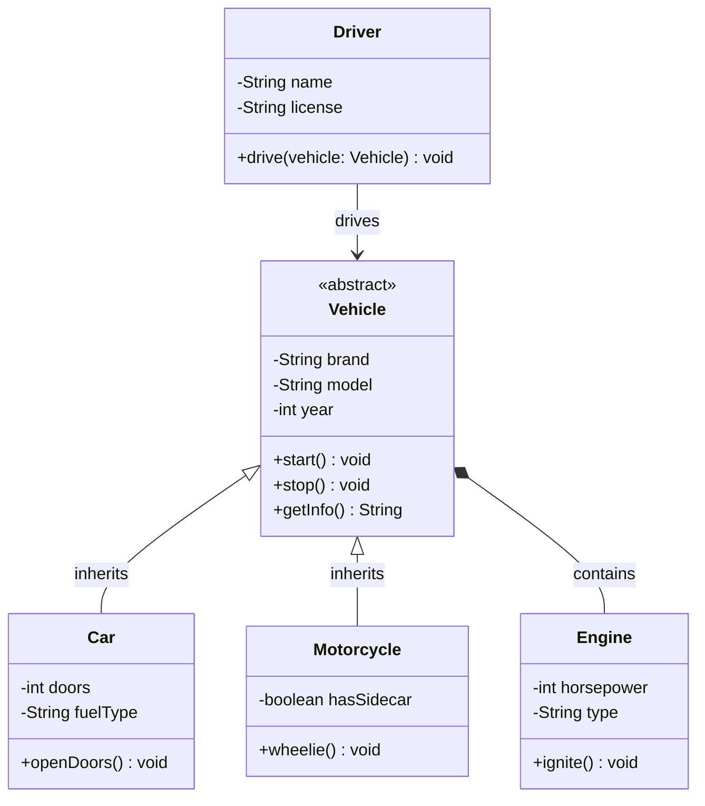

### 🔥 Tips:

- **Clases abstractas**: `<<abstract>>`
- **Interfaces**: `<<interface>>`
- **Herencia**: `<|--` 
- **Composición**: `*--` (no puede existir independiente)
- **Agregación**: `o--` (puede existir independiente)
- **Asociación**: `-->` (usa o conoce)

---

## 2. 🎭 Diagrama de objetos

### 🎯 ¿Cuándo usarlo?

- ✅ **Snapshot de instancias** en un momento específico
- ✅ **Ejemplos concretos** de clases abstractas
- ✅ **Testing y debugging** - estados específicos
- ✅ **Documentar configuraciones** complejas

### 🛠️ Ejemplo:

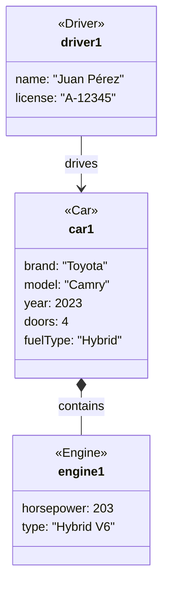

### 🔥 Tips:

- Muestra **valores reales** de atributos
- Útil para **casos de prueba**
- Complementa diagramas de clases con **ejemplos concretos**

---

## 3. 📦 Diagrama de componentes

### 🎯 ¿Cuándo usarlo?

- ✅ **Arquitectura de sistemas** grandes
- ✅ **Microservicios** y modularización
- ✅ **Interfaces y dependencias** entre módulos
- ✅ **Deployment** y organización de código

### 🛠️ Ejemplo:

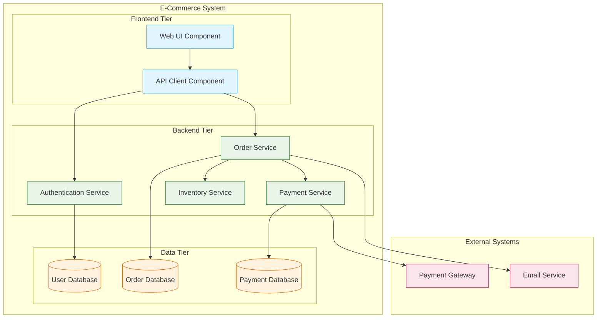

### 🔥 Tips:

- **Componentes**: Unidades desplegables independientes
- **Interfaces**: Contratos entre componentes
- **Dependencias**: Quién necesita qué
- **Capas**: Organización lógica del sistema

---

## 4. 🚀 Diagrama de despliegue

### 🎯 ¿Cuándo usarlo?

- ✅ **Infraestructura de producción**
- ✅ **Docker/Kubernetes** deployments
- ✅ **Network topology** y comunicación
- ✅ **Hardware requirements** y scaling

### 🛠️ Ejemplo:

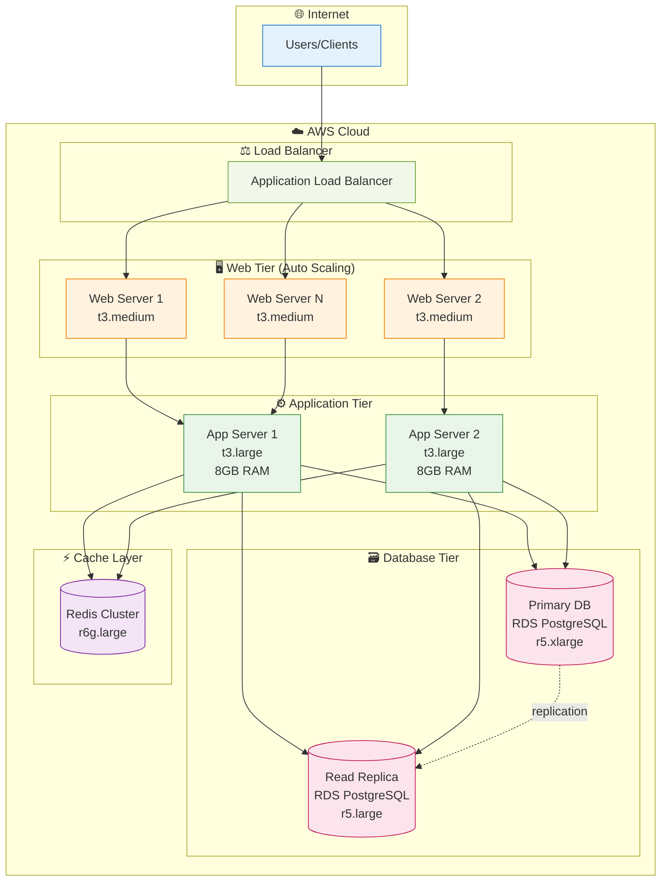

### 🔥 Tips:

- **Nodos**: Dispositivos físicos o máquinas virtuales
- **Artefactos**: Software desplegado (WAR, JAR, containers)
- **Conexiones**: Protocolos de comunicación
- **Restricciones**: CPU, RAM, storage

---

## 5. 📁 Diagrama de paquetes

### 🎯 ¿Cuándo usarlo?

- ✅ **Organización de código** en grandes proyectos
- ✅ **Arquitectura por capas**
- ✅ **Dependencias entre módulos**
- ✅ **Refactoring** y reestructuración

### 🛠️ Ejemplo:

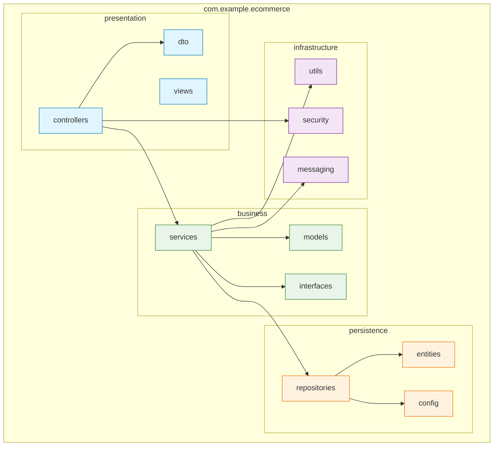

### 🔥 Tips:

- **Packages**: Agrupación lógica de clases relacionadas
- **Dependencies**: `-->` indica "usa" o "importa"
- **Layers**: Organización en capas arquitectónicas
- **Visibility**: public (+), private (-), protected (#)

---

# 🔄 DIAGRAMAS DE COMPORTAMIENTO

## 6. 🎭 Casos de uso

### 🎯 ¿Cuándo usarlo?

- ✅ **Requerimientos funcionales**
- ✅ **Interacciones usuario-sistema**
- ✅ **Alcance del proyecto**
- ✅ **Comunicación con stakeholders**

### 🛠️ Ejemplo:

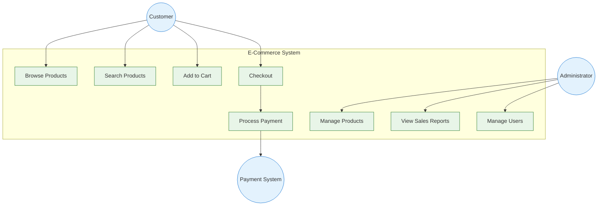

### 🔥 Tips:

- **Actores**: Usuarios o sistemas externos
- **Casos de uso**: Funcionalidades del sistema
- **Include**: `<<include>>` funcionalidad reutilizable
- **Extend**: `<<extend>>` funcionalidad opcional

---

## 7. 🔄 Diagrama de actividades

### 🎯 ¿Cuándo usarlo?

- ✅ **Procesos de negocio**
- ✅ **Workflows** complejos
- ✅ **Algoritmos** paso a paso
- ✅ **Procesos paralelos**

### 🛠️ Ejemplo:

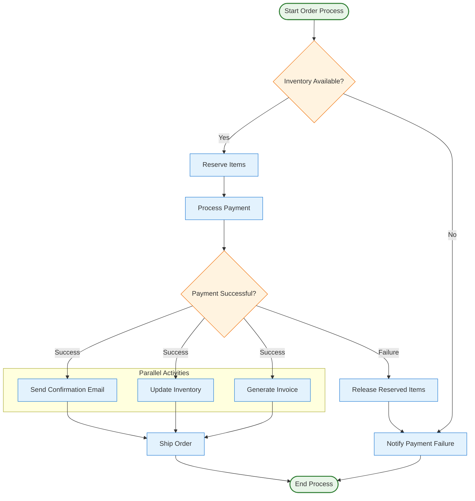

### 🔥 Tips:

- **Start/End**: Círculos con bordes gruesos
- **Activities**: Rectángulos
- **Decisions**: Diamantes con preguntas
- **Fork/Join**: Barras para actividades paralelas

---

## 8. 🔀 Diagrama de estados

### 🎯 ¿Cuándo usarlo?

- ✅ **Objetos con estados** complejos
- ✅ **State machines**
- ✅ **Protocolos** de comunicación
- ✅ **Ciclo de vida** de entidades

### 🛠️ Ejemplo:

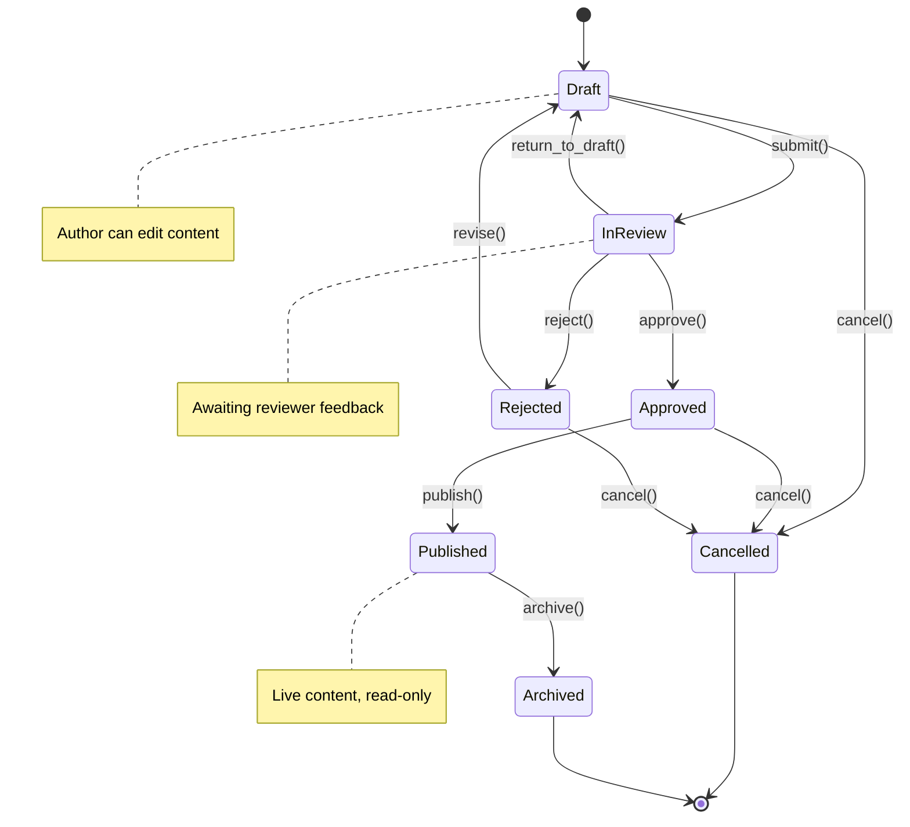

### 🔥 Tips:

- **Estados**: Situación actual del objeto
- **Transiciones**: Eventos que cambian el estado
- **Guardas**: `[condición]` para transiciones condicionales
- **Acciones**: `/acción` ejecutada durante transición

---

# 💬 DIAGRAMAS DE INTERACCIÓN

## 9. 📞 Diagrama de secuencia

### 🎯 ¿Cuándo usarlo?

- ✅ **Flujo temporal** de mensajes
- ✅ **APIs** y protocolos
- ✅ **Debugging** de interacciones
- ✅ **Documentación técnica**

### 🛠️ Ejemplo:

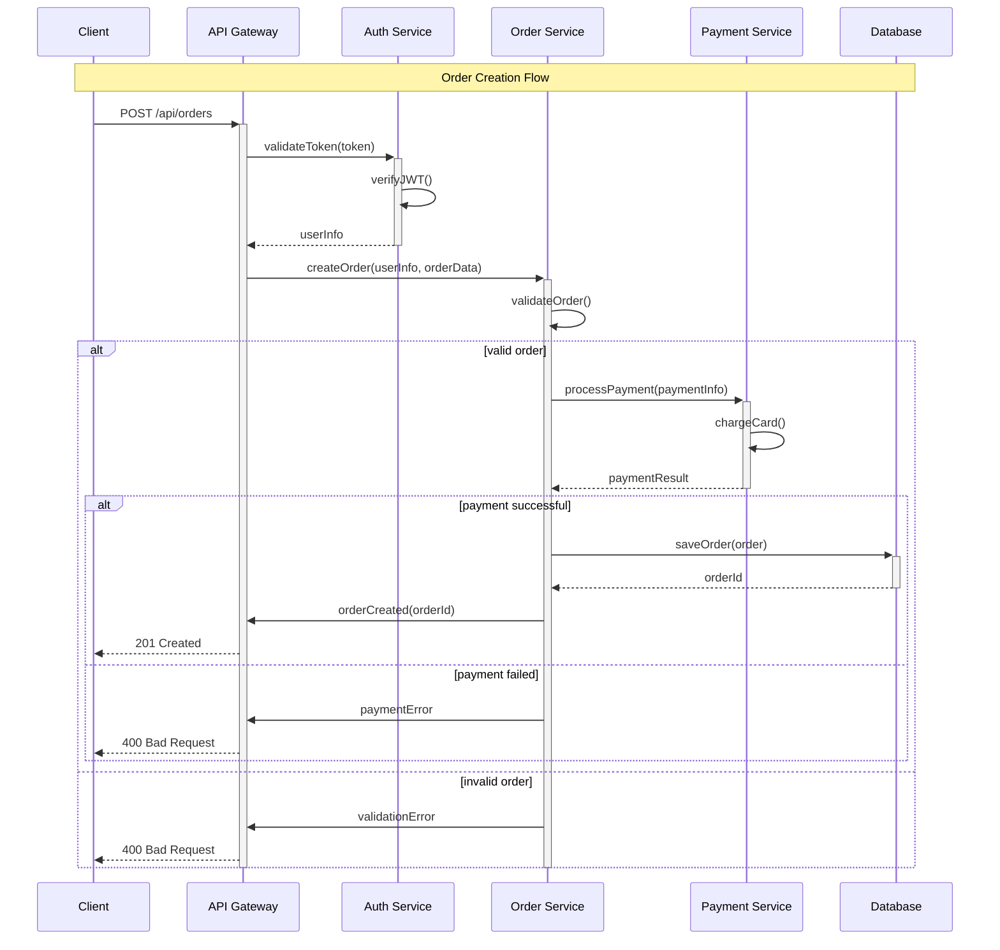

### 🔥 Tips:

- **Lifelines**: Objetos participantes
- **Messages**: `->` síncronos, `->>` asíncronos
- **Activation**: `+/-` cuándo está "activo"
- **Alt/Opt**: Condicionales y opcionales

---

## 10. 📡 Diagrama de comunicación

### 🎯 ¿Cuándo usarlo?

- ✅ **Estructura de comunicación** entre objetos
- ✅ **Arquitectura de colaboración**
- ✅ **Overview rápido** de interacciones
- ✅ **Alternativa** a diagramas de secuencia

### 🛠️ Ejemplo:

```mermaid
flowchart LR
    Client[Client]
    Controller[OrderController]
    Service[OrderService]
    Repository[OrderRepository]
    Database[(Database)]
    
    Client -->|"1: createOrder()"| Controller
    Controller -->|"2: processOrder()"| Service
    Service -->|"3: saveOrder()"| Repository
    Repository -->|"4: INSERT"| Database
    Database -->|"5: orderId"| Repository
    Repository -->|"6: order"| Service
    Service -->|"7: orderDTO"| Controller
    Controller -->|"8: 201 Created"| Client
    
    classDef client fill:#e3f2fd,stroke:#1976d2
    classDef controller fill:#e8f5e8,stroke:#2e7d32
    classDef service fill:#fff3e0,stroke:#ef6c00
    classDef repository fill:#f3e5f5,stroke:#7b1fa2
    classDef database fill:#fce4ec,stroke:#c2185b
    
    class Client client
    class Controller controller
    class Service service
    class Repository repository
    class Database database
```

### 🔥 Tips:

- **Objetos**: Participantes en la colaboración
- **Links**: Relaciones entre objetos
- **Messages**: Numerados en orden temporal
- **Focus**: En la estructura más que en el tiempo

---

# 🎯 Guía de decisión: ¿cuál diagrama usar?

## 🤔 Por propósito

### **📋 Análisis de requisitos**
- **Casos de Uso** → Funcionalidades del sistema
- **Actividades** → Procesos de negocio
- **Estados** → Ciclo de vida de entidades

### **🏗️ Diseño de arquitectura**
- **Componentes** → Módulos y sus interfaces
- **Paquetes** → Organización del código
- **Despliegue** → Infraestructura y hardware

### **💻 Diseño detallado**
- **Clases** → Estructura de datos y métodos
- **Objetos** → Instancias específicas
- **Secuencia** → Flujo de mensajes temporales

### **📞 Comunicación**
- **Casos de Uso** → Con stakeholders no técnicos
- **Componentes** → Con arquitectos
- **Secuencia** → Con desarrolladores

## ⚡ ¿Cómo elegir el modelo a diseñar?

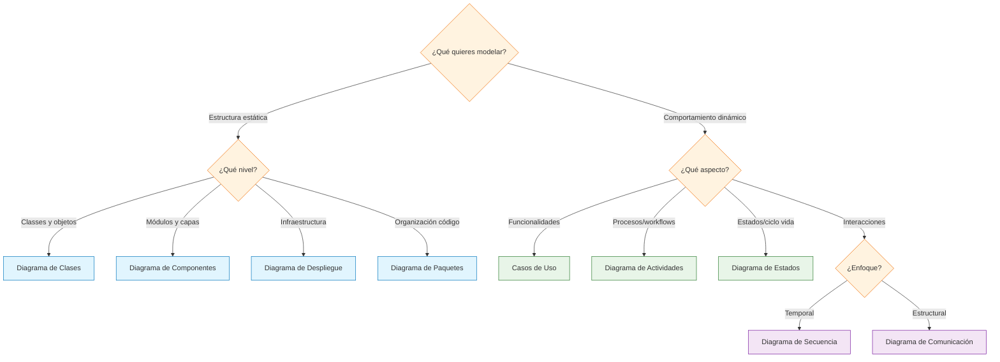

## 📄 Matriz de uso por fase del proyecto

| **Fase** | **Diagramas Principales** | **Diagramas Secundarios** |
|----------|-------------------------|--------------------------|
| **Análisis** | Casos de Uso, Actividades | Estados, Objetos |
| **Diseño Arquitectónico** | Componentes, Paquetes | Despliegue |
| **Diseño Detallado** | Clases, Secuencia | Comunicación, Estados |
| **Implementación** | Clases, Objetos | Secuencia |
| **Despliegue** | Despliegue, Componentes | Paquetes |
| **Mantenimiento** | Clases, Componentes | Todos según necesidad |

---

## 🛠️ Tools y Best practices

### **🎨 Herramientas recomendadas**

- **Mermaid** ⭐ → Diagramas como código, nativo en GitHub
- **PlantUML** → Potente para diagramas complejos
- **Draw.io** → Visual, fácil colaboración
- **Lucidchart** → Profesional, templates
- **Enterprise Architect** → Completo para grandes proyectos

### **✅ Best practices**

1. **Keep it Simple** → Solo incluir elementos necesarios
2. **Consistent Naming** → Mismos nombres en todos los diagramas
3. **Right Level of Detail** → Apropiado para la audiencia
4. **Update Regularly** → Mantener sincronizado con código
5. **Version Control** → Tratar diagramas como código

### **🚫 Errores comunes**

- ❌ **Over-modeling** → Demasiados diagramas sin valor
- ❌ **Under-modeling** → Falta de documentación clave
- ❌ **Inconsistency** → Nombres diferentes entre diagramas
- ❌ **Outdated diagrams** → No actualizar con cambios
- ❌ **Wrong audience** → Nivel de detalle incorrecto

---

## 📚 Conexión con microservicios

Este curso general **complementa** el [Curso UML Ultra Express para Microservicios](curso-express-uml-microservicios.md):

### **🔗 Flujo recomendado**

1. **Curso General** → Entender todos los tipos de diagramas
2. **Curso Microservicios** → Aplicar específicamente a arquitecturas distribuidas
3. **Práctica** → Usar ambos según el contexto del proyecto

### **🎯 Cuándo usar cada curso**

- **General** ✅ → Proyectos monolíticos, librerías, sistemas tradicionales
- **Microservicios** ✅ → Arquitecturas distribuidas, containers, cloud-native

¡Ahora tienes la base completa de UML! 🎉