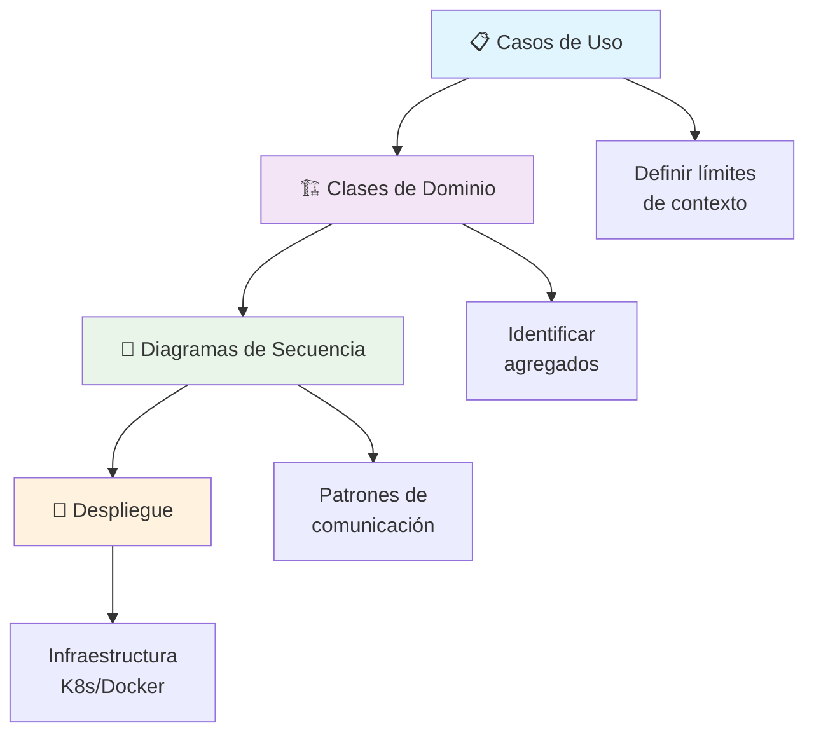
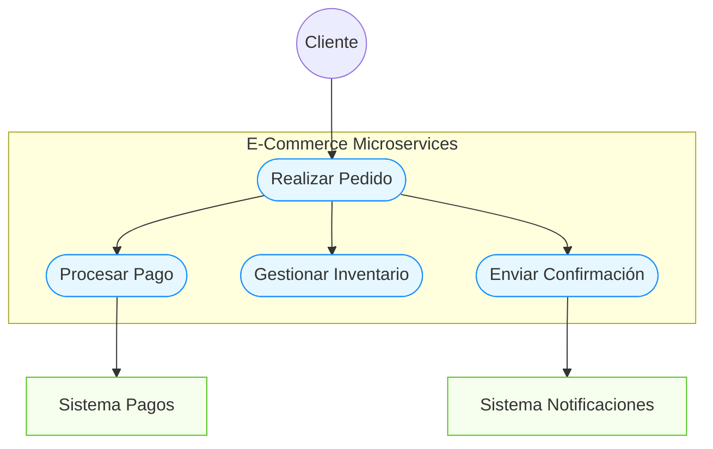
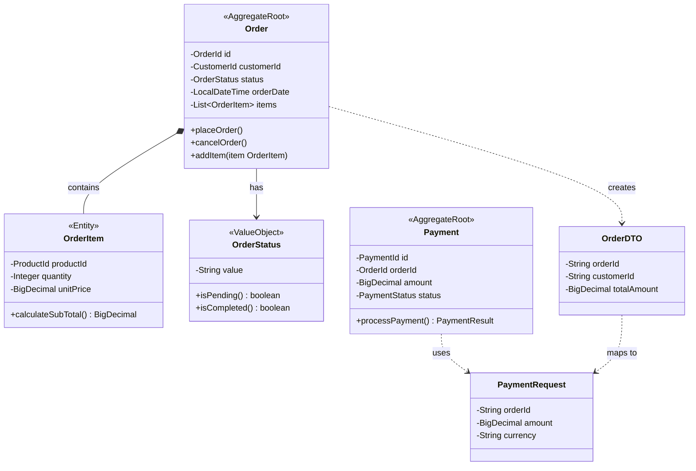
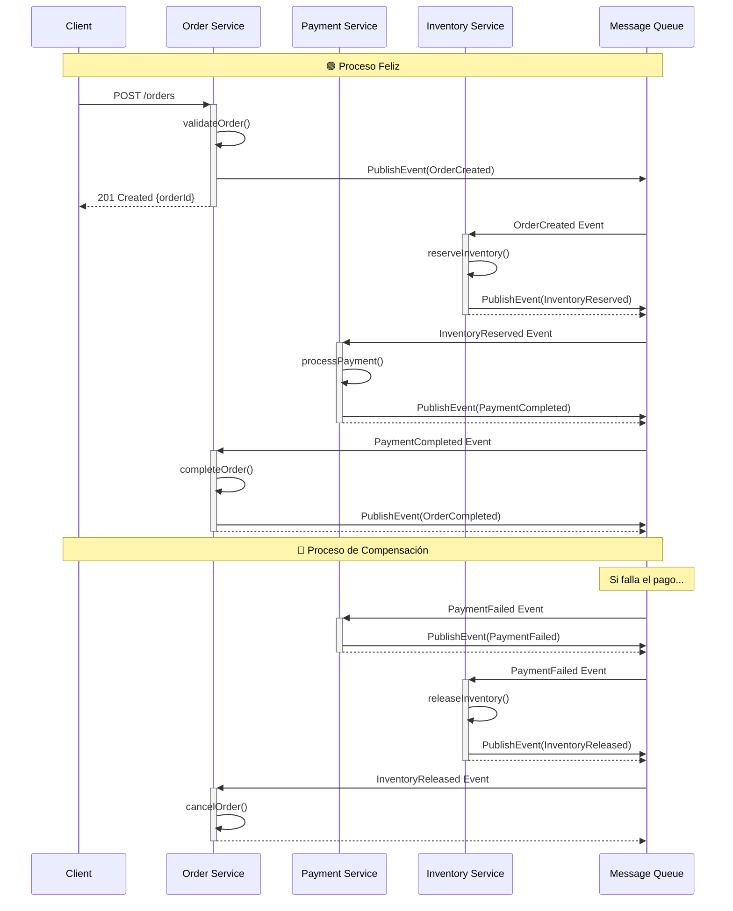
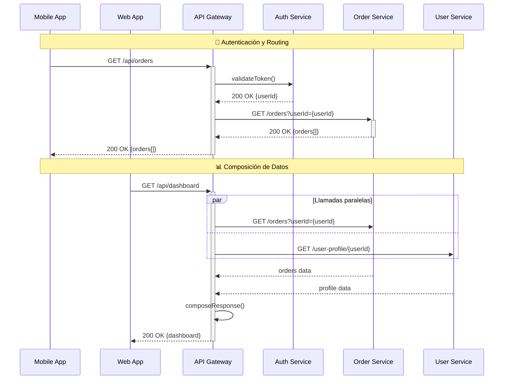
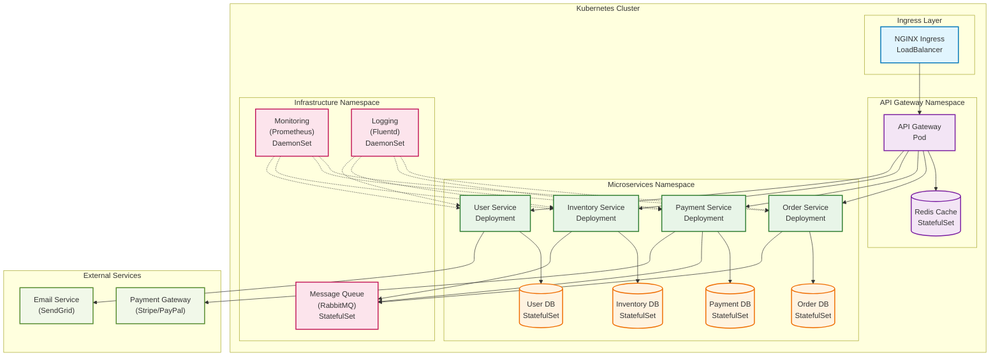
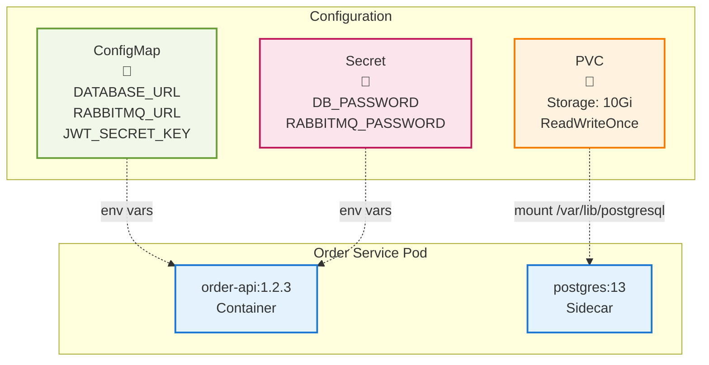
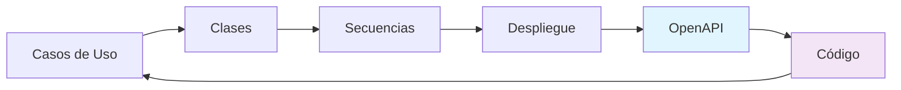

# 🚀 Curso Express: UML para Microservicios y Contenedores

## 🎯 Objetivo

Guía condensada de los diagramas UML esenciales para el diseño, desarrollo y despliegue de microservicios que serán containerizados en Docker/Kubernetes.

## 📋 Prerequisitos

- Conocimientos básicos de arquitectura de software
- Conceptos de microservicios (Unidad 1)
- Domain-Driven Design básico (Unidad 2) 

---

## 🧭 Roadmap UML para microservicios



---

## 1. 📋 Casos de uso: Definiendo fronteras de microservicios

### 🎯 ¿Por qué son críticos?

Los casos de uso nos ayudan a:
- **Identificar Bounded Contexts** (base para microservicios)
- **Definir APIs** que expondrán los servicios
- **Establecer contratos** entre servicios

### 🛠️ Ejemplo:



> 📝 **Notas del diagrama:**
> - **Realizar Pedido**: Orquesta el proceso completo del pedido
> - **Procesar Pago**: Maneja transacciones monetarias  
> - **Gestionar Inventario**: Controla disponibilidad de productos

### 🔥 Tips:

1. **Un caso de uso = Un microservicio potencial**
2. **Actores externos = Integraciones que diseñar**
3. **Dependencias entre casos de uso = Comunicación entre servicios**

### 📐 Criterios de separación

| ✅ **Separar en microservicio** | ❌ **Mantener junto** |
|-----------------------------|--------------------|
| Diferentes dominios de negocio | Misma transacción ACID requerida |
| Escalado independiente requerido | Comunicación muy frecuente |
| Equipos diferentes | Datos altamente relacionados |
| Evolución de negocio independiente | Cambios siempre coordinados |

---

## 2. 🏗️ Clases de Dominio: Del DDD al código

### 🎯 ¿Por qué son esenciales?

- **Traducen conceptos** de DDD a estructuras de código
- **Definen agregados** (transaccional boundaries)
- **Establecen DTOs/APIs** entre servicios

### 🛠️ Ejemplo:



> 📝 **Notas del diagrama:**
> - **Order**: Aggregate Root para transacciones de orden (Order Service)
> - **Payment**: Microservicio separado para pagos (Payment Service)
> - **OrderDTO**: DTO para comunicación entre microservicios

### 🔥 Tips:

1. **Aggregate Root** → Microservice boundary
2. **Value Objects** → Inmutables, compartibles
3. **DTOs** → Contratos de API entre servicios
4. **Entities** dentro del mismo agregado → Mismo microservicio

### 📄 Mapeo DDD → Microservicios

| **Concepto DDD** | **Implementación** | **Docker/K8s**   |
| ---------------- | ------------------ | ---------------- |
| Bounded Context  | Microservice       | Pod/Deployment   |
| Aggregate Root   | Service Class      | Container        |
| Repository       | Data Access Layer  | ConfigMap/Secret |
| Domain Event     | Message/Event      | Message Queue    |

---

## 3. 🔄 Diagramas de Secuencia: Comunicación entre servicios

### 🎯 ¿Por qué son críticos?

- **Diseñan la comunicación** entre microservicios
- **Identifican patrones** (Saga, CQRS, Event Sourcing)
- **Definen APIs** y contratos de integración

### 🛠️ Ejemplo: Patrón Saga



### 🛠️ Ejemplo: Patrón API Gateway



> 📝 **Funcionalidades del API Gateway:**
> - **Autenticación/Autorización**: Validación centralizada de tokens
> - **Rate Limiting**: Control de límites de solicitudes
> - **Load Balancing**: Distribución de carga entre instancias
> - **Response Composition**: Agregación de datos de múltiples servicios

### 🔥 Tips:

1. **Síncronos** → REST APIs (para queries simples)
2. **Asíncronos** → Events/Messages (para procesos complejos)
3. **Gateway** → Punto único de entrada
4. **Timeouts** y **Circuit Breakers** → Resiliencia

### 📋 Checklist de comunicación

- [ ] **¿Transacción distribuida?** → Consider Saga Pattern
- [ ] **¿Query complejo?** → Consider CQRS  
- [ ] **¿Necesita auditabilidad?** → Consider Event Sourcing
- [ ] **¿Cliente externo?** → Use API Gateway
- [ ] **¿Comunicación real-time?** → WebSockets/SSE

---

## 4. 🚀 Diagramas de Despliegue: Docker + Kubernetes

### 🎯 ¿Por qué son esenciales?

- **Visualizan la infraestructura** de containers
- **Identifican dependencias** entre servicios
- **Planifican recursos** y escalado
- **Documentan configuración** de producción

### 🛠️ Ejemplo: Arquitectura completa



> 📝 **Notas de la arquitectura:**
> - **NGINX Ingress**: Entry point - 443 HTTPS
> - **API Gateway**: Authentication, Rate Limiting, Load Balancing
> - **Message Queue**: Asynchronous Communication
> - **Payment Gateway**: PCI Compliance Required

### 🛠️ Ejemplo: Configuración de servicios



> 📝 **Tipos de configuración:**
> - **ConfigMap**: Non-sensitive configuration
> - **Secret**: Encrypted storage
> - **PVC**: Persistent data

### 🔥 Tips:

1. **Un microservicio** → Un Deployment en K8s
2. **Datos stateful** → StatefulSet + PVC
3. **Configuración** → ConfigMaps y Secrets
4. **Comunicación** → Services + Ingress
5. **Observabilidad** → Sidecar containers

### 📊 Mapeo: Microservicio → Kubernetes

| **Concepto** | **Kubernetes** | **Docker** |
|-------------|---------------|-----------|
| Microservice | Deployment | Container |
| Database | StatefulSet | Volume |
| Configuration | ConfigMap | ENV vars |
| Secrets | Secret | ENV vars |
| Load Balancer | Service | Port mapping |
| API Gateway | Ingress | Nginx container |

---

## 🎯 Metodología de aplicación

### Paso 1: Análisis de dominio
1. **Casos de Uso** → Identificar Bounded Contexts
2. **Separación de responsabilidades** → Definir microservicios

### Paso 2: Diseño detallado  
1. **Clases de Dominio** → Definir agregados y APIs
2. **Secuencias** → Diseñar comunicación entre servicios

### Paso 3: Preparación para implementación
1. **Despliegue** → Planificar infraestructura K8s
2. **APIs OpenAPI** → Documentar contratos

### 🔄 Iteración continua



---

### 🛠️ Tools recomendadas

- **Mermaid** → Diagramas como código (nativo en GitHub) ⭐
- **Draw.io** → Diagramas visuales rápidos
- **PlantUML** → Para casos específicos avanzados
- **Kubernetes Dashboard** → Visualización de despliegue en tiempo real

---

## 📚 Conexión con OpenAPI

Los DTOs de tus diagramas de clase se convertirán directamente en:

```yaml
components:
  schemas:
    OrderDTO:
      type: object
      properties:
        orderId:
          type: string
        customerId:
          type: string  
        totalAmount:
          type: number
          format: double
```

### 🔄 Flujo completo: UML → OpenAPI → Código

1. **Casos de Uso** → Definir endpoints REST
2. **Clases/DTOs** → OpenAPI schemas 
3. **Secuencias** → OpenAPI operations
4. **Despliegue** → OpenAPI servers

¡Listo para modelar APIs y construir código! 🚀