# 📋 Proceso de Desarrollo

## 📋 Fases detalladas del proceso de desarrollo

### **Fase 1: 📋 Análisis y Diseño**

- **Análisis de Requerimientos**: Entrevistas, documentación, casos de uso
- **Requerimientos Funcionales**: ¿Qué debe hacer la aplicación?
- **Requerimientos No Funcionales**: Rendimiento, seguridad, escalabilidad

### **Fase 2: 🛣️ Diseño de API**

- **Modelado de Datos**: Entidades, relaciones, esquemas
- **Diseño de Endpoints**: Rutas REST, métodos HTTP
- **Creación del Contrato OAS**: Especificación OpenAPI completa

### **Fase 3: 🔧 Desarrollo**

- **Generación de Código**: Desde OAS a código fuente
- **Implementación del Servidor**: Spring Boot, Quarkus, etc.
- **Lógica de Negocio**: Servicios, validaciones, reglas

### **Fase 4: 🗄️ Integración**

- **Base de Datos**: Conexión, migraciones, repositorios
- **Seguridad**: Autenticación, autorización, tokens
- **Servicios Externos**: APIs terceros, integraciones

### **Fase 5: 🧪 Testing**

- **Pruebas Unitarias**: Componentes individuales
- **Pruebas de Integración**: Interacción entre componentes
- **Pruebas de API**: Endpoints, contratos, rendimiento
- **Pruebas de Usuario**: UI/UX, casos reales

### **Fase 6: 📚 Documentación**

- **Documentación API**: Swagger, ejemplos, guías
- **Manual de Usuario**: Guías de uso, tutoriales
- **Guía de Despliegue**: Instrucciones técnicas

### **Fase 7: 🐳 Containerización**

- **Dockerfile**: Configuración del contenedor
- **Imagen Docker**: Build y optimización
- **Pruebas de Contenedor**: Validación local

### **Fase 8: ⚙️ Configuración**

- **Variables de Entorno**: Configuración externa
- **Archivos de Config**: Properties, YAML, JSON
- **Base de Datos**: Setup, migraciones, seeds

### **Fase 9: ☁️ Despliegue**

- **Selección de Plataforma**: Kubernetes, Cloud, local
- **Configuración de Infraestructura**: Redes, volúmenes
- **Deploy Inicial**: Primera puesta en producción

### **Fase 10: 🔄 DevOps/CI-CD**

- **Pipeline Automatizado**: Build, test, deploy
- **Integración Continua**: Git hooks, validaciones
- **Monitoreo**: Logs, métricas, health checks

### **Fase 11: 📊 Producción**

- **Métricas**: Performance, uso, errores
- **Alertas**: Notificaciones automáticas
- **Mantenimiento**: Updates, patches, backup

### **Fase 12: 🔄 Mejora Continua**

- **Análisis**: Performance, feedback usuarios
- **Bugfixes**: Correcciones y optimizaciones
- **Nuevas Features**: Expansión funcional
- **Ciclo de Vida**: Volver a fase de análisis

## 🎯 **Puntos clave:**

1. **No es lineal**: Algunas fases se ejecutan en paralelo
2. **Iterativo**: Se regresa a fases anteriores para mejoras
3. **Flexible**: El orden puede variar según metodología (Agile, Waterfall)
4. **Escalable**: Para proyectos pequeños, algunas fases se simplifican
5. **Colaborativo**: Diferentes roles participan en diferentes fases

Este diagrama muestra el **ciclo completo** desde la idea hasta la aplicación en producción con mejora continua.

```mermaid
flowchart TD
    %% Fase 1: Análisis y Diseño
    A[📋 Análisis de Requerimientos] --> B[📝 Requerimientos Funcionales]
    A --> C[⚡ Requerimientos No Funcionales]
    B --> D[🎯 Definición de APIs]
    C --> D
    
    %% Fase 2: Diseño de API
    D --> E[📊 Modelado de Datos]
    E --> F[🛣️ Diseño de Endpoints]
    F --> G[📑 Creación del Contrato OAS]
    
    %% Fase 3: Desarrollo
    G --> H{🔧 Generación de Código}
    H --> I[🍃 Servidor Spring Boot]
    H --> J[🚀 Servidor Quarkus]
    H --> K[⚛️ Cliente Frontend]
    
    %% Fase 4: Implementación
    I --> L[💼 Lógica de Negocio]
    J --> L
    L --> M[🗄️ Integración Base de Datos]
    M --> N[🔐 Implementar Seguridad]
    
    %% Fase 5: Testing
    N --> O[🧪 Pruebas Unitarias]
    O --> P[🔗 Pruebas de Integración]
    P --> Q[🌐 Pruebas de API]
    Q --> R[👥 Pruebas de Usuario]
    
    %% Fase 6: Documentación
    R --> S[📚 Documentación API]
    S --> T[📖 Manual de Usuario]
    T --> U[🛠️ Guía de Despliegue]
    
    %% Fase 7: Containerización
    U --> V[🐳 Crear Dockerfile]
    V --> W[📦 Construir Imagen Docker]
    W --> X[🧪 Probar Contenedor Local]
    
    %% Fase 8: Configuración de Entorno
    X --> Y[⚙️ Variables de Entorno]
    Y --> Z[🔧 Archivos de Configuración]
    Z --> AA[🗃️ Configurar Base de Datos]
    
    %% Fase 9: Despliegue
    AA --> BB{☁️ Plataforma de Despliegue}
    BB --> CC[☸️ Kubernetes]
    BB --> DD[🐙 Docker Swarm]
    BB --> EE[☁️ Cloud Provider]
    BB --> FF[🖥️ Servidor Local]
    
    %% Fase 10: DevOps y CI/CD
    CC --> GG[🔄 Pipeline CI/CD]
    DD --> GG
    EE --> GG
    FF --> GG
    GG --> HH[🚀 Automatización Deploy]
    HH --> II[📊 Configurar Monitoreo]
    
    %% Fase 11: Producción
    II --> JJ[📈 Métricas y Logs]
    JJ --> KK[🚨 Alertas y Notificaciones]
    KK --> LL[🔄 Mantenimiento Continuo]
    
    %% Fase 12: Feedback y Mejora
    LL --> MM[📊 Análisis de Rendimiento]
    MM --> NN[🐛 Corrección de Bugs]
    NN --> OO[✨ Nuevas Funcionalidades]
    OO --> PP[🔄 Ciclo de Mejora]
    
    %% Conexión de vuelta al inicio para mejoras
    PP -.-> A
    
    %% Estilos
    classDef analisis fill:#b3e5fc,color:#000000
    classDef diseno fill:#e2c0e7,color:#000000
    classDef desarrollo fill:#c4e6c4,color:#000000
    classDef testing fill:#ffdfad,color:#000000
    classDef devops fill:#f7b6cc,color:#000000
    classDef produccion fill:#d8ecc2,color:#000000
    
    class A,B,C analisis
    class D,E,F,G diseno
    class H,I,J,K,L,M,N desarrollo
    class O,P,Q,R,S,T,U testing
    class V,W,X,Y,Z,AA,BB,CC,DD,EE,FF,GG,HH devops
    class II,JJ,KK,LL,MM,NN,OO,PP produccion
```

