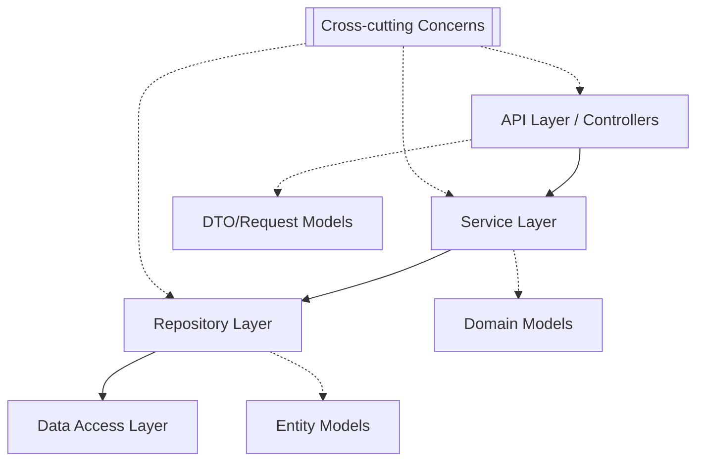
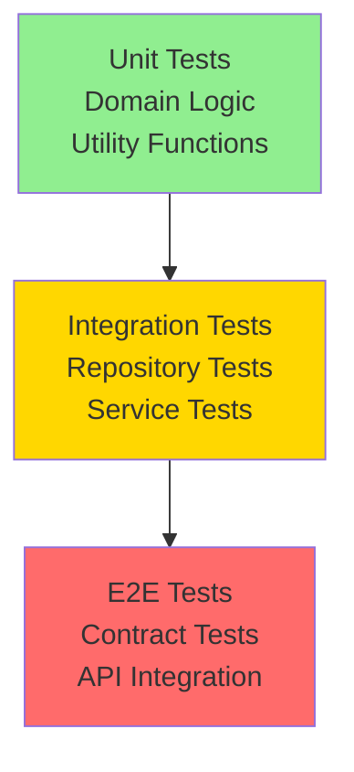

# Teoría - Implementación de Microservicios

> **Fundamentos teóricos para la implementación práctica de microservicios con Spring Boot y Quarkus**

- [Teoría - Implementación de Microservicios](#teoría---implementación-de-microservicios)
  - [🎯 Objetivos de aprendizaje teórico](#-objetivos-de-aprendizaje-teórico)
  - [1. 📐 Enfoque API-First vs Code-First](#1--enfoque-api-first-vs-code-first)
    - [**Paradigma API-First**](#paradigma-api-first)
      - [Definición y Filosofía](#definición-y-filosofía)
      - [Ventajas del enfoque API-First](#ventajas-del-enfoque-api-first)
      - [Herramientas del ecosistema API-First](#herramientas-del-ecosistema-api-first)
    - [**Paradigma Code-First**](#paradigma-code-first)
      - [Definición y Características](#definición-y-características)
      - [Comparación Práctica](#comparación-práctica)
  - [2. 🏗️ Arquitectura de Capas en Microservicios](#2-️-arquitectura-de-capas-en-microservicios)
    - [**Patrón de Capas Estándar**](#patrón-de-capas-estándar)
      - [**API Layer (Controllers/Resources)**](#api-layer-controllersresources)
      - [**Service Layer (Business Logic)**](#service-layer-business-logic)
      - [**Repository Layer (Data Access)**](#repository-layer-data-access)
    - [**Cross-Cutting Concerns**](#cross-cutting-concerns)
      - [**Configuration Management**](#configuration-management)
    - [**Exception Handling**](#exception-handling)
  - [3. ⚡ Spring Boot vs Quarkus: Análisis Técnico Detallado](#3--spring-boot-vs-quarkus-análisis-técnico-detallado)
    - [**Filosofías de Diseño**](#filosofías-de-diseño)
      - [**Spring Boot: Convention over Configuration**](#spring-boot-convention-over-configuration)
      - [**Quarkus: Cloud-Native First**](#quarkus-cloud-native-first)
    - [**Performance Comparison**](#performance-comparison)
      - [**Startup Time Analysis**](#startup-time-analysis)
      - [**Memory Consumption**](#memory-consumption)
    - [**Developer Experience**](#developer-experience)
      - [**Development Workflow Comparison**](#development-workflow-comparison)
    - [**Ecosystem and Extensions**](#ecosystem-and-extensions)
      - [**Spring Boot Starters vs Quarkus Extensions**](#spring-boot-starters-vs-quarkus-extensions)
  - [4. 🔍 Observabilidad y Monitoring](#4--observabilidad-y-monitoring)
    - [**Health Checks y Readiness**](#health-checks-y-readiness)
      - [**Spring Boot Actuator**](#spring-boot-actuator)
      - [**Quarkus SmallRye Health**](#quarkus-smallrye-health)
    - [**Métricas y Observabilidad**](#métricas-y-observabilidad)
      - [**Prometheus Metrics**](#prometheus-metrics)
    - [**Structured Logging**](#structured-logging)
      - [**JSON Logging Configuration**](#json-logging-configuration)
  - [5. 🧪 Testing Strategies](#5--testing-strategies)
    - [**Testing Pyramid en Microservicios**](#testing-pyramid-en-microservicios)
      - [**Unit Testing**](#unit-testing)
      - [**Integration Testing**](#integration-testing)
      - [**Contract Testing con OpenAPI**](#contract-testing-con-openapi)
  - [📚 Recursos de profundización](#-recursos-de-profundización)
    - [**Documentación Oficial**](#documentación-oficial)
    - [**Herramientas de desarrollo**](#herramientas-de-desarrollo)
    - [**Performance y Observabilidad**](#performance-y-observabilidad)


---

## 🎯 Objetivos de aprendizaje teórico

Al completar este módulo teórico, comprenderás:
- **Enfoques de desarrollo** API-First vs Code-First y sus implicaciones
- **Arquitecturas de implementación** para microservicios en Java
- **Frameworks modernos** y sus características distintivas
- **Principios de observabilidad** y testing en sistemas distribuidos

---

## 1. 📐 Enfoque API-First vs Code-First

### **Paradigma API-First**

#### Definición y Filosofía

```yaml
# Flujo API-First

1. Design → OpenAPI Specification
2. Review → Stakeholder validation
3. Generate → Code scaffolding
4. Implement → Business logic
5. Test → Against specification
6. Deploy → With living documentation
```

**Principios fundamentales:**

- **Contract-first development** - La API es el contrato inmutable
- **Consumer-driven design** - Diseño basado en necesidades del cliente
- **Documentation as code** - Especificación como fuente de verdad
- **Team coordination** - Equipos frontend/backend trabajan en paralelo

#### Ventajas del enfoque API-First

```markdown
## Beneficios Organizacionales

✅ **Paralelización del desarrollo** - Frontend y backend simultáneos
✅ **Comunicación clara** - Especificación como lenguaje común
✅ **Validación temprana** - Detección de problemas en diseño
✅ **Consistent APIs** - Estándares organizacionales aplicados

## Beneficios Técnicos

✅ **Automated code generation** - Reducción de boilerplate
✅ **Contract testing** - Validación automática de cumplimiento
✅ **Mock servers** - Testing sin implementación completa
✅ **Living documentation** - Documentación siempre actualizada
```

#### Herramientas del ecosistema API-First

```yaml
# Stack de herramientas API-First

Design Tools:
  - Swagger Editor: Visual OpenAPI editing
  - Insomnia Designer: Collaborative API design
  - Stoplight Studio: Advanced API design platform

Generation Tools:
  - OpenAPI Generator: Multi-language code generation
  - Swagger Codegen: Legacy but widely supported
  - Spring Cloud Contract: Contract testing

Testing Tools:
  - Postman: Manual and automated testing
  - Newman: Command-line collection runner
  - Dredd: HTTP API testing framework
  - Prism: Mock server generation
```

### **Paradigma Code-First**

#### Definición y Características

```java
// Ejemplo Code-First con Spring Boot
@RestController
@RequestMapping("/api/v1/products")
public class ProductController {

    @PostMapping
    @ApiOperation(value = "Create new product")
    public ResponseEntity<Product> createProduct(
            @Valid @RequestBody CreateProductRequest request) {
        // Implementation drives the API design
        return ResponseEntity.ok(reservationService.create(request));
    }
}
```

**Características del Code-First:**

- **Implementation-driven** - El código define la API
- **Rapid prototyping** - Iteración rápida en desarrollo
- **Developer-centric** - Enfoque desde perspectiva de implementación
- **Generated documentation** - Documentación deriva del código

#### Comparación Práctica

| Aspecto | API-First | Code-First |
|---------|-----------|------------|
| **Punto de partida** | OpenAPI Specification | Código Java |
| **Documentación** | Manual, detallada | Generada, básica |
| **Coordinación** | Temprana, clara | Tardía, iterativa |
| **Flexibilidad** | Estructura rígida | Evolución orgánica |
| **Calidad API** | Consistente, pensada | Variable, emergente |
| **Velocidad inicial** | Lenta (diseño) | Rápida (codificación) |
| **Mantenimiento** | Predecible | Deuda técnica |

---

## 2. 🏗️ Arquitectura de Capas en Microservicios

### **Patrón de Capas Estándar**



> **🔍 Explicación del diagrama:**  
> Esta arquitectura de **capas estándar** organiza el código por responsabilidades: 
> 
> **API Layer** expone endpoints y maneja DTOs.
> 
> **Service Layer** implementa lógica de negocio con Domain Models.
> 
> **Repository Layer** abstrae persistencia usando Entity Models.
> 
> **Data Access Layer** maneja la base de datos.
> 
> Los **Cross-cutting Concerns** (logging, seguridad, validación) se aplican transversalmente a todas las capas mediante aspectos o middleware.

#### **API Layer (Controllers/Resources)**

```java
// Spring Boot - Controller Pattern
@RestController
@Validated
public class ReservationController {

    @Autowired
    private ReservationService reservationService;

    @PostMapping("/reservations")
    public ResponseEntity<ReservationResponse> create(
            @Valid @RequestBody CreateReservationRequest request) {

        // 1. Validate input (handled by @Valid)
        // 2. Delegate to service layer
        var reservation = reservationService.createReservation(request);

        // 3. Transform domain model to response DTO
        // 4. Return appropriate HTTP status
        return ResponseEntity.status(CREATED).body(reservation);
    }
}
```

```java
// Quarkus - JAX-RS Resource Pattern
@Path("/api/v1/reservations")
@Produces(MediaType.APPLICATION_JSON)
@Consumes(MediaType.APPLICATION_JSON)
public class ReservationResource {

    @Inject
    ReservationService reservationService;

    @POST
    public Response create(@Valid CreateReservationRequest request) {

        // Same responsibilities as Spring Controller
        var reservation = reservationService.createReservation(request);

        return Response.status(Response.Status.CREATED)
                      .entity(reservation)
                      .build();
    }
}
```

**Responsabilidades de la API Layer:**

- ✅ **HTTP handling** - Status codes, headers, content negotiation
- ✅ **Input validation** - Request validation y transformation
- ✅ **Authentication/Authorization** - Security concerns
- ✅ **Error handling** - Exception mapping y response formatting
- ❌ **Business logic** - Delegado a Service Layer
- ❌ **Data access** - Delegado a Repository Layer

#### **Service Layer (Business Logic)**

```java
// Service Layer - Framework agnostic business logic
@Service  // Spring
@ApplicationScoped  // Quarkus CDI
public class ReservationService {

    @Autowired/@Inject
    private ReservationRepository repository;

    @Autowired/@Inject
    private NotificationService notificationService;

    @Transactional
    public Reservation createReservation(CreateReservationRequest request) {

        // 1. Business validation
        validateBusinessRules(request);

        // 2. Domain logic execution
        var reservation = Reservation.create(
            request.getCustomerId(),
            request.getRoomType(),
            request.getCheckIn(),
            request.getCheckOut()
        );

        // 3. Persistence
        reservation = repository.save(reservation);

        // 4. Side effects (events, notifications)
        notificationService.sendConfirmation(reservation);

        return reservation;
    }

    private void validateBusinessRules(CreateReservationRequest request) {
        // Complex business validation that spans multiple entities
        if (request.getCheckIn().isAfter(request.getCheckOut())) {
            throw new InvalidReservationException("Check-in must be before check-out");
        }

        // Check room availability
        if (!isRoomAvailable(request.getRoomType(), request.getCheckIn(), request.getCheckOut())) {
            throw new RoomNotAvailableException("Room not available for selected dates");
        }
    }
}
```

**Responsabilidades de la Service Layer:**

- ✅ **Business logic** - Reglas de negocio complejas
- ✅ **Transaction management** - Coordinación de operaciones
- ✅ **Domain validation** - Validaciones que requieren múltiples entidades
- ✅ **Event publishing** - Comunicación asíncrona
- ✅ **Integration** - Llamadas a servicios externos
- ❌ **HTTP concerns** - Delegado a Controller/Resource
- ❌ **Data mapping** - Delegado a Repository

#### **Repository Layer (Data Access)**

```java
// Spring Data JPA approach
@Repository
public interface ReservationRepository extends JpaRepository<Reservation, Long> {

    @Query("SELECT r FROM Reservation r WHERE r.customerId = :customerId " +
           "AND r.status = :status")
    List<Reservation> findByCustomerIdAndStatus(
            @Param("customerId") String customerId,
            @Param("status") ReservationStatus status);

    @Query("SELECT COUNT(r) FROM Reservation r WHERE r.roomId = :roomId " +
           "AND r.checkIn <= :checkOut AND r.checkOut >= :checkIn")
    long countOverlappingReservations(
            @Param("roomId") Long roomId,
            @Param("checkIn") LocalDate checkIn,
            @Param("checkOut") LocalDate checkOut);
}

// Quarkus Panache approach (alternative)
@ApplicationScoped
public class ReservationRepository implements PanacheRepository<Reservation> {

    public List<Reservation> findByCustomerAndStatus(String customerId, ReservationStatus status) {
        return find("customerId = ?1 and status = ?2", customerId, status).list();
    }

    public long countOverlapping(Long roomId, LocalDate checkIn, LocalDate checkOut) {
        return find("roomId = ?1 and checkIn <= ?2 and checkOut >= ?3",
                   roomId, checkOut, checkIn).count();
    }
}
```

### **Cross-Cutting Concerns**

> Se refiere a funcionalidades o aspectos de un programa que afectan a múltiples módulos o capas de una aplicación, pero que no forman parte de la lógica de negocio central de ninguno de ellos.

#### **Configuration Management**

```yaml
# application.yml - Spring Boot

spring:
  application:
    name: product-catalog-service
  datasource:
    url: jdbc:postgresql://localhost:5432/productdb
    username: ${DB_USERNAME:product_user}
    password: ${DB_PASSWORD:product_pass}
  jpa:
    hibernate:
      ddl-auto: validate
    show-sql: false
  profiles:
    active: ${ENVIRONMENT:development}

management:
  endpoints:
    web:
      exposure:
        include: health,info,metrics,prometheus
  endpoint:
    health:
      show-details: always

logging:
  level:
    com.ecommerce.catalog: INFO
    org.springframework.web: DEBUG
  pattern:
    console: "%d{ISO8601} [%thread] %-5level %logger{36} - %msg%n"
```

```properties
# application.properties - Quarkus

# Database configuration

quarkus.datasource.db-kind=postgresql
quarkus.datasource.username=${DB_USERNAME:product_user}
quarkus.datasource.password=${DB_PASSWORD:product_pass}
quarkus.datasource.jdbc.url=jdbc:postgresql://localhost:5432/productdb

# Hibernate ORM configuration

quarkus.hibernate-orm.database.generation=validate
quarkus.hibernate-orm.log.sql=false

# HTTP configuration

quarkus.http.port=8080
quarkus.http.cors=true

# Observability

quarkus.smallrye-health.ui.always-include=true
quarkus.micrometer.export.prometheus.enabled=true

# Logging

quarkus.log.level=INFO
quarkus.log.category."com.ecommerce.catalog".level=DEBUG
quarkus.log.console.format=%d{HH:mm:ss} %-5p [%c{2.}] %s%e%n
```

### **Exception Handling**

```java
// Spring Boot Global Exception Handler
@ControllerAdvice
@Slf4j
public class GlobalExceptionHandler {

    @ExceptionHandler(ValidationException.class)
    public ResponseEntity<ApiError> handleValidation(ValidationException ex) {
        log.warn("Validation error: {}", ex.getMessage());

        ApiError error = ApiError.builder()
                .code("VALIDATION_ERROR")
                .message(ex.getMessage())
                .timestamp(Instant.now())
                .build();

        return ResponseEntity.badRequest().body(error);
    }

    @ExceptionHandler(ReservationNotFoundException.class)
    public ResponseEntity<ApiError> handleNotFound(ReservationNotFoundException ex) {
        log.info("Resource not found: {}", ex.getMessage());

        ApiError error = ApiError.builder()
                .code("RESOURCE_NOT_FOUND")
                .message(ex.getMessage())
                .timestamp(Instant.now())
                .build();

        return ResponseEntity.notFound().build();
    }
}
```

```java
// Quarkus JAX-RS Exception Mapper
@Provider
public class ValidationExceptionMapper implements ExceptionMapper<ValidationException> {

    private static final Logger LOG = Logger.getLogger(ValidationExceptionMapper.class);

    @Override
    public Response toResponse(ValidationException exception) {
        LOG.warn("Validation error: " + exception.getMessage());

        ApiError error = new ApiError();
        error.setCode("VALIDATION_ERROR");
        error.setMessage(exception.getMessage());
        error.setTimestamp(Instant.now());

        return Response.status(Response.Status.BAD_REQUEST)
                      .entity(error)
                      .build();
    }
}
```

---

## 3. ⚡ Spring Boot vs Quarkus: Análisis Técnico Detallado

### **Filosofías de Diseño**

#### **Spring Boot: Convention over Configuration**

```java
// Spring Boot - Autoconfiguration magic
@SpringBootApplication  // Combines @Configuration, @EnableAutoConfiguration, @ComponentScan
public class ProductApplication {
    public static void main(String[] args) {
        SpringApplication.run(ProductApplication.class, args);
        // Automatically configures:
        // - Web server (Tomcat, Jetty, Undertow)
        // - Database connections
        // - JSON serialization (Jackson)
        // - Validation framework
        // - Metrics and health endpoints
    }
}

// Zero configuration for basic REST controller
@RestController
public class ProductController {
    // Spring automatically:
    // - Creates HTTP endpoints
    // - Handles JSON serialization/deserialization
    // - Injects dependencies
    // - Manages transaction boundaries
}
```

#### **Quarkus: Cloud-Native First**

```java
// Quarkus - Optimized for containers and native compilation
@QuarkusApplication
public class ProductApplication {
    public static void main(String... args) {
        Quarkus.run(args);
        // Optimized for:
        // - Fast startup time (< 50ms native)
        // - Low memory footprint (< 20MB native)
        // - Build-time optimizations
        // - GraalVM native compilation
    }
}

// JAX-RS with CDI - Standard Jakarta EE approach
@Path("/api/v1/products")
public class ProductResource {
    // Uses standard Jakarta EE APIs:
    // - JAX-RS for REST endpoints
    // - CDI for dependency injection
    // - Bean Validation for input validation
    // - JPA for persistence
}
```

### **Performance Comparison**

#### **Startup Time Analysis**

```bash
# Spring Boot startup metrics

$ time java -jar product-catalog-spring.jar
INFO 12345 --- [main] c.e.c.ProductApplication : Started ProductApplication in 3.847 seconds

real    0m4.2s   # JVM + Spring context initialization
user    0m8.1s   # CPU time
sys     0m0.3s   # System calls

# Quarkus JVM mode

$ time java -jar product-catalog-quarkus-runner.jar
INFO [main] c.e.c.ProductApplication: Quarkus started in 1.234s

real    0m1.5s   # Optimized JVM startup
user    0m2.8s   # Reduced CPU usage
sys     0m0.2s   # Fewer system resources

# Quarkus Native mode

$ time ./product-catalog-native
INFO [main] c.e.c.ProductApplication: Quarkus started in 0.043s

real    0m0.1s   # Near-instant startup
user    0m0.05s  # Minimal CPU
sys     0m0.02s  # Native binary efficiency
```

#### **Memory Consumption**

```bash
# Runtime memory comparison

Framework     | JVM Mode | Native Mode | Docker Image
------------- | -------- | ----------- | ------------
Spring Boot   | ~200MB   | N/A         | ~180MB
Quarkus JVM   | ~80MB    | N/A         | ~120MB
Quarkus Native| N/A      | ~20MB       | ~50MB

# Memory efficiency factors:

# 1. Dead code elimination in native compilation

# 2. Build-time optimizations

# 3. Reduced reflection usage

# 4. Optimized class loading

```

### **Developer Experience**

#### **Development Workflow Comparison**

```yaml
# Spring Boot Development

Development Mode:
  - mvn spring-boot:run
  - Automatic restart on code changes (spring-boot-devtools)
  - Live reload for static resources
  - JVM debugging support

Testing:
  - @SpringBootTest for Integration Testing
  - TestContainers integration
  - Mockito integration
  - Web layer testing with @WebMvcTest

Packaging:
  - Fat JAR with embedded Tomcat
  - War deployment option
  - Docker layered JARs
  - Cloud native buildpacks
```

```yaml
# Quarkus Development

Development Mode:
  - mvn quarkus:dev
  - Live reload without restart (continuous testing)
  - Dev UI at /q/dev/
  - Automatic test execution

Testing:
  - @QuarkusTest for Integration Testing
  - TestContainers native support
  - Mockito integration via quarkus-junit5-mockito
  - Native testing with @NativeImageTest

Packaging:
  - Uber JAR or fast-jar
  - Native executable with GraalVM
  - Distroless container images
  - Kubernetes-optimized deployment
```

### **Ecosystem and Extensions**

#### **Spring Boot Starters vs Quarkus Extensions**

```xml
<!-- Spring Boot - Extensive starter ecosystem -->
<dependencies>
    <dependency>
        <groupId>org.springframework.boot</groupId>
        <artifactId>spring-boot-starter-web</artifactId>
    </dependency>
    <dependency>
        <groupId>org.springframework.boot</groupId>
        <artifactId>spring-boot-starter-data-jpa</artifactId>
    </dependency>
    <dependency>
        <groupId>org.springframework.boot</groupId>
        <artifactId>spring-boot-starter-validation</artifactId>
    </dependency>
    <dependency>
        <groupId>org.springframework.boot</groupId>
        <artifactId>spring-boot-starter-actuator</artifactId>
    </dependency>
    <!-- 200+ official starters available -->
</dependencies>
```

```xml
<!-- Quarkus - Curated extensions for cloud-native -->
<dependencies>
    <dependency>
        <groupId>io.quarkus</groupId>
        <artifactId>quarkus-rest</artifactId>
    </dependency>
    <dependency>
        <groupId>io.quarkus</groupId>
        <artifactId>quarkus-hibernate-orm-panache</artifactId>
    </dependency>
    <dependency>
        <groupId>io.quarkus</groupId>
        <artifactId>quarkus-hibernate-validator</artifactId>
    </dependency>
    <dependency>
        <groupId>io.quarkus</groupId>
        <artifactId>quarkus-smallrye-health</artifactId>
    </dependency>
    <!-- 300+ extensions, all native-compilation ready -->
</dependencies>
```

---

## 4. 🔍 Observabilidad y Monitoring

### **Health Checks y Readiness**

#### **Spring Boot Actuator**

```java
// Custom health indicator
@Component
public class DatabaseHealthIndicator implements HealthIndicator {

    @Autowired
    private DataSource dataSource;

    @Override
    public Health health() {
        try (Connection connection = dataSource.getConnection()) {
            if (connection.isValid(1)) {
                return Health.up()
                           .withDetail("database", "PostgreSQL")
                           .withDetail("connections", getActiveConnections())
                           .build();
            }
        } catch (SQLException ex) {
            return Health.down()
                        .withDetail("error", ex.getMessage())
                        .build();
        }

        return Health.down().build();
    }
}

// Configuration for health endpoints
management:
  endpoints:
    web:
      exposure:
        include: health,info,metrics,prometheus
  endpoint:
    health:
      show-details: always
      group:
        readiness:
          include: db,redis
        liveness:
          include: diskSpace,ping
```

#### **Quarkus SmallRye Health**

```java
// Health check implementation
@ApplicationScoped
public class DatabaseHealthCheck implements HealthCheck {

    @Inject
    DataSource dataSource;

    @Override
    public HealthCheckResponse call() {
        HealthCheckResponseBuilder responseBuilder =
                HealthCheckResponse.named("database");

        try (Connection connection = dataSource.getConnection()) {
            if (connection.isValid(1)) {
                return responseBuilder
                        .up()
                        .withData("database", "PostgreSQL")
                        .withData("status", "UP")
                        .build();
            }
        } catch (SQLException ex) {
            return responseBuilder
                    .down()
                    .withData("error", ex.getMessage())
                    .build();
        }

        return responseBuilder.down().build();
    }
}

# Quarkus health configuration

quarkus:
  smallrye-health:
    ui:
      always-include: true
    root-path: /q/health
```

### **Métricas y Observabilidad**

#### **Prometheus Metrics**

```java
// Spring Boot with Micrometer
@RestController
public class ReservationController {

    private final Counter reservationCounter;
    private final Timer reservationTimer;

    public ProductController(MeterRegistry meterRegistry) {
        this.reservationCounter = Counter.builder("products.created")
                .description("Number of products created")
                .tag("service", "product-catalog")
                .register(meterRegistry);

        this.reservationTimer = Timer.builder("products.processing.time")
                .description("Product processing time")
                .register(meterRegistry);
    }

    @PostMapping("/products")
    public ResponseEntity<Reservation> create(@Valid @RequestBody CreateReservationRequest request) {
        return Timer.Sample.start(reservationTimer)
                .stop(() -> {
                    reservationCounter.increment();
                    return processReservation(request);
                });
    }
}
```

```java
// Quarkus with Micrometer
@Path("/api/v1/reservations")
@ApplicationScoped
public class ReservationResource {

    @Inject
    @Metric(name = "reservations_created_total",
            description = "Number of reservations created")
    Counter reservationCounter;

    @Inject
    @Metric(name = "reservation_processing_seconds",
            description = "Reservation processing time")
    Timer reservationTimer;

    @POST
    @Timed(name = "reservation_processing_seconds")
    @Counted(name = "reservations_created_total")
    public Response create(@Valid CreateReservationRequest request) {
        // Metrics automatically recorded via annotations
        return processReservation(request);
    }
}
```

### **Structured Logging**

#### **JSON Logging Configuration**

```yaml
# Spring Boot - Logback configuration

logging:
  level:
    com.ecommerce.catalog: INFO
    org.springframework.web: DEBUG
  pattern:
    console: >
      {
        "timestamp": "%d{ISO8601}",
        "level": "%level",
        "logger": "%logger{36}",
        "thread": "%thread",
        "message": "%msg",
        "traceId": "%X{traceId:-}",
        "spanId": "%X{spanId:-}",
        "exception": "%ex"
      }%n
```

```properties
# Quarkus - JSON logging

quarkus.log.console.json=true
quarkus.log.console.json.pretty-print=true
quarkus.log.console.json.date-format=iso-offset-date-time

# Custom fields in JSON logs

quarkus.log.console.json.additional-field."service.name".value=product-catalog
quarkus.log.console.json.additional-field."service.version".value=${quarkus.application.version:unknown}
```

---

## 5. 🧪 Testing Strategies

### **Testing Pyramid en Microservicios**



> **🔍 Explicación del diagrama:**  
> La **Testing Pyramid** organiza las pruebas por costo y velocidad. En la base, **Unit Tests** (verde) son rápidos, baratos y numerosos, probando lógica de dominio aislada. **Integration Tests** (amarillo) son moderados en costo, probando interacciones entre componentes. En la cima, **E2E Tests** (rojo) son costosos y lentos pero validan el sistema completo. En microservicios, los **Contract Tests** son especialmente importantes para validar interfaces entre servicios.

#### **Unit Testing**

```java
// Domain logic unit test - Framework agnostic
@ExtendWith(MockitoExtension.class)
class ReservationServiceTest {

    @Mock
    private ReservationRepository repository;

    @Mock
    private NotificationService notificationService;

    @InjectMocks
    private ReservationService reservationService;

    @Test
    @DisplayName("Should create reservation when room is available")
    void shouldCreateReservationWhenRoomAvailable() {
        // Given
        CreateReservationRequest request = CreateReservationRequest.builder()
                .customerId("CUST-123")
                .roomType(RoomType.DELUXE)
                .checkIn(LocalDate.now().plusDays(1))
                .checkOut(LocalDate.now().plusDays(3))
                .build();

        when(repository.countOverlapping(any(), any(), any())).thenReturn(0L);
        when(repository.save(any())).thenAnswer(invocation -> invocation.getArgument(0));

        // When
        Reservation result = reservationService.createReservation(request);

        // Then
        assertThat(result).isNotNull();
        assertThat(result.getCustomerId()).isEqualTo("CUST-123");
        assertThat(result.getStatus()).isEqualTo(ReservationStatus.CONFIRMED);

        verify(repository).save(any(Reservation.class));
        verify(notificationService).sendConfirmation(any(Reservation.class));
    }
}
```

#### **Integration Testing**

```java
// Spring Boot Integration Test
@SpringBootTest(webEnvironment = SpringBootTest.WebEnvironment.RANDOM_PORT)
@Testcontainers
class ProductControllerIntegrationTest {

    @Container
    static PostgreSQLContainer<?> postgres = new PostgreSQLContainer<>("postgres:15")
            .withDatabaseName("producttest")
            .withUsername("test")
            .withPassword("test");

    @Autowired
    private TestRestTemplate restTemplate;

    @Autowired
    private ReservationRepository repository;

    @Test
    void shouldCreateReservationSuccessfully() {
        // Given
        CreateReservationRequest request = new CreateReservationRequest();
        request.setCustomerId("CUST-123");
        request.setRoomType(RoomType.STANDARD);
        request.setCheckIn(LocalDate.now().plusDays(1));
        request.setCheckOut(LocalDate.now().plusDays(2));

        // When
        ResponseEntity<ReservationResponse> response = restTemplate.postForEntity(
                "/api/v1/reservations",
                request,
                ReservationResponse.class);

        // Then
        assertThat(response.getStatusCode()).isEqualTo(HttpStatus.CREATED);
        assertThat(response.getBody().getCustomerId()).isEqualTo("CUST-123");

        // Verify database state
        List<Reservation> reservations = repository.findAll();
        assertThat(reservations).hasSize(1);
    }
}
```

```java
// Quarkus Integration Test
@QuarkusTest
@TestHTTPEndpoint(ReservationResource.class)
class ReservationResourceTest {

    @TestHTTPResource
    URL baseUrl;

    @Inject
    ReservationRepository repository;

    @Test
    void shouldCreateReservationSuccessfully() {
        // Given
        CreateReservationRequest request = new CreateReservationRequest();
        request.setCustomerId("CUST-456");
        request.setRoomType(RoomType.SUITE);
        request.setCheckIn(LocalDate.now().plusDays(1));
        request.setCheckOut(LocalDate.now().plusDays(3));

        // When
        Response response = given()
                .contentType(ContentType.JSON)
                .body(request)
        .when()
                .post("/api/v1/reservations")
        .then()
                .statusCode(201)
                .extract().response();

        // Then
        ReservationResponse result = response.as(ReservationResponse.class);
        assertThat(result.getCustomerId()).isEqualTo("CUST-456");

        // Verify persistence
        assertThat(repository.count()).isEqualTo(1L);
    }
}
```

#### **Contract Testing con OpenAPI**

```java
// OpenAPI contract validation
@SpringBootTest
class OpenAPIContractTest {

    @Autowired
    private MockMvc mockMvc;

    @Test
    void shouldComplyWithOpenAPISpecification() throws Exception {
        // Load OpenAPI specification
        OpenApiInteractionValidator validator = OpenApiInteractionValidator
                .createForSpecificationUrl("classpath:api/openapi.yaml")
                .build();

        // Test request/response against contract
        MvcResult result = mockMvc.perform(post("/api/v1/reservations")
                .contentType(MediaType.APPLICATION_JSON)
                .content("""
                    {
                        "customerId": "CUST-789",
                        "roomType": "STANDARD",
                        "checkIn": "2024-01-15",
                        "checkOut": "2024-01-17"
                    }
                    """))
                .andExpect(status().isCreated())
                .andReturn();

        // Validate against OpenAPI specification
        ValidationReport report = validator.validate(
                SimpleRequest.Builder.post("/api/v1/reservations").build(),
                SimpleResponse.Builder.ok().build()
        );

        assertThat(report.hasErrors()).isFalse();
    }
}
```

---

## 📚 Recursos de profundización

### **Documentación Oficial**

- [Spring Boot Reference Guide](https://docs.spring.io/spring-boot/docs/current/reference/html/)
- [Quarkus Guides](https://quarkus.io/guides/)
- [OpenAPI Specification 3.1](https://spec.openapis.org/oas/v3.1.0)

### **Herramientas de desarrollo**

- [Spring Initializr](https://start.spring.io/)
- [Quarkus Code Generator](https://code.quarkus.io/)
- [OpenAPI Generator](https://openapi-generator.tech/)

### **Performance y Observabilidad**

- [Micrometer Documentation](https://micrometer.io/docs)
- [Spring Boot Actuator Guide](https://spring.io/guides/gs/actuator-service/)
- [Quarkus Observability](https://quarkus.io/guides/observability-concept)

---

**Siguiente:** [Actividades Prácticas →](../02-recursos/README.md)
