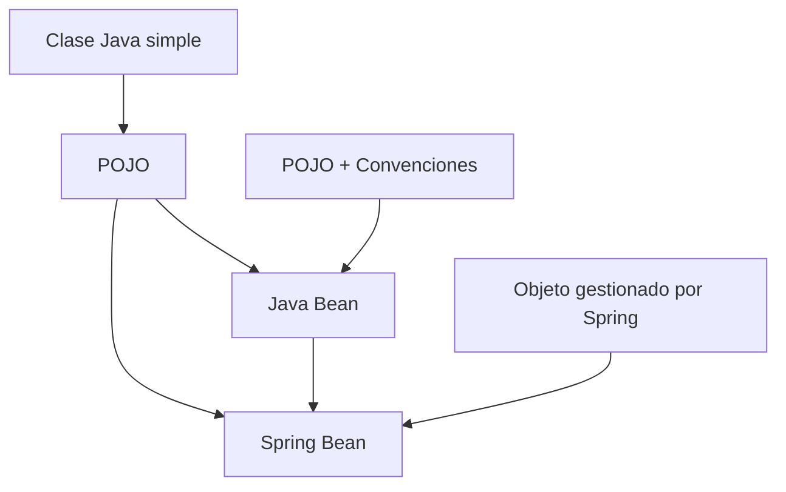

# POJO vs Java Bean vs Spring Bean

## 🟢 POJO (Plain Old Java Object)

### ¿Qué es?
Un **POJO** es simplemente una clase Java común y corriente, sin restricciones especiales ni dependencias de frameworks.

### Características:
- ✅ No hereda de clases especiales
- ✅ No implementa interfaces específicas de frameworks
- ✅ No usa anotaciones especiales (opcional)
- ✅ Clase Java "pura"

### Ejemplo:
```java
public class Persona {
    private String nombre;
    private int edad;
    
    // Constructor
    public Persona(String nombre, int edad) {
        this.nombre = nombre;
        this.edad = edad;
    }
    
    // Métodos normales
    public void saludar() {
        System.out.println("Hola, soy " + nombre);
    }
    
    // Getters/Setters opcionales
    public String getNombre() { return nombre; }
    public void setNombre(String nombre) { this.nombre = nombre; }
}
```

---

## ☕ Java Bean

### ¿Qué es?
Un **Java Bean** es un POJO que sigue **convenciones específicas** para ser compatible con herramientas y frameworks Java.

### Reglas obligatorias:
1. ✅ **Constructor público sin parámetros**
2. ✅ **Propiedades privadas**
3. ✅ **Métodos getter/setter públicos**
4. ✅ **Implementar Serializable** (recomendado)

### Ejemplo:
```java
import java.io.Serializable;

public class PersonaBean implements Serializable {
    private String nombre;
    private int edad;
    
    // 1. Constructor sin parámetros (OBLIGATORIO)
    public PersonaBean() {
    }
    
    // 2. Getters y Setters (OBLIGATORIOS)
    public String getNombre() {
        return nombre;
    }
    
    public void setNombre(String nombre) {
        this.nombre = nombre;
    }
    
    public int getEdad() {
        return edad;
    }
    
    public void setEdad(int edad) {
        this.edad = edad;
    }
}
```

---

## 🍃 Spring Bean

### ¿Qué es?
Un **Spring Bean** es cualquier objeto (POJO o Java Bean) que es **gestionado por el contenedor de Spring**.

### Características:
- ✅ **Creado automáticamente** por Spring
- ✅ **Inyección de dependencias** automática
- ✅ **Ciclo de vida gestionado** por Spring
- ✅ **Singleton por defecto**

### Ejemplo:
```java
@Component  // ← Esto lo convierte en Spring Bean
public class PersonaService {
    private String nombre;
    
    @Autowired
    private EmailService emailService;  // Inyección automática
    
    @PostConstruct
    public void init() {
        System.out.println("Bean inicializado por Spring");
    }
    
    public void enviarSaludo() {
        emailService.enviar("Hola desde PersonaService");
    }
}
```

---

## 📊 Comparación Rápida

| Aspecto | POJO | Java Bean | Spring Bean |
|---------|------|-----------|-------------|
| **Definición** | Clase Java simple | POJO + convenciones | Objeto gestionado por Spring |
| **Constructor sin parámetros** | Opcional | **Obligatorio** | Depende |
| **Getters/Setters** | Opcional | **Obligatorio** | Opcional |
| **Anotaciones** | No necesita | No necesita | **Sí** (`@Component`, `@Service`, etc.) |
| **Gestión de ciclo de vida** | Manual | Manual | **Automática** (Spring) |
| **Inyección de dependencias** | Manual | Manual | **Automática** (`@Autowired`) |
| **Serializable** | Opcional | Recomendado | Opcional |

---

## 🎯 Ejemplos Prácticos

### 1. POJO Simple
```java
// Solo una clase Java normal
public class Producto {
    private String nombre;
    private double precio;
    
    public Producto(String nombre, double precio) {
        this.nombre = nombre;
        this.precio = precio;
    }
    
    public double calcularImpuesto() {
        return precio * 0.16;
    }
}
```

### 2. Java Bean (para frameworks, JSP, etc.)
```java
public class ProductoBean implements Serializable {
    private String nombre;
    private double precio;
    
    // Constructor sin parámetros OBLIGATORIO
    public ProductoBean() {}
    
    // Getters y Setters OBLIGATORIOS
    public String getNombre() { return nombre; }
    public void setNombre(String nombre) { this.nombre = nombre; }
    
    public double getPrecio() { return precio; }
    public void setPrecio(double precio) { this.precio = precio; }
}
```

### 3. Spring Bean (gestionado por Spring)
```java
@Service  // ← Spring Bean
public class ProductoService {
    
    @Autowired
    private ProductoRepository repository;  // Inyección automática
    
    @Value("${impuesto.tasa:0.16}")
    private double tasaImpuesto;  // Valor desde configuración
    
    public Producto guardarProducto(Producto producto) {
        return repository.save(producto);
    }
    
    @PostConstruct
    public void init() {
        System.out.println("ProductoService inicializado con tasa: " + tasaImpuesto);
    }
}
```

---

## 🔄 Relación Entre Ellos



### Explicación:
- **Java Bean** es un POJO con reglas específicas
- **Spring Bean** puede ser cualquier POJO o Java Bean gestionado por Spring
- **No todos los POJOs son Java Beans**
- **No todos los Java Beans son Spring Beans**

---

## 🎪 En Nuestro Proyecto SOAP

### POJO (Clases generadas desde XSD):
```java
// Generado automáticamente desde gym.xsd
public class Reservation {
    protected String idClient;
    protected String activity;
    protected String dayOfWeek;
    protected String time;
    
    // Getters y setters...
}
```

### Spring Bean (Nuestro endpoint):
```java
@Endpoint  // ← Spring Bean
public class GymEndpoint {
    
    @PayloadRoot(namespace = NAMESPACE_URI, localPart = "reservation")
    @ResponsePayload
    public Confirmation createReservation(@RequestPayload Reservation request) {
        // Reservation es un POJO
        // Este método está en un Spring Bean
        // Spring gestiona todo automáticamente
    }
}
```

---

## 💡 ¿Cuándo Usar Cada Uno?

### 🟢 Usa POJO cuando:
- Necesites clases simples para lógica de negocio
- No requieras integración con frameworks
- Quieras máxima simplicidad y flexibilidad

### ☕ Usa Java Bean cuando:
- Trabajes con JSP, JSF, o herramientas visuales
- Necesites serialización/deserialización automática
- Requieras compatibilidad con especificaciones Java EE

### 🍃 Usa Spring Bean cuando:
- Desarrolles con Spring/Spring Boot
- Necesites inyección de dependencias
- Quieras gestión automática del ciclo de vida
- Requieras configuración externalizada

---

## 🎯 Resumen Final

| Concepto | Propósito | Cuándo Usar |
|----------|-----------|-------------|
| **POJO** | Clase Java simple | Lógica de negocio básica |
| **Java Bean** | Interoperabilidad con herramientas Java | Integración con frameworks legacy |
| **Spring Bean** | Gestión automática de objetos | Aplicaciones Spring/Spring Boot |

**Recuerda:** En aplicaciones Spring Boot modernas, principalmente usarás **POJOs** para datos y **Spring Beans** para servicios, controladores y configuración.
