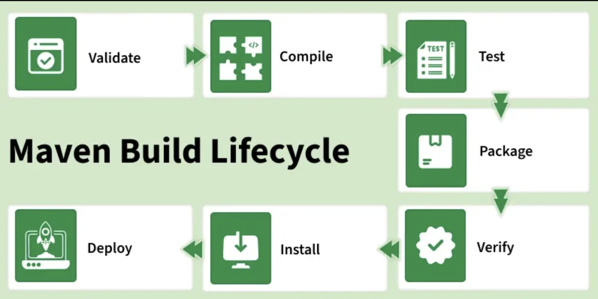

# Gestión de Proyectos con Apache Maven (Spring Boot & Quarkus)

## 1. Fundamentos de Maven

Apache Maven es una herramienta de **gestión de proyectos y automatización de construcción (Build Automation)** basada en el concepto de **POM (Project Object Model)**. A diferencia de scripts de construcción tradicionales, Maven permite gestionar el ciclo de vida de una aplicación, sus dependencias y la generación de reportes de manera estandarizada.

### Convention over Configuration (Convención sobre Configuración)

Maven opera bajo el principio de que "el sistema ya conoce los valores por defecto". Esto significa que, si el desarrollador sigue la estructura de directorios estándar, no necesita configurar manualmente dónde están las fuentes o las pruebas:

- `src/main/java`: Código fuente de la aplicación.
    
- `src/test/java`: Código de pruebas unitarias.
    
- `target/`: Directorio de salida para binarios y artefactos.
    

### El archivo `pom.xml`

El **Project Object Model** es un archivo XML que actúa como el "plano" del proyecto. Contiene la identidad del artefacto (`groupId`, `artifactId`, `version`), las dependencias externas y los plugins necesarios para extender las capacidades de construcción.

---

## 2. El Ciclo de vida (Lifecycle) en detalle

El ciclo de vida de Maven es una secuencia de **fases** claramente definidas. Al ejecutar una fase, Maven garantiza la ejecución de todas las fases previas en el orden establecido.

### Fases Principales del Default Lifecycle:

1. **validate:** Verifica que el proyecto esté correcto y que toda la información necesaria esté disponible.
    
2. **compile:** Compila el código fuente del proyecto.
    
3. **test:** Ejecuta las pruebas unitarias utilizando frameworks como JUnit o TestNG.
    
4. **package:** Empaqueta el código compilado en su formato distributible (JAR/WAR).
    
5. **verify:** Ejecuta comprobaciones sobre los resultados de las pruebas de integración.
    
6. **install:** Instala el paquete en el repositorio local (`~/.m2/repository`) para ser usado como dependencia en otros proyectos locales.
    
7. **deploy:** Copia el paquete final al repositorio remoto para compartirlo con otros desarrolladores.



### Diferenciación técnica en la fase `package`

|Framework|Resultado del Empaquetado|Descripción Técnica|
|---|---|---|
|**Spring Boot**|**Fat JAR / Uber-jar**|Contiene todas las dependencias del proyecto y un servidor embebido (Tomcat/Undertow) dentro de un solo archivo ejecutable.|
|**Quarkus**|**Fast-jar / Native Executable**|Genera un archivo optimizado para un arranque rápido. Además, permite la **compilación nativa** vía GraalVM, eliminando la necesidad de una JVM en tiempo de ejecución.|


---

## 3. Gestión de dependencias y plugins

Maven gestiona las librerías necesarias mediante identificadores únicos. Para Spring Boot y Quarkus, el enfoque varía ligeramente en su ecosistema:

### Declaración de dependencias base

En **Spring Boot**, se utilizan los "Starters" para agrupar funcionalidades:

XML

```
<dependency>
    <groupId>org.springframework.boot</groupId>
    <artifactId>spring-boot-starter-web</artifactId>
</dependency>
```

En **Quarkus**, se utilizan "Extensions" optimizadas para tiempo de compilación:

XML

```
<dependency>
    <groupId>io.quarkus</groupId>
    <artifactId>quarkus-resteasy-reactive</artifactId>
</dependency>
```

### Plugins específicos

Los plugins permiten que Maven interactúe con las características particulares de cada framework:

- **`spring-boot-maven-plugin`**: Se encarga de crear el ejecutable "Fat JAR" y permite ejecutar la aplicación directamente desde Maven.
    
- **`quarkus-maven-plugin`**: Es vital para el "Augmentation" (procesamiento de bytecode en tiempo de build) y facilita el desarrollo en modo "Live Reload".
    

---

## 4. Comandos esenciales

|Acción|Comando Spring Boot|Comando Quarkus|
|---|---|---|
|**Modo Desarrollo**|`mvn spring-boot:run`|`mvn quarkus:dev`|
|**Limpiar y Empaquetar**|`mvn clean package`|`mvn clean package`|
|**Ejecutar Pruebas**|`mvn test`|`mvn test`|
|**Compilación Nativa**|N/A (Requiere config extra)|`mvn package -Pnative`|

Export to Sheets

---

## 5. Ejemplo de estructura de un `pom.xml` (simplificado)

XML

```
<project xmlns="http://maven.apache.org/POM/4.0.0" ...>
    <modelVersion>4.0.0</modelVersion>
    <groupId>com.universidad.sistemas</groupId>
    <artifactId>proyecto-demo</artifactId>
    <version>1.0.0-SNAPSHOT</version>

    <dependencies>
        </dependencies>

    <build>
        <plugins>
            </plugins>
    </build>
</project>
```

---

## 6. Análisis crítico

Como futuro ingeniero, es vital cuestionar las herramientas. **Maven** destaca por su madurez, su estructura rígida que facilita el trabajo en equipos grandes y su enorme ecosistema de plugins.

Sin embargo, herramientas como **Gradle** ofrecen un rendimiento superior en builds incrementales y una configuración basada en código (Groovy/Kotlin) en lugar de XML.
