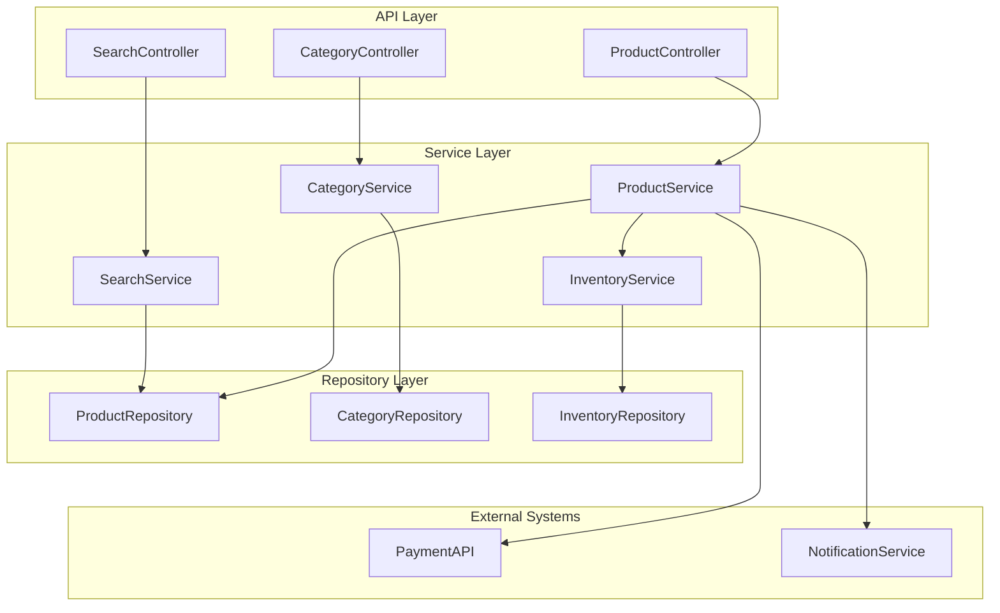

# Creación de Proyecto OAS - Spring Boot


> **Sistema de Gestión de Catálogo de Productos usando enfoque API-First con Spring Boot**

---

## 🎯 Objetivos de la práctica

### **Objetivo general**

Implementar un sistema completo de gestión de catálogo de productos utilizando Spring Boot con enfoque API-First, aplicando los conceptos de Domain-Driven Design de la unidad 2.

### **Objetivos específicos**

- **Generar código automáticamente** desde especificaciones OpenAPI.
- **Implementar arquitectura en capas** con Spring Boot 4.
- **Configurar hilos virtuales (Virtual Threads)** para alta concurrencia con Java 25.
- **Configurar validación robusta** y manejo de errores.
- **Establecer observabilidad** nativa con Spring Boot Actuator.
- **Crear documentation interactiva** con Swagger UI.

---

## 📋 Especificaciones del Proyecto

### **Dominio: Sistema de catálogo de productos**

Basado en el modelo desarrollado en la [Unidad 2 - Creación Open API Specification](../../unidad-2-diseno/03-actividades/01-creacion-openapi-specification.md):

```yaml
# Contextos bounded implementados

Product Context:
  - Product management
  - Category organization
  - Inventory tracking
  - Price management

Catalog Context:
  - Product search and filtering
  - Category navigation
  - Product details
  - Availability status
```

## **Funcionalidades Requeridas**

- ✅ **Gestión de productos** - CRUD completo de product catalog
- ✅ **Sistema de categorías** - Category hierarchy management
- ✅ **Validación de inventario** - Stock availability checking
- ✅ **Cálculo de precios** - Dynamic pricing with discounts
- ✅ **Búsqueda y filtrado** - Product search and filtering capabilities
- ✅ **Reportes básicos** - Sales and inventory reports

---

## 🏗️ Arquitectura del Sistema

### **Estructura de Capas**



> **🔍 Explicación del diagrama:**  
> Esta arquitectura de **3 capas** separa responsabilidades claramente: 
> 
> **API Layer** maneja requests HTTP y validaciones de entrada.
> 
> **Service Layer** contiene la lógica de negocio y orquestación entre servicios
> 
> **Repository Layer** abstrae el acceso a datos.
> 
> El flujo va de Controllers → Services → Repositories, con integraciones a sistemas externos (PaymentAPI, NotificationService). Esta separación facilita testing, mantenibilidad y escalabilidad del sistema de catálogo de productos.

### **Bounded Context Mapping**

```yaml
# Implementation mapping desde Unidad 2

Product Aggregate:
  - Entity: Product (root)
  - Value Objects: ProductId, ProductName, Price, Category
  - Repository: ProductRepository
  - Service: ProductService

Category Aggregate:
  - Entity: Category (root)
  - Value Objects: CategoryName, Description
  - Repository: CategoryRepository
  - Service: CategoryService

Inventory Aggregate:
  - Entity: Inventory (root)
  - Value Objects: StockLevel, AvailabilityStatus
  - Repository: InventoryRepository
  - Service: InventoryService
```

---

## 🚀 Paso 1: Crear el proyecto en Spring Initializr

Primero, generaremos la estructura base de nuestro proyecto Spring Boot.

1. Ve a [start.spring.io](https://start.spring.io/).

2. Configura tu proyecto:

    - **Project:** Maven
    - **Language:** Java
    - **Spring Boot:** 4.0.4
    - **Project Metadata:**
        - **Group:** `com.ejemplo` (o el de tu organización)
        - **Artifact:** `api-rest`
        - **Package name:** `com.ejemplo.api` (¡Importante! Usaremos este como base).
        - **Packaging**: `jar`
        - **Configuration**: `Properties`
        - **Java:** `25 (LTS)`

3. **Añadir dependencias:** Busca y agrega las siguientes dependencias esenciales:

    - **Spring Web:** Necesario para crear controladores REST.
    - **Spring Boot Actuator** (Para observabilidad).
    - **Validation** (Bean Validation con Jakarta EE 11).

4. Haz clic en **"Generate"**. Esto descargará un archivo `.zip`.

5. Descomprime el archivo y abre el proyecto en tu IDE favorito (IntelliJ, Eclipse, VSCode).

---

## 📦 Paso 2: Estructura de paquetes y OAS

Una buena organización es clave.

1. **Colocar el OAS:** Dentro de la carpeta `src/main/resources`, crea una nueva carpeta llamada `api`, copia tu archivo OAS dentro de la carpeta, se recomienda renombrar tu archivo con el nombre [**openapi.yaml**](../02-recursos/oas-ecommerce-product.yaml).

    - Ruta final: `src/main/resources/api/openapi.yaml`

2. **Verificar paquetes:** En `src/main/java`, ya tendrás tu paquete base (ej. `com.ejemplo.api`). Dentro de este, crea los siguientes sub-paquetes si no existen:

    - `com.ejemplo.api.controller` (Para nuestros controladores)

    - `com.ejemplo.api.model` (Aquí moveremos los modelos generados)

    - `com.ejemplo.api.service` (Para la lógica de negocio)

Tu estructura debería verse así:

```text
api-rest/
├── src/
│   ├── main/
│   │   ├── java/
│   │   │   └── com/ejemplo/api/
│   │   │       ├── controller/
│   │   │       ├── model/
│   │   │       ├── service/
│   │   │       └── ApiRestApplication.java
│   │   └── resources/
│   │       ├── api/
│   │       │   └── openapi.yaml  <-- Tu archivo OAS aquí
│   │       └── application.properties
└── pom.xml
```

---

## ⚙️ Paso 3: Configurar `pom.xml` para generar modelos

Ahora, le diremos a Maven cómo leer nuestro `openapi.yaml` y generar las clases POJO (Plain Old Java Objects) del modelo.

Abre tu archivo `pom.xml` en la raíz del proyecto.

1. **Añadir dependencias:** Asegúrate de tener estas versiones compatibles con **Jakarta EE 11** y **Spring Boot 4.0.4**, estás dependencias van dentro de la etiqueta `<dependencies>`:

    ```xml
            <dependency>
                <groupId>org.openapitools</groupId>
                <artifactId>jackson-databind-nullable</artifactId>
                <version>0.2.6</version>
            </dependency>

            <dependency>
                <groupId>jakarta.validation</groupId>
                <artifactId>jakarta.validation-api</artifactId>
            </dependency>

            <dependency>
                <groupId>io.swagger.core.v3</groupId>
                <artifactId>swagger-annotations</artifactId>
                <version>2.2.22</version>
            </dependency>        
    ```

2. **Añadir el plugin generador:** Dentro de la etiqueta `<build>`, agrega la sección `<plugins>` (si no existe) y añade el siguiente plugin. Este es el motor que generará el código.

    ```xml
                <plugin>
                    <groupId>org.openapitools</groupId>
                    <artifactId>openapi-generator-maven-plugin</artifactId>
                    <version>7.5.0</version>
                    <executions>
                        <execution>
                            <id>generate-sources</id>
                            <goals>
                                <goal>generate</goal>
                            </goals>                        
                            <configuration>
                                <inputSpec>${project.basedir}/src/main/resources/api/openapi.yaml</inputSpec>
                                <generatorName>spring</generatorName>
                                <modelPackage>com.ejemplo.api.model</modelPackage>
                                <generateModels>true</generateModels>
                                <generateApis>false</generateApis>
                                <generateSupportingFiles>false</generateSupportingFiles>
                                <configOptions>
                                    <useJakartaEe>true</useJakartaEe>
                                    <interfaceOnly>false</interfaceOnly>
                                    <skipDefaultInterface>true</skipDefaultInterface>
                                    <serializableModel>true</serializableModel>
                                    <useBeanValidation>true</useBeanValidation>
                                    <useVirtualThreads>true</useVirtualThreads>
                                </configOptions>
                            </configuration>
                        </execution>
                    </executions>
                </plugin>
    ```

---

## ☕ Paso 4: Generar y mover los modelos

Con el `pom.xml` configurado, vamos a generar las clases.

1. **Ejecutar Maven:** Abre una terminal en la raíz de tu proyecto y ejecuta el siguiente comando:

	**Opción 1:**
    ```bash
	   mvn generate-sources
    ```

	**Opción 2:**

	```bash
	mvn openapi-generator:generate
	mvn openapi-generator:generate@generate-sources
	```

	**Opción 3:**

	```bash
	mvn clean generate-sources
	```

    - **Nota:** Si se usa un IDE, puede hacerse desde la pestaña "Maven" -> "Plugins" -> "openapi-generator" -> "openapi-generator:generate".

2. **Verificar archivos generados:** Este comando _no_ pone los archivos en `src/main/java`. Los crea en la carpeta `target`. Ve a: `target/generated-sources/openapi/src/main/java/com/ejemplo/api/model`

3. **Mover los modelos:**

    - Copia todos los archivos `.java` que encuentres en ese directorio (por ejemplo: `Product.java`, `ProductList.java`, `ApiError.java`, etc.).

    - Pégalos en tu paquete de código fuente: `src/main/java/com/ejemplo/api/model`

4. **Desactivar generación de modelos:** Comentar el plugin que permite generar los modelos.

¡Listo! Ahora tu proyecto "conoce" las estructuras de datos (Modelos/POJOs) definidas en tu API.

---

## ➡️ Paso 5: Crear el Controller (Lógica del API)

Aquí es donde implementamos los _endpoints_. El OAS nos dice _qué_ debemos construir, y ahora lo _construimos_.

Supongamos que tu OAS define un endpoint `POST /products` que recibe un `Product` y devuelve un `ProductResponse`.

1. **Crear la Clase Controller:** En el paquete `com.ejemplo.api.controller`, crea una nueva clase Java, por ejemplo, `ProductController.java`.

2. **Añadir Anotaciones:**

    - `@RestController`: Le dice a Spring que esta clase manejará peticiones REST.

    - `@RequestMapping("/api/v1")`: (Opcional) Define un prefijo base para todas las rutas en esta clase. Debe coincidir con tu OAS (`servers: url`).

    - `@Validated`: Necesario para que Spring active las validaciones de parámetros y cuerpos de petición..

    ```java
    package com.ejemplo.api.controller;

    import com.ejemplo.api.model.Category; // Importa el modelo generado para recibir datos
    import com.ejemplo.api.model.Product; // Importa el modelo generado para recibir datos
    import com.ejemplo.api.model.ProductResponse; // Importa el modelo generado para responder

    import org.springframework.http.HttpStatus;
    import org.springframework.http.ResponseEntity;
    import org.springframework.validation.annotation.Validated;
    import org.springframework.web.bind.annotation.GetMapping;
    import org.springframework.web.bind.annotation.PathVariable;
    import org.springframework.web.bind.annotation.PostMapping;
    import org.springframework.web.bind.annotation.RequestBody;
    import org.springframework.web.bind.annotation.RequestMapping;
    import org.springframework.web.bind.annotation.RestController;

    import jakarta.validation.Valid; // Permite la validación de los request bodies

    @RestController
    @RequestMapping("/api/v1") // Prefijo base de la API
    @Validated // Activa la validación
    public class ProductController {
        
        // ... aquí irán los métodos

    }
    ```

3. **Implementar el Endpoint (Método):**

    - Usamos `@PostMapping("/products")` para mapear la ruta y el método HTTP.

    - Usamos `@RequestBody` para indicarle a Spring que convierta el JSON de la petición en un objeto `Product`.

    - Usamos `@Valid` _antes_ del `@RequestBody` para que Spring revise las anotaciones de validación del modelo (ej. `@NotNull`) antes de que nuestro método se ejecute.

    - Devolvemos un `ResponseEntity<Confirmation>` para tener control total sobre la respuesta (código HTTP, headers y cuerpo).

    ```java
	    // ... dentro de la clase ProductController ...
	    
        @PostMapping("/products")
        public ResponseEntity<ProductResponse> createProduct(
            @Valid @RequestBody Product productRequest) 
        {
            System.out.println("Controller - Product recibido: " + productRequest.getName());

            // Simulamos que la DB le persiste la información
            ProductResponse productResponse = new ProductResponse();
            productResponse.setId("prod-12345");
            productResponse.setName(productRequest.getName());
            productResponse.setDescription(productRequest.getDescription());
            productResponse.setPrice(productRequest.getPrice());
            productResponse.setCategory(productRequest.getCategory());
            productResponse.setInStock(true);
            productResponse.setSku("LAP-GAM-001");
            productResponse.setCreatedAt(java.time.OffsetDateTime.now());
            productResponse.setUpdatedAt(java.time.OffsetDateTime.now());

            System.out.println("Controller - Product creado: " + productResponse.getName());
        
            // Devolvemos la respuesta con el código 201 (CREATED)
            return new ResponseEntity<>(productResponse, HttpStatus.CREATED);
        }
    ```

    - Se agrega otro método de ejemplo implementando la operación GET.

    ```java
        @GetMapping("/products/{productId}")
        public ResponseEntity<ProductResponse> getProductById(@PathVariable("productId") Integer productId) 
        {
            System.out.println("Controller - Buscando Product con ID: " + productId);

            // Validación básica del ID
            if (productId == null || productId < 1 || productId > 999999) {
                return ResponseEntity.notFound().build();
            }
            
            // Simulamos buscar la reserva en la base de datos
            // En un caso real, aquí harías: productService.findById(productId)
            
            // Simulamos que encontramos la reserva
            ProductResponse productResponse = new ProductResponse();
            productResponse.setId("prod-12345");
            productResponse.setName("Laptop Gamer");
            productResponse.setDescription("Una laptop para gaming");
            productResponse.setPrice(1500.00);
            productResponse.setCategory(Category.ELECTRONICS);
            productResponse.setInStock(true);
            productResponse.setSku("LAP-GAM-001");
            productResponse.setCreatedAt(null);
            productResponse.setUpdatedAt(null);

            // Devolvemos la consulta con código 200 (OK)
            return ResponseEntity.ok(productResponse);
        }
    ```

En este momento el servicio puede ser validado ejecutando los siguientes pasos.

- Ejecuta el proyecto desde terminal: `mvn spring-boot:run`.
- Envia una petición `POST` a <http://localhost:8080/api/v1/products>.
- Envia una petición `GET` a <http://localhost:8080/api/v1/products/1>`.

Es importante mencionar que también existen otras urls que pueden ser invocadas.

- Accede a <http://localhost:8080/actuator/health> desde tu navegador de Internet para revisar la salud del servicio.
- También puedes utilizar el comando curl para enviar una petición GET `curl http://localhost:8080/actuator/health`.

Una vez termina la prueba se presionan las teclas CTRL + C.

---

## 🛠️ Paso 6: Añadir Capa de Servicio

Los controladores no deben tener lógica de negocio (cálculos, acceso a base de datos). Deben delegar esa tarea a una **Capa de Servicio**.

1. **Crear `ProductService`:** En `com.ejemplo.api.service`, crea una clase `ProductService.java`.

2. **Anotar con `@Service`:** Esto le dice a Spring que gestione esta clase como un "bean".

    ```java
    package com.ejemplo.api.service;

    import java.time.OffsetDateTime;
    import java.util.UUID;

    import org.springframework.stereotype.Service;

    import com.ejemplo.api.model.Category;
    import com.ejemplo.api.model.Product;
    import com.ejemplo.api.model.ProductResponse;

    @Service
    public class ProductService {

        public ProductResponse createProduct(Product product) 
        {
            System.out.println("Service - Product recibido: " + product.getName());

            // Simulamos la persistencia y generación de datos del sistema
            ProductResponse response = new ProductResponse();
            
            // Mapeo de campos desde el Request
            response.setName(product.getName());
            response.setPrice(product.getPrice());
            response.setCategory(product.getCategory());
            response.setDescription(product.getDescription());
            response.setInStock(product.getInStock());

            // Datos generados por el servidor (conforme al OAS)
            response.setId("prod-" + System.currentTimeMillis());
            response.setSku("SKU-" + UUID.randomUUID().toString().substring(0, 8).toUpperCase());
            response.setCreatedAt(OffsetDateTime.now());
            response.setUpdatedAt(OffsetDateTime.now());

            return response;
        }

        public ProductResponse getProductById(String productId) 
        {
            System.out.println("Service - Buscando Product con ID: " + productId);

            // Simulación de búsqueda en base de datos
            ProductResponse response = new ProductResponse();
            response.setId(productId);
            response.setName("Producto de Ejemplo");
            response.setPrice(99.99);
            response.setCategory(Category.ELECTRONICS);
            response.setSku("LAP-GAM-001");
            response.setCreatedAt(OffsetDateTime.now());
            response.setInStock(true);
            
            return response;
        }
    }
    ```

3. **Usar el Service en el Controller:** Modifica tu `ProductController.java` para "inyectar" (`@Autowired`) el servicio y usarlo.

    ```java
    package com.ejemplo.api.controller;

    import com.ejemplo.api.model.ApiError;
    import com.ejemplo.api.model.Product; // Importa el modelo generado para recibir datos
    import com.ejemplo.api.model.ProductResponse; // Importa el modelo generado para responder
    import com.ejemplo.api.service.ProductService;

    import java.time.OffsetDateTime;
    import java.util.HashMap;
    import java.util.Map;
    import org.springframework.beans.factory.annotation.Autowired;
    import org.springframework.http.HttpStatus;
    import org.springframework.http.ResponseEntity;
    import org.springframework.validation.annotation.Validated;
    import org.springframework.web.bind.annotation.GetMapping;
    import org.springframework.web.bind.annotation.PathVariable;
    import org.springframework.web.bind.annotation.PostMapping;
    import org.springframework.web.bind.annotation.RequestBody;
    import org.springframework.web.bind.annotation.RequestMapping;
    import org.springframework.web.bind.annotation.RestController;

    import jakarta.validation.Valid; // Permite la validación de los request bodies

    @RestController
    @RequestMapping("/api/v1") // Prefijo base de la API
    @Validated // Activa la validación
    public class ProductController {

        // Inyección de dependencias: Spring nos "pasa" una instancia del servicio
        @Autowired
        private ProductService productService;
        
        @PostMapping("/products")
        public ResponseEntity<ProductResponse> createProduct(
            @Valid @RequestBody Product productRequest) 
        {
            System.out.println("Controller - Product recibido: " + productRequest.getName());

            // El controller delega la lógica al service
            ProductResponse productResponse = productService.createProduct(productRequest);
        
            // Devolvemos la respuesta con el código 201 (CREATED)
            return new ResponseEntity<>(productResponse, HttpStatus.CREATED);
        }

        @GetMapping("/products/{productId}")
        public ResponseEntity<?> getProductById(@PathVariable("productId") Integer productId) 
        {
            System.out.println("Controller - Buscando Product con ID: " + productId);

            // Validación básica del ID
            if (productId == null || productId < 1 || productId > 999999) {
                ApiError errorResponse = new ApiError();
                errorResponse.setCode(ApiError.CodeEnum.INVALID_INPUT);
                errorResponse.setMessage("Invalid product ID");
                errorResponse.setTimestamp(OffsetDateTime.now());
                errorResponse.setPath("/products/{productId}");

                Map<String, Object> details = new HashMap<>();
                details.put("info", "El valor proporcionado no es correcto, debe estar entre 1 y 999999");
                errorResponse.setDetails(details);

                return ResponseEntity.badRequest().body(errorResponse);
            }
            
            // El controller delega la lógica al service
            ProductResponse productResponse = productService.getProductById(productId.toString());

            // Devolvemos la consulta con código 200 (OK)
            return ResponseEntity.ok(productResponse);
        }
    }
    ```

---

## 🛠️ Paso 7: Configuración de Rendimiento y Observabilidad

En `src/main/resources/application.properties`, activamos las características de nueva generación:

```properties
# Activación de Hilos Virtuales (Project Loom)
spring.threads.virtual.enabled=true

# Observabilidad: Health Checks
management.endpoints.web.exposure.include=health,info,metrics
management.endpoint.health.show-details=always
```

Ahora es posible tener más información de salud del servicio.

- Envía una petición GET para revisar toda la información disponible `curl http://localhost:8080/actuator/health`.
- Envía una petición `GET` para obtener una métrica específica `curl http://localhost:8080/actuator/metrics/jvm.memory.used`.

---

## 🧪 Paso 8: Probar con Postman

1. **Ejecutar la aplicación:** Ejecuta tu clase principal `ApiRestApplication.java` (o usa `mvn spring-boot:run`).

2. **Validación de salud:** Accede a `http://localhost:8080/actuator/health`. Si el estado es `"UP"`, el microservicio está correctamente configurado.

3. **Abrir Postman.**

4. **Probar el `POST /products`:**

    - **Método:** `POST`

    - **URL:** `http://localhost:8080/api/v1/products`

    - **Pestaña "Body"**:

        - Selecciona `raw` y `JSON`.

        - Escribe el JSON de tu reservation (¡los nombres deben coincidir con tu modelo!).

        ```json
        {
            "name": "Laptop Gaming",
            "price": 1299.99,
            "category": "BOOKS",
            "description": "Laptop de alto rendimiento para gaming",
            "inStock": true
        }
        ```

    - **¡Enviar!** Debes recibir una respuesta `201 Created` con el JSON de respuesta.

        ```json
        {
            "name": "Laptop Gaming",
            "price": 1299.99,
            "category": "BOOKS",
            "inStock": true,
            "id": "prod-1774315603200",
            "sku": "SKU-4920627E",
            "createdAt": "2026-03-23T19:26:43.202419-06:00",
            "description": "Laptop de alto rendimiento para gaming",
            "updatedAt": "2026-03-23T19:26:43.202465-06:00"
        }
        ```

5. **Probar el `GET /products/{id}`:**

    - **Método:** `GET`

    - **URL:** `http://localhost:8080/api/v1/products/1` (o el ID que quieras probar).

    - **¡Enviar!** Deberías recibir una respuesta `200 OK` con el JSON de respuesta.
        ```json
        {
            "name": "Producto de Ejemplo",
            "price": 99.99,
            "category": "ELECTRONICS",
            "inStock": true,
            "id": "1",
            "sku": "LAP-GAM-001",
            "createdAt": "2026-03-23T19:30:36.518198-06:00",
            "description": null,
            "updatedAt": null
        }
        ```
