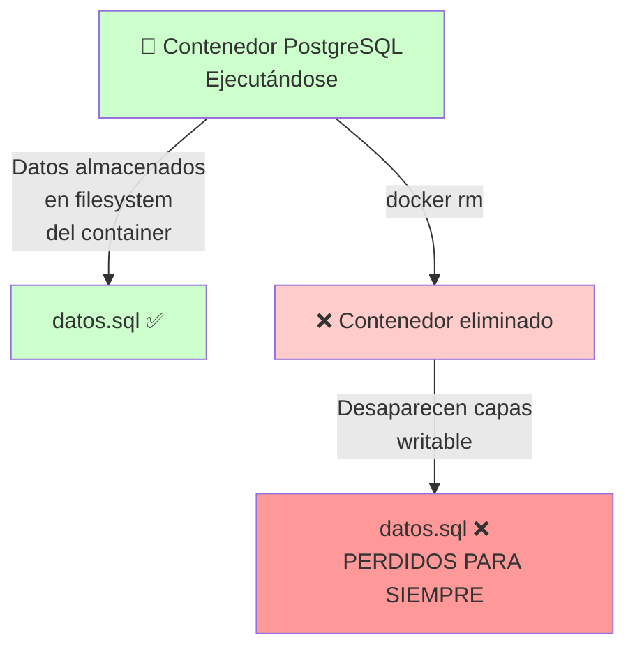
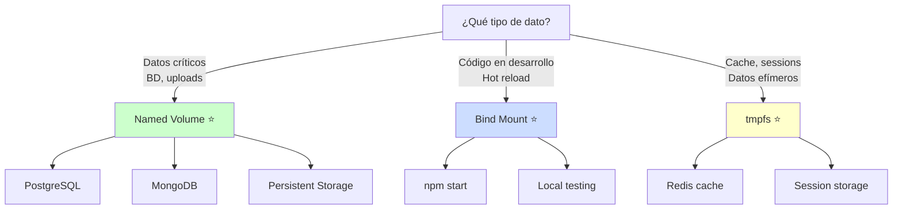
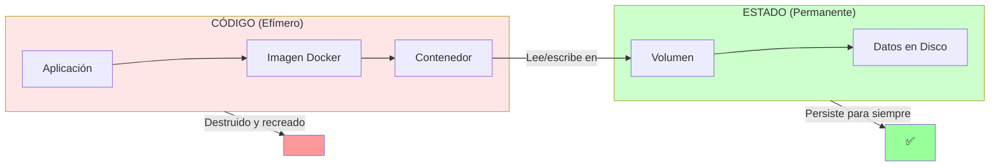
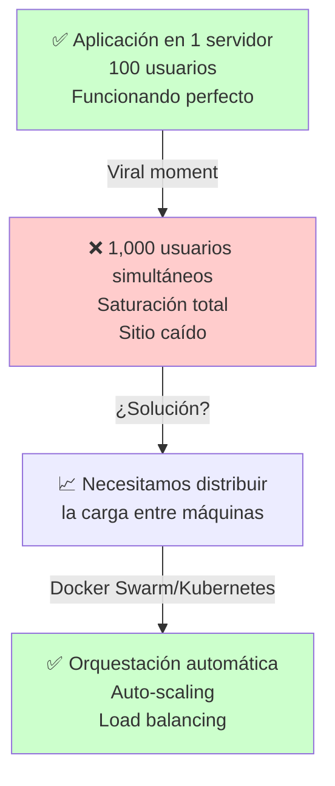
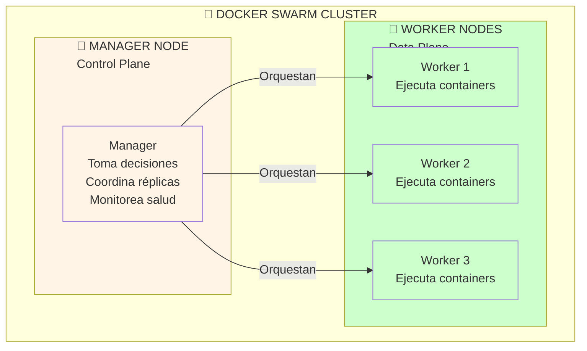
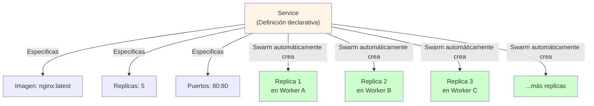
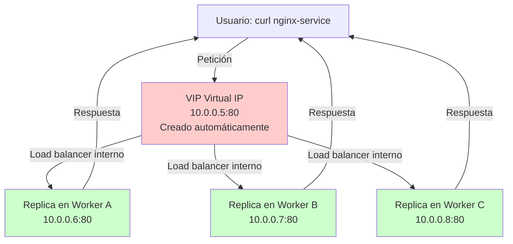
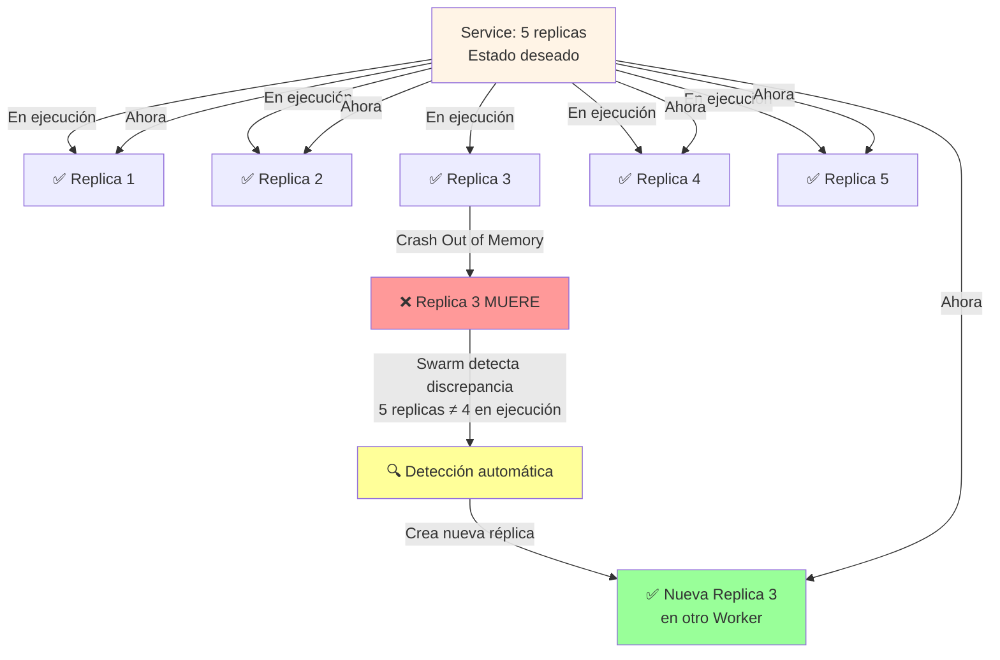
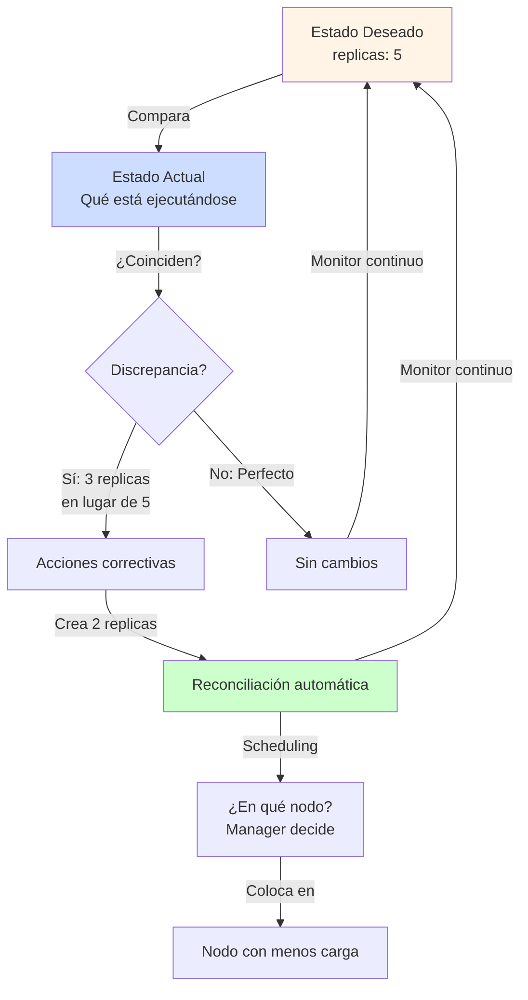

# 🐳 Docker: Desde Cero hasta Producción

- [🐳 Docker: Desde Cero hasta Producción](#-docker-desde-cero-hasta-producción)
- [6. "Almacenamiento: Datos que persisten"](#6-almacenamiento-datos-que-persisten)
  - [Objetivo: No perder datos cuando los contenedores se detienen](#objetivo-no-perder-datos-cuando-los-contenedores-se-detienen)
    - [🎯 El problema: Contenedores efímeros](#-el-problema-contenedores-efímeros)
    - [💾 Las 3 soluciones de almacenamiento](#-las-3-soluciones-de-almacenamiento)
      - [Comparativa: Soluciones de Persistencia](#comparativa-soluciones-de-persistencia)
      - [1. Named Volumes (⭐ Producción)](#1-named-volumes--producción)
      - [2. Bind Mounts (⭐ Desarrollo)](#2-bind-mounts--desarrollo)
      - [3. tmpfs (⭐ Datos temporales)](#3-tmpfs--datos-temporales)
    - [🎓 Cuándo usar cada uno](#-cuándo-usar-cada-uno)
    - [🎯 Ejemplo práctico: Django + PostgreSQL](#-ejemplo-práctico-django--postgresql)
    - [✅ Checkpoint 6: Experimenta persistencia](#-checkpoint-6-experimenta-persistencia)
    - [🎓 Teoría Consolidada: Persistencia y Volúmenes](#-teoría-consolidada-persistencia-y-volúmenes)
- [7. "Escala tu aplicación: Docker Swarm"](#7-escala-tu-aplicación-docker-swarm)
  - [Objetivo: Múltiples máquinas trabajando juntas](#objetivo-múltiples-máquinas-trabajando-juntas)
    - [🎯 El desafío: Una máquina no es suficiente](#-el-desafío-una-máquina-no-es-suficiente)
    - [💡 Solución: Distribuir trabajo entre múltiples máquinas](#-solución-distribuir-trabajo-entre-múltiples-máquinas)
    - [🔑 Conceptos clave](#-conceptos-clave)
    - [📋 Inicializar un Swarm (conceptos)](#-inicializar-un-swarm-conceptos)
    - [🎯 Desplegar un servicio en el Swarm](#-desplegar-un-servicio-en-el-swarm)
    - [🎓 La orquestación en acción](#-la-orquestación-en-acción)
    - [✅ Checkpoint 7: Conceptos teóricos](#-checkpoint-7-conceptos-teóricos)
    - [🎓 Teoría Consolidada: Clustering y Escalabilidad](#-teoría-consolidada-clustering-y-escalabilidad)
- [8. "Producción profesional"](#8-producción-profesional)
  - [Objetivo: Arquitectura real como Netflix/Spotify](#objetivo-arquitectura-real-como-netflixspotify)
    - [🎯 Componentes de una arquitectura profesional](#-componentes-de-una-arquitectura-profesional)
    - [🎓 Principios de diseño](#-principios-de-diseño)
    - [📋 Ejemplo: Stack de producción real](#-ejemplo-stack-de-producción-real)
    - [✅ Checkpoint 8: Arquitectura profesional](#-checkpoint-8-arquitectura-profesional)
    - [🎓 Teoría Consolidada: Arquitectura de Microservicios](#-teoría-consolidada-arquitectura-de-microservicios)
- [9. "DevOps: El ciclo de vida completo"](#9-devops-el-ciclo-de-vida-completo)
  - [Objetivo: Entender el viaje del código desde escritura hasta producción](#objetivo-entender-el-viaje-del-código-desde-escritura-hasta-producción)
    - [🎯 El Pipeline DevOps moderno](#-el-pipeline-devops-moderno)
    - [🔄 El ciclo continuo](#-el-ciclo-continuo)
    - [💡 Beneficios de esta automatización](#-beneficios-de-esta-automatización)
    - [📋 Archivo de ejemplo: GitHub Actions + Docker](#-archivo-de-ejemplo-github-actions--docker)
    - [🎓 Teoría Consolidada: CI/CD y DevOps](#-teoría-consolidada-cicd-y-devops)
    - [✅ Checkpoint 9: La big picture](#-checkpoint-9-la-big-picture)
- [✨ Conclusión](#-conclusión)
  - [Recordatorio final](#recordatorio-final)

# 6. "Almacenamiento: Datos que persisten"

## Objetivo: No perder datos cuando los contenedores se detienen

### 🎯 El problema: Contenedores efímeros



> **🔍 El dilema de los contenedores:**  
> Los contenedores están diseñados para ser **efímeros** (temporales, desechables). Cuando los eliminas, Docker descarta la capa writable donde se almacenaban todos los datos. Esto es excelente para aplicaciones sin estado (web servers), pero **desastroso para datos críticos** (bases de datos, archivos de configuración, uploads de usuarios). La solución: separar código (contenedor) de datos (volúmenes).

**La realidad en producción:**
- ❌ Perder una base de datos = servicio caído + pérdida de millones de dólares
- ❌ Perder uploads de usuarios = demandas legales
- ❌ Perder configuración = inconsistencia en el cluster

### 💾 Las 3 soluciones de almacenamiento

#### Comparativa: Soluciones de Persistencia

| Tipo | Ubicación | Persistencia | Caso de Uso | Rendimiento |
|------|-----------|--------------|-------------|------------|
| **Named Volumes** | `/var/lib/docker/volumes/` (Docker lo maneja) | ✅ Sí, permanente | Producción (DB, datos críticos) | 5/5 (Excelente) |
| **Bind Mounts** | Ruta arbitraria del host | ✅ Sí, en disco host | Desarrollo local (editar código en vivo) | 4/5 (Bueno) |
| **tmpfs** | RAM del host | ❌ No, temporal | Cache, sessions, datos efímeros | 5/5 (Ultra rápido) |

#### 1. Named Volumes (⭐ Producción)

```bash
# Crear un volumen
docker volume create mi-data

# Usarlo en un contenedor
docker run -v mi-data:/data postgres

# El volumen persiste aunque elimines el contenedor
docker rm postgres
docker volume ls  # ¡El volumen sigue aquí!
```

**Ventajas:** 
- ✅ Docker lo gestiona automáticamente
- ✅ Portátil entre contenedores
- ✅ Respaldos y restauración simplificados
- ✅ Cifrado y permisos controlados por Docker

**Desventajas:** 
- ❌ No ves los archivos directamente en el host"}}]

#### 2. Bind Mounts (⭐ Desarrollo)

```bash
# En docker-compose.yml
volumes:
  - ./mi-carpeta-local:/ruta/en/container

# O con docker run
docker run -v /Users/miusuario/datos:/data postgres
```

**Ventajas:** 
- ✅ Ves y editas archivos en tiempo real
- ✅ Cambios en el host se reflejan en el container instantáneamente

**Desventajas:** 
- ❌ Problemas de permisos entre OS
- ❌ No portable (paths diferentes Mac/Windows/Linux)

#### 3. tmpfs (⭐ Datos temporales)

```bash
docker run --tmpfs /temp nginx  # Datos en RAM, super rápido
```

**Ventajas:** Ultra rápido (memoria RAM)
**Desventajas:** Se pierde al reiniciar, limitado por RAM

### 🎓 Cuándo usar cada uno



> **🔍 Estrategia de selección:**  
> Pregúntate: "¿Necesito estos datos después de que el contenedor muera?" Si sí → Named Volume. "¿Es código que edito localmente?" Si sí → Bind Mount. "¿Es temporal y solo para velocidad?" Si sí → tmpfs.

### 🎯 Ejemplo práctico: Django + PostgreSQL

```yaml
version: '3.9'

services:
  db:
    image: postgres:15
    environment:
      POSTGRES_DB: myapp
      POSTGRES_PASSWORD: secret
    volumes:
      # Datos persistentes de la DB
      - postgres_data:/var/lib/postgresql/data
    networks:
      - app-network

  web:
    image: mi-django-app:1.0
    ports:
      - "8000:8000"
    volumes:
      # Código en desarrollo (cambios en tiempo real)
      - ./myproject:/app
    environment:
      DATABASE_URL: postgresql://postgres:secret@db:5432/myapp
    depends_on:
      - db
    networks:
      - app-network

volumes:
  postgres_data:  # Datos de DB persisten

networks:
  app-network:
```

### ✅ Checkpoint 6: Experimenta persistencia

```bash
# Crea un volumen
docker volume create test-data

# Ejecuta un contenedor con ese volumen
docker run -d --name db -v test-data:/data postgres

# Escribe datos
docker exec db bash -c "echo 'Datos importantes' > /data/archivo.txt"

# Elimina el contenedor
docker stop db
docker rm db

# Crea un nuevo contenedor con EL MISMO volumen
docker run -d --name db2 -v test-data:/data postgres

# ¡Los datos siguen aquí!
docker exec db2 cat /data/archivo.txt  # "Datos importantes" ✅
```

### 🎓 Teoría Consolidada: Persistencia y Volúmenes

**Definición formal:**
> **Volumen Docker** es un mecanismo de persistencia de datos administrado por Docker que permite que datos sobrevivan al ciclo de vida de los contenedores. Los volúmenes desacoplan el código (contenedor, efímero) del estado (volumen, permanente), permitiendo arquitecturas resilientes y escalables.

**¿Qué vimos en la práctica?**
Datos sobrevivieron a la eliminación de contenedores gracias a volúmenes. Un contenedor murió, pero sus datos permanecieron intactos en el volumen.

**La teoría detrás:**
Docker maneja **3 mecanismos de almacenamiento con ciclos de vida distintos**:

```mermaid
graph TB
    subgraph vol["📦 NAMED VOLUME"]
        V1["Gestión: Docker"]
        V2["Persistencia: Permanente"]
        V3["Dueño: Docker Engine"]
        V1 --> V2 --> V3
    end
    
    subgraph bind["🔗 BIND MOUNT"]
        B1["Gestión: Host OS"]
        B2["Persistencia: En disco host"]
        B3["Dueño: Usuario"]
        B1 --> B2 --> B3
    end
    
    subgraph tmp["⚡ TMPFS"]
        T1["Gestión: RAM"]
        T2["Persistencia: Temporal"]
        T3["Dueño: Kernel"]
        T1 --> T2 --> T3
    end
    
    style vol fill:#ccffcc
    style bind fill:#ccddff  
    style tmp fill:#ffffcc
```



> **🔍 Modelo de ciclo de vida:**  
> Named Volumes tiene ciclo de vida independiente del container. Bind Mounts está atado al filesystem del host. tmpfs existe solo mientras el kernel lo mantenga en RAM.

**Arquitectura: Separación de responsabilidades**



> **🔍 Principio arquitectónico:**  
> En microservicios, **la aplicación es desechable pero los datos son sagrados**. Si necesitas actualizar tu aplicación, simplemente destruyes el contenedor viejo y creas uno nuevo conectado al MISMO volumen. Los datos nunca se pierden. Este patrón es fundamental para sistemas resilientes.

**Impacto en la arquitectura:**
- ✅ Permite deployments sin downtime (kill container, start new one con mismo volume)
- ✅ Facilita actualizaciones automáticas (upgrade sin perder datos)
- ✅ Habilita escalado horizontal (múltiples containers leyendo del mismo volumen)
- ✅ Simplifica backups (respaldo del volumen = respaldo de todo)

**Caso real: Spotify**
Spotify ejecuta 10,000+ contenedores diariamente. Los contenedores van y vienen, pero sus datos (índices de música, metadatos de usuarios) persisten en volúmenes compartidos. La filosofía: "Containers are feathers, Volumes are bedrock".

**Aplicación práctica:**

- PostgreSQL en producción: volumen named (Docker maneja respaldo)
- Desarrollo: bind mount (editas código, container refleja cambios)

---

# 7. "Escala tu aplicación: Docker Swarm"

## Objetivo: Múltiples máquinas trabajando juntas

### 🎯 El desafío: Una máquina no es suficiente



> **🔍 El problema de escala:**  
> Una máquina tiene límites: CPU, RAM, network bandwidth. Cuando tus usuarios crecen, estos límites se alcanzan. La solución tradicional (vertical scaling: máquinas más grandes) es cara y limitada. La solución moderna (horizontal scaling: más máquinas) requiere orquestación para coordinarlas automáticamente.

### 💡 Solución: Distribuir trabajo entre múltiples máquinas

**Docker Swarm = "Orquestación declarativa"**



> **🔍 Arquitectura del cluster:**  
> El **Manager Node** actúa como el cerebro del cluster: toma decisiones sobre dónde ejecutar cada contenedor, coordina las réplicas y monitorea la salud de todos los nodos. Los **Worker Nodes** son los músculos: ejecutan los contenedores reales. La magia está en que **tú solo declaras qué quieres** (ej: "quiero 5 réplicas de mi app") y el Swarm automáticamente distribuye, monitorea y mantiene ese estado deseado.

### 🔑 Conceptos clave

**1. Services (Servicios Declarativos)**



> **🔍 Servicio vs Container:**  
> Un "Service" es una **especificación de qué quieres**, no **cómo hacerlo**. Tú dices: "Quiero 5 réplicas de nginx". El Swarm decide automáticamente dónde ponerlas, cómo distribuirlas y cómo mantenerlas vivas.

**2. Load Balancing automático**



> **🔍 Load Balancing mágico:**  
> Cada servicio obtiene una VIP única. Las peticiones se distribuyen automáticamente entre todas las réplicas. Si una réplica muere, el tráfico se redirige automáticamente a las demás.

**3. Self-Healing (Recuperación automática)**



> **🔍 Tolerancia a fallos:**  
> El Swarm constantemente verifica que el "estado actual" (qué está realmente ejecutándose) coincida con el "estado deseado" (qué definiste en el service). Si un container muere, el Swarm automáticamente lo reemplaza. Tu aplicación se auto-repara sin intervención humana.

### 📋 Inicializar un Swarm (conceptos)

```bash
# En máquina 1 (será el Manager)
docker swarm init

# En máquina 2 (será Worker)
docker swarm join --token <TOKEN> <IP_MANAGER>:2377
```

### 🎯 Desplegar un servicio en el Swarm

Archivo: `stack.yml`
```yaml
version: '3.9'

services:
  web:
    image: mi-app:1.0
    ports:
      - "3000:3000"
    deploy:
      replicas: 5              # ← MÁGICO: 5 copias automáticas
      restart_policy:
        condition: on-failure  # ← Se reinician si fallan
  
  database:
    image: postgres:15
    environment:
      POSTGRES_PASSWORD: secret
    volumes:
      - db_data:/var/lib/postgresql/data
    deploy:
      replicas: 1              # Solo 1 instancia de la BD

volumes:
  db_data:
```

**Desplegarlo:**

```bash
docker stack deploy -c stack.yml mi-app
```

### 🎓 La orquestación en acción

```text
Usuario hace una request
        ↓
    Balanceador
        ↓
        ├→ web.1 en Worker1  ✅
        ├→ web.2 en Worker2  ✅
        ├→ web.3 en Worker1  ✅
        ├→ web.4 en Worker3  ✅
        └→ web.5 en Worker2  ✅

Si falla web.1:
        ↓
    Swarm lo detecta
        ↓
    Crea una nueva web.1
        ↓
    La coloca en otro worker
        ↓
    Todo sigue funcionando ✅
```

### ✅ Checkpoint 7: Conceptos teóricos

**Preguntas:**
1. ¿Quién elige en qué nodo ejecutar cada contenedor?
2. ¿Qué pasa si falla un nodo worker?
3. ¿Cómo sabe el usuario dónde está la app?

**Respuestas esperadas:**
1. El manager node (orchestrator)
2. El manager crea replicas nuevas en otros workers
3. Siempre accede a través de una VIP (IP virtual)

### 🎓 Teoría Consolidada: Clustering y Escalabilidad

**Definición formal:**
> **Docker Swarm** es un orquestador de contenedores nativo que convierte múltiples máquinas Docker en un cluster único, donde los contenedores se distribuyen automáticamente, se replican bajo demanda y se recuperan de fallos sin intervención manual.

**¿Qué vimos en la práctica?**
Definiste `replicas: 5` en un YAML y Swarm distribuyó automáticamente 5 instancias en múltiples máquinas sin que tuvieras que decir en cuál.

**La teoría detrás:**
Docker Swarm implementa un **modelo declarativo de orquestación**:



> **🔍 Loop de reconciliación:**  
> El control loop de Swarm ejecuta continuamente: \"Observa estado actual, compáralo con deseado, actúa para reconciliarlos\". Esto es el principio de \"Desired State\" que es fundamental en Kubernetes y todos los orquestadores modernos.\n\n**Arquitectura: Control Plane vs Data Plane**\n\n```mermaid\ngraph TB\n    subgraph cp[\"👑 CONTROL PLANE (Manager)\"]\n        SCH[\"Scheduler\"]\n        STATE[\"State Store<br/>(Raft consensus)\"]\n        MON[\"Monitor\"]\n        \n        SCH --> STATE --> MON\n    end\n    \n    subgraph dp[\"👷 DATA PLANE (Workers)\"]\n        W1[\"Worker 1<br/>Ejecuta work\"]\n        W2[\"Worker 2<br/>Ejecuta work\"]\n        W3[\"Worker 3<br/>Ejecuta work\"]\n    end\n    \n    MON -->|\"¿Qué está corriendo?\"| W1\n    MON -->|\"¿Qué está corriendo?\"| W2\n    MON -->|\"¿Qué está corriendo?\"| W3\n    \n    SCH -->|\"Ejecuta aquí\"| W1\n    SCH -->|\"Ejecuta aquí\"| W2\n    SCH -->|\"Ejecuta aquí\"| W3\n    \n    style cp fill:#fff4e6\n    style W1 fill:#ccffcc\n    style W2 fill:#ccffcc\n    style W3 fill:#ccffcc\n```\n\n> **🔍 Separación de responsabilidades:**  \n> Manager toma decisiones (scheduling, healing). Workers ejecutan trabajo. Esta separación permite que el cluster sea resiliente: si un worker muere, el manager redistributuye su trabajo a otros workers.\n\n**Patrón: Reconciliación declarativa**\n\n| Aspecto | Imperativo (Viejo) | Declarativo (Swarm) |\n|--------|---|---|\n| **Tú dices** | \"Crea container en worker 2\" | \"Quiero 5 replicas de nginx\" |\n| **Sistema hace** | Crea el container, punto | Crea 5, monitorea, reemplaza fallos |\n| **Si un container falla** | ❌ Nada (tienes que reparar) | ✅ Automáticamente lo reemplaza |\n| **Si un nodo muere** | ❌ Pierdes esos containers | ✅ Los reemplaza en otros nodos |\n\n**Ventajas de Swarm:**\n- ✅ **Declarativo**: Especificas qué, no cómo\n- ✅ **Self-healing**: Recuperación automática de fallos\n- ✅ **Escalabilidad horizontal**: Agrega máquinas, el cluster las detecta\n- ✅ **Nativo**: Viene con Docker, sin instalación adicional\n- ✅ **Rolling updates**: Actualiza sin downtime\n\n**Caso real: Amazon Prime Video**\nAmazon usa orquestación similar (ECS con Swarm mode) para servir millones de streams simultáneos. Cuando un servidor falla, miles de contenedores se redistribuyen automáticamente en 10-30 segundos sin que los usuarios noten interruption."}}]

docker service create --replicas 5 mi-app:1.0
                                 ↓
Swarm ejecuta:
  - replica 1 en nodo A
  - replica 2 en nodo B
  - replica 3 en nodo A
  - replica 4 en nodo C
  - replica 5 en nodo B
```

**Load Balancing automático:**

```text
Usuario → VIP (172.20.0.1:3000)
          ↓
       IPVS (kernel)
          ↓
        Swarm network router
          ↓
      Replica 1, 2, 3, 4 o 5 (aleatoria)
```

**¿Por qué importa?**
- **Escalabilidad horizontal**: Agregar replicas, no máquinas más grandes
- **Resiliencia**: Un nodo cae, otros lo reemplazan
- **Cero downtime**: Rolling updates sin parar el servicio

---

# 8. "Producción profesional"

## Objetivo: Arquitectura real como Netflix/Spotify

### 🎯 Componentes de una arquitectura profesional

```text
INTERNET
  ↓
┌──────────────────────────────────┐
│ 🔒 Reverse Proxy / Load Balancer │
│ (nginx, HAProxy)                 │
│ Punto de entrada único           │
└──────────────────────────────────┘
  ↓
┌────────────────────────────────────────────┐
│ 🌐 FRONTEND TIER                           │
│ ├─ web.1 (nginx)                           │
│ ├─ web.2 (nginx)                           │
│ └─ web.3 (nginx)                           │
└────────────────────────────────────────────┘
  ↓
┌────────────────────────────────────────────┐
│ ⚙️ BACKEND TIER (API)                      │
│ ├─ api.1 (node.js, replicas: 10)           │
│ ├─ api.2                                   │
│ ├─ api.3                                   │
│ └─ ... (distribuidas automáticamente)      │
└────────────────────────────────────────────┘
  ↓
┌────────────────────────────────────────────┐
│ 💾 DATA TIER                               │
│ ├─ PostgreSQL (Primary)                    │
│ ├─ PostgreSQL (Replica)                    │
│ └─ Redis (Cache)                           │
└────────────────────────────────────────────┘
  ↓
┌────────────────────────────────────────────┐
│ 📊 OBSERVABILIDAD                          │
│ ├─ Prometheus (métricas)                   │
│ ├─ Grafana (dashboards)                    │
│ ├─ ELK Stack (logs)                        │
│ └─ Jaeger (tracing)                        │
└────────────────────────────────────────────┘
```

### 🎓 Principios de diseño

**1. Separación de responsabilidades**
- Frontend, Backend, Data cada uno en su sitio
- Fácil de escalar independientemente

**2. Alta disponibilidad**
```
Si un componente falla → No afecta todo
Si una máquina falla → Otros lo reemplazan
```

**3. Escalabilidad horizontal**
```
¿Más tráfico?
  docker service scale api=20
  ↓
Se crean 10 replicas más automáticamente
```

**4. Observabilidad (Los 3 pilares)**

| Métrica | Ejemplo | Herramienta |
|---------|---------|-------------|
| **Logs** | "Usuario X hizo login a las 14:32" | ELK, Splunk |
| **Métricas** | "CPU al 78%, Memoria al 65%" | Prometheus |
| **Traces** | "Request tardó 250ms: BD 100ms, API 150ms" | Jaeger |

### 📋 Ejemplo: Stack de producción real

```yaml
version: '3.9'

services:
  # FRONTEND
  nginx:
    image: nginx:alpine
    ports:
      - "80:80"
      - "443:443"
    volumes:
      - ./nginx.conf:/etc/nginx/nginx.conf
    deploy:
      replicas: 2
    depends_on:
      - api

  # BACKEND
  api:
    image: mi-api:v1.2.3
    environment:
      DB_HOST: postgres
      REDIS_HOST: redis
      NODE_ENV: production
    deploy:
      replicas: 10
      restart_policy:
        condition: on-failure
      resources:
        limits:
          cpus: '0.5'
          memory: 512M
    depends_on:
      - postgres
      - redis

  # DATA - DATABASE
  postgres:
    image: postgres:15
    environment:
      POSTGRES_DB: myapp
      POSTGRES_PASSWORD: ${DB_PASSWORD}
    volumes:
      - postgres_data:/var/lib/postgresql/data
    deploy:
      replicas: 1
      placement:
        constraints: [node.hostname == db-node]  # ← En máquina especial

  # DATA - CACHE
  redis:
    image: redis:7-alpine
    deploy:
      replicas: 1

  # MONITORING
  prometheus:
    image: prom/prometheus:latest
    volumes:
      - ./prometheus.yml:/etc/prometheus/prometheus.yml
      - prometheus_data:/prometheus
    ports:
      - "9090:9090"

  # LOGGING
  elasticsearch:
    image: docker.elastic.co/elasticsearch/elasticsearch:8.0.0
    environment:
      discovery.type: single-node
    volumes:
      - elasticsearch_data:/usr/share/elasticsearch/data
    ports:
      - "9200:9200"

volumes:
  postgres_data:
  prometheus_data:
  elasticsearch_data:
```

### ✅ Checkpoint 8: Arquitectura profesional

**Preguntas de reflexión:**

1. ¿Por qué 10 replicas de API pero solo 1 PostgreSQL?
2. ¿Qué pasa si falla nginx?
3. ¿Por qué limits en CPU y memoria?

**Respuestas esperadas:**

1. API es stateless (sin estado), se puede duplicar. DB es stateful, replica = problemas
2. Se levanta una nueva nginx automáticamente
3. Para que un contenedor defectuoso no consuma todo

### 🎓 Teoría Consolidada: Arquitectura de Microservicios

**¿Qué vimos en la práctica?**
Una arquitectura con múltiples capas (Frontend, Backend, Data), cada una escalable independientemente.

**La teoría detrás:**
La arquitectura profesional se basa en **3 principios**:

1. **Separación de responsabilidades**
   ```
   Monolito: 1 contenedor hace todo
   Microservicios: Cada contenedor hace 1 cosa bien
   
   Ventaja: Escalar web ≠ escalar API ≠ escalar DB
   ```

2. **Stateless vs Stateful**
   ```
   Stateless (API, Web): Sin memoria → replicable → 10 instancias
   Stateful (DB): Con memoria → NO replicable fácil → 1 instancia
   ```

3. **Observabilidad (Logs, Métricas, Traces)**
   ```
   Problema: ¿Dónde falló? ¿Cuándo? ¿Por qué?
   Solución:
   - Logs: "Usuario X falló a las 14:32"
   - Métricas: "CPU 80%, Memoria 60%"
   - Traces: "Request tardó 250ms: API 100ms + DB 150ms"
   ```

**Pattern: Health Checks + Auto-Restart**
```
Swarm verifica periódicamente: ¿Contenedor vivo?
  - Sí: Continúa
  - No: Mata el contenedor + crea uno nuevo en otro nodo
```

**¿Por qué importa?**
- Escalabilidad: Crece sin rediseñar
- Mantenibilidad: Cambiar API no afecta Web
- Resiliencia: Fallo aislado ≠ fallo total

---

# 9. "DevOps: El ciclo de vida completo"

## Objetivo: Entender el viaje del código desde escritura hasta producción

### 🎯 El Pipeline DevOps moderno

```text
Fase 1: DEVELOP
├─ Escribo código en mi laptop
├─ Ejecuto tests locales
│  docker-compose up -d
│  npm test
└─ Todo funciona ✅

Fase 2: BUILD
├─ Hago push a GitHub
├─ GitHub Actions lo detecta
├─ Builds la imagen automáticamente
│  docker build -t mi-app:sha12345 .
└─ Queda lista en el registro

Fase 3: TEST
├─ Se corre la imagen en un ambiente de testing
├─ Pruebas de integración
├─ Pruebas de performance
└─ ¿Pasa? ✅ Continúa. ❌ Stop.

Fase 4: DEPLOY
├─ Se envía la imagen a producción
├─ Orchestrator (Docker Swarm/Kubernetes) lo despliega
├─ Rolling update (sin downtime)
└─ Los usuarios usan la nueva versión

Fase 5: MONITOR
├─ Prometheus registra métricas
├─ Logs se envían a Elasticsearch
├─ Alertas si hay problemas
└─ Feedback para mejorar
```

### 🔄 El ciclo continuo

```text
Bugs reportados de producción
        ↓
Nuevo feature solicitado
        ↓
Developer lo arregla/implementa
        ↓
Vuelve al DEVELOP
        ↓
El ciclo comienza de nuevo (despliegue cada día/hora)
```

### 💡 Beneficios de esta automatización

| Antes (sin Docker) | Después (con Docker) |
|-------------------|----------------------|
| Deploy = cambio manual de 1 hora | Deploy = automático en 5 minutos |
| Miedo a cambiar código | Confianza (se puede revertir) |
| Despliegue 1x por mes | Despliegue 100x por mes |
| Bugs llegan a producción | Detectados en testing |

### 📋 Archivo de ejemplo: GitHub Actions + Docker

Archivo: `.github/workflows/deploy.yml`

```yaml
name: Deploy to Production

on:
  push:
    branches:
      - main

jobs:
  build-and-deploy:
    runs-on: ubuntu-latest
    steps:
      # Paso 1: Descargar código
      - uses: actions/checkout@v3
      
      # Paso 2: Correr tests
      - name: Run tests
        run: |
          docker-compose -f docker-compose.test.yml up --abort-on-container-exit
      
      # Paso 3: Construir imagen
      - name: Build Docker image
        run: docker build -t mi-app:${{ github.sha }} .
      
      # Paso 4: Subirlo al registro
      - name: Push to Docker Hub
        run: |
          docker tag mi-app:${{ github.sha }} mi-app:latest
          docker push mi-app:${{ github.sha }}
          docker push mi-app:latest
      
      # Paso 5: Desplegar en producción
      - name: Deploy to Swarm
        run: |
          docker pull mi-app:${{ github.sha }}
          docker service update --image mi-app:${{ github.sha }} my-app_api
```

### 🎓 Teoría Consolidada: CI/CD y DevOps

**¿Qué vimos en la práctica?**
Un GitHub Actions automáticamente testea, construye, sube y despliega tu código al cambiar.

**La teoría detrás:**
El pipeline CI/CD es un **automatismo de 5 fases**:

| Fase | Qué pasa | Duración |
|------|----------|----------|
| **Develop** | Dev escribe código | Continuo |
| **Build** | Compilar, construir imagen Docker | 2-5 min |
| **Test** | Tests automáticos en la imagen | 3-10 min |
| **Deploy** | Enviar imagen a producción | 1-5 min |
| **Monitor** | Observar comportamiento | Continuo |

**Beneficio clave: Feedback rápido**
```
Sin automatización:
  Dev escribe → pasa a QA (2 días) → QA testea (3 días)
  → Devops despliega (1 día) → Bug en producción (1 semana después)

Con CI/CD:
  Dev escribe → Automático: build + test + deploy (30 minutos)
  → ¡En producción en 30 minutos!
  → Bug detectado → arreglado → desplegado el mismo día
```

**Estrategia de deployment: Rolling Update**

```text
V1 (actual)     V2 (nueva)
┌──────┐       ┌──────┐
│  5   │       │  0   │ replicas
└──────┘       └──────┘
    ↓
┌──────┐       ┌──────┐
│  3   │  →    │  2   │
└──────┘       └──────┘
    ↓
┌──────┐       ┌──────┐
│  1   │  →    │  4   │
└──────┘       └──────┘
    ↓
┌──────┐       ┌──────┐
│  0   │  →    │  5   │
└──────┘       └──────┘

✅ Cero downtime
✅ Fácil rollback (vuelve a V1 si falla)
```

**¿Por qué importa?**
- Confianza: Se puede desplegar múltiples veces al día
- Velocidad: Bugs se arreglan en horas, no semanas
- Automatización: Menos errores humanos
- Feedback: Sabes inmediatamente si algo falló

### ✅ Checkpoint 9: La big picture

**Reflexión final:**
- ¿Quién quiere bajar cambios a producción a mano? ❌
- ¿Quién quiere que sea automático y seguro? ✅

---

# ✨ Conclusión

**Docker no es "un tema más"**, es **el estándar de la industria**.

Desde startups hasta Netflix, Spotify y Google: todos usan Docker en producción.

**Tu objetivo**: No memorizarDOM, sino entender:
- ✅ Por qué Docker existe
- ✅ Cuándo usarlo
- ✅ Cómo aplicarlo a TUS proyectos
- ✅ Cómo construir infraestructura profesional

**Este curso te lo enseña mediante EXPERIENCIA, no teoría.**

## Recordatorio final

> "No eres un experto en Docker cuando puedes recitar 50 comandos.  
> Eres un experto cuando resuelves problemas reales de forma elegante y automática."
